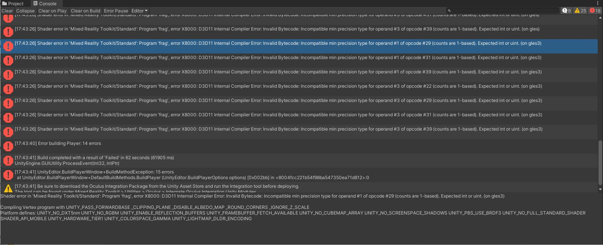
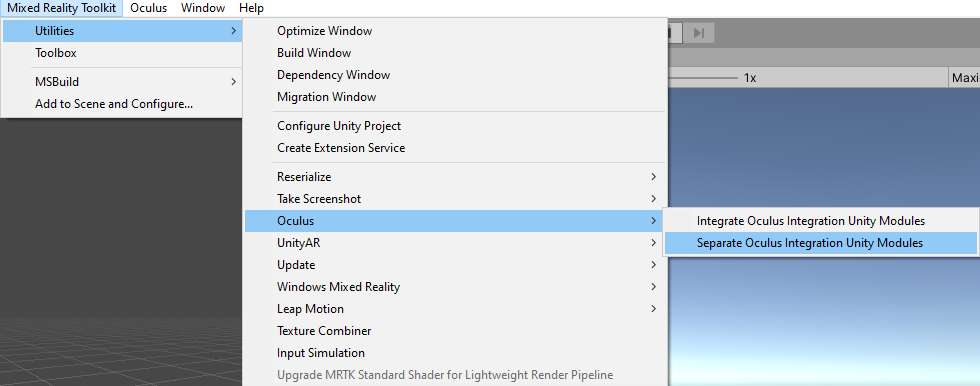

# XRSDK パイプラインを使った MRTK での Oculus Quest の設定方法

[Oculus Quest](https://www.oculus.com/quest/) が必要です。

MRTK による Oculus Quest のサポートは 2 つの異なるソースを介して提供されています。それは Unity の XR パイプラインと Oculus Integration Unity パッケージです。
**Oculus XRSDK Data Provider** を利用することで両方のソースを利用することができ、Oculus Quest で MRTK を利用するにはこれを使う必要があります。

[Unity の XR Pipeline](https://docs.unity3d.com/Manual/XR.html) によって、Oculus Touch コントローラーと Oculus Quest のヘッド トラッキングが利用可能です。
このパイプラインは Unity 2019.3 以降で XR アプリケーションを開発するための標準となっています。このパイプラインを使うには、**Unity 2019.3 以降** を使っていることを確認してください。

[Oculus Integration Unity パッケージ](https://assetstore.unity.com/packages/tools/integration/oculus-integration-82022) によって、Oculus Quest での **ハンド トラッキング** が利用できます。
このデータ プロバイダーは Unity の **XR Pipeline** や **Legacy XR Pipeline** は利用**しません**が、コントローラーとヘッド トラッキングは Unity の XR Pipeline で処理されます。
そのため、廃止予定の **Legacy XR Pipeline** ではなく **XR Pipeline** を使っていることを確認するために **Oculus Quest のためのプロジェクトのセットアップ** のステップを実行する必要があります。

## Oculus Quest のためのプロジェクトのセットアップ

1. [これらのステップ](https://developer.oculus.com/documentation/unity/book-unity-gsg/) にしたがって、プロジェクトを Oculus Quest へデプロイする準備ができていることを確認してください。

1. デバイスで[開発者モード](https://developer.oculus.com/documentation/native/android/mobile-device-setup/)が有効化されていることを確認してください。Oculus ADB Drivers のインストールはオプションです。

## Oculus Quest のための XR Pipeline のセットアップ
1. **Window --> Package Manager** 内で **Oculus XR Plugin** がインストールされていることを確認してください。

    

1. **Edit --> Project Settings --> XR Plug-in Management --> Plug-in Providers** を開いて、プロジェクトに Oculus Plug-in Provider が含まれていることを確認してください。

    

## ハンドトラッキングを有効化するための Oculus Integration Unity パッケージのセットアップ
1. Unity Asset Store から [Oculus Integration](https://assetstore.unity.com/packages/tools/integration/oculus-integration-82022) をダウンロードしインポートします。
動作確認されている最新バージョンは 20.0.0 です。古いバージョンは[アーカイブ](https://developer.oculus.com/downloads/package/unity-integration-archive/)にあります。

1. Mixed Reality Toolkit > Utilities > Oculus > Integrate Oculus Integration Unity Modules を選択します。これを行うことで、関連する Oculus Quest のコードを機能させるために必要な asmdef の定義と参照を更新します。
また、Oculus Integration アセットが出す Obsolete (廃止予定) の Warning をフィルタリングするため、csc ファイルの更新も行います。MRTK のリポジトリには Warning を Error に変換する csc ファイルが含まれており、この変換で MRTK-Quest の設定プロセスが停止します。

    

1. インポートされた Oculus フォルダ (Assets/Oculus にあるはずです) の中に、OculusProjectConfig というスクリプタブル オブジェクトがあります。
この設定ファイルで、HandTrackingSupport を "Controllers and Hands" に設定する必要があります。

    
   
## シーンのセットアップ
1. 新しい Unity シーンを作成するか、HandInteractionExamples のような既存のシーンを開きます
1. **Mixed Reality Toolkit** > **Add to Scene and Configure** を選択し、シーンに MRTK を追加します

## Oculus XRSDK Data Provider の利用

1. Configure your profile to use the **Oculus XRSDK Data Provider**
1. **Oculus XRSDK Data Provider** を使ってプロファイルを設定します
    - 設定プロファイルを変更するつもりがない場合
        - プロファイルを DefaultXRSDKInputSystemProfile に変更し、[プロジェクトのビルドと Oculus Quest へのデプロイ](OculusQuestMRTK.md#build-and-deploy-your-project-to-oculus-quest) を行います

    - 変更する場合は、以下を実行します
        - ヒエラルキーで MixedRealityToolkit ゲーム オブジェクトを選択し、**Copy and Customize** を選択してデフォルトの Mixed Reality プロファイルをクローンします。

        

        - **Input** の設定プロファイルを選択します。

        

        - Input System プロファイルで **Clone** を選択し、変更可能にします。

        

        - **Input Data Providers** セクションを開き、一番上の **Add Data Provider** を選択すると、新しいデータ プロバイダーがリストの最後に追加されます。新しいデータプロバイダーを開き、**Type** を **Microsoft.MixedReality.Toolkit.XRSDK.Oculus > OculusXRSDKDeviceManager** に設定します。

        

    - Oculus Controller が認識されることを確認します。

## プロジェクトのビルドと Oculus Quest へのデプロイ
1. Oculus Quest を USB 3.0 -> USB C ケーブルで接続します
1. **File > Build Settings** を開きます
1. デプロイメントを **Android** へと変更します
1. 対象の Run Device (実行デバイス) として Oculus Quest が選択されていることを確認します
    
    

1. Build And Run を選択します
    - 初めて *Build And Run* を選択した際は以下のようなビルド エラーが発生する可能性があります。再度 *Build And Run* を選択するとデプロイに成功するはずです。

    

1. Quest 内で _USB デバッグの許可_ プロンプトを承認します
1. Oculus Quest 内で作成したシーンが表示されます

## Oculus Integration のプロジェクトからの削除

1. Mixed Reality Toolkit > Oculus > Separate Oculus Integration Unity Modules を選択します
    
1. このステップで Microsoft.MixedReality.Toolkit.Providers.Oculus.asmdef や他のファイルの参照が変更されるので、Unity のリフレッシュを待ちます
1. Unity を閉じます
1. Visual Studio が開いている場合は閉じます
1. File Explorer を開き、MRTK Unity プロジェクトのルート フォルダを開きます
1. UnityProjectName/Library ディレクトリを削除します
1. UnityProjectName/Assets/Oculus ディレクトリを削除します
1. UnityProjectName/Assets/Oculus.meta ファイルを削除します
1. 再度 Unity を開きます

## よくあるエラー

### Quest が Unity に認識されない

Android のパスが適切に設定されていることを確認してください。引き続き問題が発生する場合は、こちらの[ガイド](https://developer.oculus.com/documentation/unity/book-unity-gsg/#install-android-tools)に従ってください。

**Edit > Preferences > External Tools > Android**

