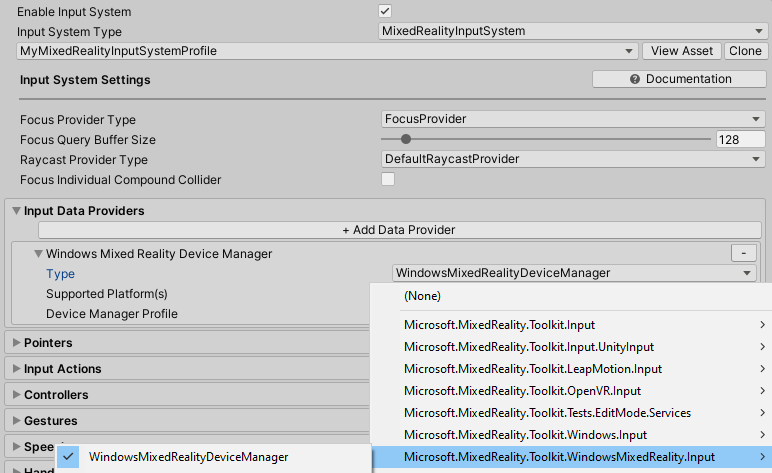
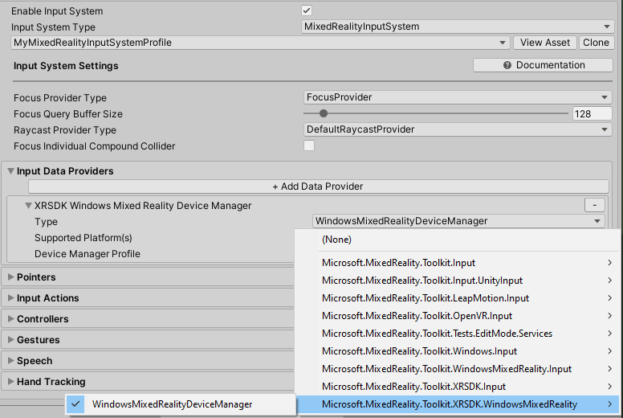
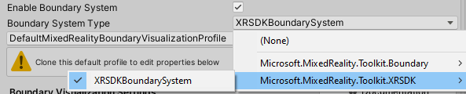
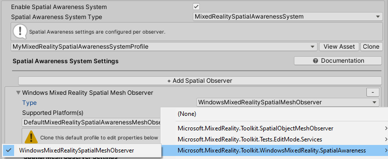

# MRTK と XR SDK を使い始める

XR SDK は Unity の [Unity 2019.3 以降における新しい XR パイプライン](https://blogs.unity3d.com/2020/01/24/unity-xr-platform-updates/) です。Unity 2019 では、XR SDK は既存の XR パイプラインに代わるものを提供します。Unity 2020 では、XR SDK は Unity における唯一の XR パイプラインとなります。

## 前提条件

Mixed Reality Toolkit を使い始めるには、[提供されている手順](WelcomeToMRTK.md) にしたがって MRTK をプロジェクトに追加してください。

## XR SDK を Unity プロジェクトに追加する

Windows Mixed Reality と Oculus が XR SDK でサポートされています。

### Unity での必要事項

#### Windows Mixed Reality

1. Unity の Package Manager を開き、Windows XR Plugin パッケージをインストールします。このパッケージは XR SDK での Windows Mixed Reality のサポートを追加します。いくつかの依存パッケージも取得されます。以下のすべてが正常にインストールされていることをご確認ください。
   1. XR Plugin Management
   1. Windows XR Plugin
   1. XR Legacy Input Helpers
1. Edit > Project Settings を開きます。
1. Project Settings ウィンドウの XR Plug-in Management タブをクリックします。
1. Universal Windows Platform の設定を開き、Plug-in Providers にて Windows Mixed Reality がチェックされていることを核にします。
1. Initialize XR on Startup がチェックされていることを確認します。
1. (**_Editor での HoloLens Remoting に必要、そうでなければオプション_**) Standalone 設定を開き、Plug-in Providers にて Windows Mixed Reality がチェックされていることを確認します。また、Initialize XR on Startup がチェックされていることも確認します。
1. (**_オプション_**) XR Plug-in Management 内の Windows Mixed Reality タブをクリックし、カスタム設定プロファイルを作成してデフォルトの設定を変更します。設定のリストがすでにあれば、プロファイルを作成する必要はありません。

### MRTK での必要事項

アクティブなプロファイルとして "DefaultXRSDKConfigurationProfile" を選択するか、クローンしてカスタマイズします。このプロファイルは必要に応じて MRTK の XR SDK システムとプロバイダでセットアップされます。

既存のプロファイルを XR SDK に移行するには、以下のサービスとデータ プロバイダを更新する必要があります。

#### Camera

[`WindowsMixedReality.WindowsMixedRealityCameraSettings`](xref:Microsoft.MixedReality.Toolkit.WindowsMixedReality.WindowsMixedRealityCameraSettings) から

[`XRSDK.WindowsMixedReality.WindowsMixedRealityCameraSettings`](xref:Microsoft.MixedReality.Toolkit.XRSDK.WindowsMixedReality.WindowsMixedRealityCameraSettings) **と** [`GenericXRSDKCameraSettings`](xref:Microsoft.MixedReality.Toolkit.XRSDK.GenericXRSDKCameraSettings) に変更

#### Input

[`WindowsMixedReality.Input.WindowsMixedRealityDeviceManager`](xref:Microsoft.MixedReality.Toolkit.WindowsMixedReality.Input.WindowsMixedRealityDeviceManager) から

[`XRSDK.WindowsMixedReality.WindowsMixedRealityDeviceManager`](xref:Microsoft.MixedReality.Toolkit.XRSDK.WindowsMixedReality.WindowsMixedRealityDeviceManager) に変更

#### Boundary

[`MixedRealityBoundarySystem`](xref:Microsoft.MixedReality.Toolkit.Boundary.MixedRealityBoundarySystem) から

[`XRSDKBoundarySystem`](xref:Microsoft.MixedReality.Toolkit.XRSDK.XRSDKBoundarySystem) に変更

#### Spatial Awareness

[`WindowsMixedReality.SpatialAwareness.WindowsMixedRealitySpatialMeshObserver`](xref:Microsoft.MixedReality.Toolkit.WindowsMixedReality.SpatialAwareness.WindowsMixedRealitySpatialMeshObserver) から

[`XRSDK.WindowsMixedReality.WindowsMixedRealitySpatialMeshObserver`](xref:Microsoft.MixedReality.Toolkit.XRSDK.WindowsMixedReality.WindowsMixedRealitySpatialMeshObserver) に変更

#### コントローラー マッピング

カスタムのコントローラー マッピング プロファイルを使用する場合は、そのうちの1つを開き、Mixed Reality Toolkit -> Utilities -> Update -> Controller Mapping Profiles のメニュー項目を実行して、新しい XR SDK コントローラー タイプが定義されていることを確認してください。

## 関連項目

* [Getting started with AR development in Unity](https://docs.unity3d.com/Manual/AROverview.html)
* [Getting started with VR development in Unity](https://docs.unity3d.com/Manual/VROverview.html)
