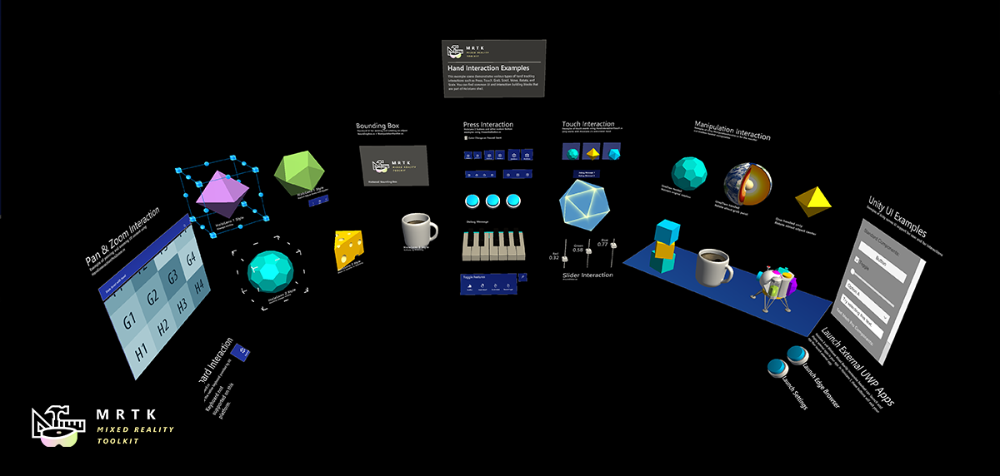

# MRTK を始める

Mixed Reality Toolkit (MRTK) は、Virtual Reality (VR) 及び Augmented Reality (AR) の Mixed Reality エクスペリエンスを構築するためのクロスプラットフォーム ツールキットです。

## 前提条件

Mixed Reality Toolkit を始めるには、次のものが必要です。

* [Visual Studio 2019](https://visualstudio.microsoft.com/downloads/)
* [Unity 2018.4.x, Unity 2019](https://unity3d.com/get-unity/download/archive)

  MRTKは、 Unity 2018 で IL2CPP と .NET scripting backends の両方をサポートします。

* [Windows SDK 18362+](https://developer.microsoft.com/windows/downloads/windows-10-sdk)

  これは WMR、HoloLens 1、または HoloLens 2 向けの UWP アプリを構築する場合に必要です。OpenVR 向けに構築する場合は不要です。

## MRTK を Unity Project に追加する

### 必須事項

1. [最新の MRTK Unity package を取得する](#get-the-latest-mrtk-unity-packages)
1. [MRTK のパッケージを Unity プロジェクトにインポートする](#import-mrtk-packages-into-your-unity-project)
1. [Unity プロジェクトをターゲット プラットフォームに切り替える](#switch-your-unity-project-to-the-target-platform)
1. [MRTK を新しいシーン、または新しいプロジェクトに追加する](#add-mrtk-to-a-new-scene-or-new-project)

### オプション

* [チュートリアルを始める](#getting-started-tutorials)
* [XR SDK getting started guide (Unity 2019.3 or later)](GettingStartedWithMRTKAndXRSDK.md)
* [MRTK のコアとなるビルディング ブロックについて学ぶ](#learn-about-the-core-building-blocks-of-mrtk)
* [HandInteractionExamples のシーンを Unity Editor で実行する](#run-the-handinteractionexamples-scene-in-the-unity-editor)

### 最新の MRTK Unity package を取得する

1. <a href="https://github.com/Microsoft/MixedRealityToolkit-Unity/releases" target="_blank">MRTK リリース ページ</a>を開きます。
1. Assets の下から、以下をダウンロードします。
    * **Microsoft.MixedRealityToolkit.Unity.Foundation.unitypackage**
    * (**_オプション_**) Microsoft.MixedRealityToolkit.Unity.Extensions.unitypackage
    * (**_オプション_**) Microsoft.MixedRealityToolkit.Unity.Tools.unitypackage
    * (**_オプション_**) Microsoft.MixedRealityToolkit.Unity.Examples.unitypackage

パッケージの内容の情報については、[MRTK Package Contents](MRTK_PackageContents.md) をご覧ください。

Mixed Reality Toolkit は、Nuget.org からもダウンロードできます。詳細は [MRTK NuGet Package](MRTKNuGetPackage.md) を参照してください。

### MRTK のパッケージを Unity プロジェクトにインポートする

1. 新しい Unity プロジェクトを作成するか、既存のプロジェクトを開きます。新しいプロジェクトを作成する場合は、テンプレート タイプに 「3D」 が選択されていることを確認してください。
1. ダウンロードした **Microsoft.MixedRealityToolkit.Unity.Foundation.unitypackage** をインポートします。「Asset -> Import Package -> Custom Package」から、 .unitypackage ファイルを選択し、 インポートする全ての項目がチェックされていることを確認してから、「Import」を選択します。
1. (**_オプション_**) **Microsoft.MixedRealityToolkit.Unity.Examples.unitypackage** を上記と同様の手順でインポートします。Examples のパッケージは、オプションであり、現在の MRTK の機能の有用なデモ シーンが含まれています。
1. (**_オプション_**) **Microsoft.MixedRealityToolkit.Unity.Tools.unitypackage** を Foundation パッケージと同様にインポートします。Tools のパッケージは、オプションであり、MRTK 開発者のエクスペリエンスを向上させる、ExtensionServiceCreator などの便利なツールが含まれています。
1. (**_オプション_**) **Microsoft.MixedRealityToolkit.Unity.Extensions.unitypackage** を Foundation パッケージと同様にインポートします。 Extensions パッケージは、オプションで、 MRTK の便利なオプション コンポーネントのセットを提供します。

> [!Note]
> Android と iOS の開発には、追加のパッケージ インストールが必要です。より多くの情報については、[MRTK を iOS と Android 向けに設定する方法](CrossPlatform/UsingARFoundation.md)をご覧ください。
Foundation パッケージをインポートすると、次のようなプロンプトが表示される場合があります。

MRTK は、以下を実行することで Mixed Reality ソリューションを構築するためのプロジェクトをセットアップします。

* 現在のプラットフォームで XR Settings を有効にします (XR チェックボックスを有効にします)。
* テキストのシリアライズを強制 / メタ ファイルの可視化をします （ソース管理をする Unity プロジェクトに推奨）。

これらのオプションを適用するかは選択的ですが、推奨されています。

一部のプレハブ、及びアセットには、TextMesh Pro が必要です。つまり、TextMesh Pro のパッケージをインストールし、アセットがプロジェクト内にあることが必要です。(Window -> TextMeshPro -> Import TMP Essential Resources)
 **TMP Essentials Resources をインポートした後、変更を確認するには Unity を再起動する必要があります**。

### Unity プロジェクトをターゲット プラットフォームに切り替える

パッケージがインポートされたら、次のステップはアプリケーションの正しいプラットフォームを選択することです。

**HoloLens アプリケーション**を作成するには、Universal Windows Platform に切り替えます。

* File > Build Settings からメニューを開きます。
* **Platform** の一覧から、**Universal Windows Platform** を選択します。
* **Switch Platform** ボタンを押します。

>[!NOTE]
> Mixed Reality Toolkit は、プラットフォームが選択された際にプロジェクトに推奨される変更を適用するためのプロンプトを表示します。プラットフォームが変更されたときはいつでも、必要であれば適切な設定がチェックされプロンプトに表示されます。

### MRTK を新しいシーン、または新しいプロジェクトに追加する

1. 新規のプロジェクトを作成する、あるいは新しいシーンを現在のプロジェクトに作成します。

1. MRTK のパッケージが[上記の手順](#mrtk-のパッケージを-unity-プロジェクトにインポートする) に従ってインポートされていることを確認します。(Examples は必須ではありませんが、 Foundation と Examles の両方をインポートすることを推奨します。 )

1. メニュー バーから、Mixed Reality Toolkit -> Add to Scene and Configure を選択します。

    

    インスペクターには現在アクティブな MRTK の設定プロファイルとプロファイル選択のドロップダウンが表示され、デフォルトのプロファイルがあらかじめ選択されています。プロファイルは MRTK のコアコンポーネントの振る舞いを設定します。より詳しくは[プロファイル](Profiles/Profiles.md)の記事に記載されています。

    > [!NOTE]
    > * もし Unity 2019.3 またはそれ以降で Unity の XR SDK を使っている場合、「DefaultXRSDKConfigurationProfile」 を選ぶべきです。このプロファイルは、MRTK の XR SDK のシステムとプロバイダーを必要な箇所に設定しています。  
    > * HoloLens または HoloLens 2 で始める場合は、「DefaultHoloLens1ConfigurationProfile」または「DefaultHoloLens2ConfigurationProfile」をかわりに選択すべきです。  
    > * DefaultMixedRealityToolkitConfigurationProfile と DefaultHoloLens2ConfigurationProfile の違いは、[プロファイル](Profiles/Profiles.md#hololens-2-profile) を参照してください。

    シーンのヒエラルキーに以下が表示されます。

    

    ヒエラルキーには以下のものが含まれます。

    * **Mixed Reality Toolkit** - Toolkit それ自身であり、フレームワーク全体に対する中心的な設定のエントリ ポイントを提供します。
    * **MixedRealityPlayspace** - ヘッドセットの親オブジェクト。ヘッドセット / コントローラー及びその他の必要なシステムがシーンで正しく管理されるようにします。
    * Main Camera は Playspace の子要素として移動されます。- これにより、プレイスペースが SDK と連動してカメラを管理できるようになります。

    >[!NOTE]
    > シーンで作業している間、シーンの原点 (0,0,0) から **Main Camera** (または **MixedRealityPlayspace**) を**動かさないでください** 。これは MRTK と アクティブな SDK によって制御されます。プレイヤーを初期位置から動かしたい場合は、**カメラではなくシーンのコンテンツを移動してください**！

1. Play を押して再生し、Space キーを押してハンド シミュレーションでテストします。

これで、デバイスにビルドしてデプロイする準備ができました！ [MRTK のビルドとデプロイ](BuildAndDeploy.md) の手順に従ってください。

### チュートリアルを始める

MRTK、または MR 開発が初めての場合は、MRTK v2 を使った [チュートリアルを始める](https://docs.microsoft.com/windows/mixed-reality/mrlearning-base) をチェックすることをお勧めします。

### MRTK のコアとなるビルディング ブロックについて学ぶ

コアとなるビルディング ブロックについて学ぶには、[MRTK 101: How to use Mixed Reality Toolkit Unity for Basic Interactions (HoloLens 2, HoloLens, Windows Mixed Reality, Open VR)](https://docs.microsoft.com/windows/mixed-reality/mrtk-101) をチェックしてください。

### HandInteractionExamples のシーンを Unity Editor で実行する

[Hand Interaction のサンプル シーン](README_HandInteractionExamples.md) の記事は、MRTK の UX コントロールとインタラクションについて学ぶには最適な場所です。

ハンド インタラクション シーンを試すには、以下のステップを実行してください。

1. `Assets\MixedRealityToolkit.Examples\Demos\HandTracking\Scenes\HandInteractionExamples` の中の  **HandInteractionExamples** シーンを開きます。

1. 「TMP Essentials」をインポートするかを尋ねるプロンプトが表示されます。

    

    このようなプロンプトが表示された場合は、「Import TMP essentials」 ボタンを選択します。「TMP Essentials」とは、Text Mesh プラグインを指し、MRTK のサンプルの一部はテキスト レンダリングを改善するために使用しています。(詳細については、[Unity のテキスト](https://docs.microsoft.com/windows/mixed-reality/text-in-unity)を参照してください。)

1. TMP ダイアログを閉じます。この後、シーンをリロードする必要があります。これを行うには、プロジェクト タブでシーンをダブルクリックします。

1. Play ボタンを押します。

## Editor 内ハンド入力シミュレーションを使ってシーンをテストする

Editor 内の入力シミュレーション を使って、[手](InputSimulation/InputSimulationService.md#ハンド-シミュレーション)や[目](EyeTracking/EyeTracking_BasicSetup.md#simulating-eye-tracking-in-the-unity-editor)などの特定のタイプの入力に対し、バーチャルなオブジェクトの動作をテストすることができます。

シーン内を移動する方法:

* **W/A/S/D** キーを使用して、カメラを前後/左右に移動します。
* **Q/E** キーを使用して、カメラを上下に動かします。
* **マウスの右ボタン**を押したままにして、カメラを回転させます。

手の入力をシミュレートする方法:

* **Space キー**を押し続けて、右手を有効にします。
* Space キーを押しながら、マウスを動かして手を動かします。
* **マウスのスクロールホイール**を使用して、手の奥行を調整します。
* **マウスの左ボタン**をクリックして、ピンチ ジェスチャをシミュレートします。
* **T/Y** キーで、ハンドをビューに固定します。
* **CTRL** キーを押しながら、マウスを動かして手を回転させます。

シーンの探索を楽しんでください！ UI コントロールの詳細については、[ハンド インタラクションのサンプル ガイド](README_HandInteractionExamples.md) で学ぶことができます。また、[入力シミュレーションのドキュメント](InputSimulation/InputSimulationService.md)を読んで、MRTK の Editor 内の手の入力シミュレーションの詳細を確認してください。

おめでとうございます、最初の MRTK のシーンを使うことができました。これであなた自身のエクスペリエンスを創りはじめることができます。

## 次のステップ

お勧めの次のステップを紹介します。

* [MRTK 101: How to use Mixed Reality Toolkit Unity for Basic Interactions](https://docs.microsoft.com/windows/mixed-reality/mrtk-101) で、グラブ、移動、スケール、回転などの一般的な空間的インタラクションの実現方法について学ぶ。
* [UI とインタラクションのビルディング ブロック](../README.md#ui-and-interaction-building-blocks) で UX コントロール について学ぶ。
* [MRTK Examples Hub](README_ExampleHub.md) を試す(事前にビルドされたアプリケーション パッケージはリリース ページに含まれています)。
* [Mixed Reality Toolkit プロファイル設定ガイド](MixedRealityConfigurationGuide.md) で MRTK Configuration profile の使い方を学ぶ。
* [MRTK のアーキテクチャ](./Architecture/Overview.md) を、学ぶ。
* [MRTK のインプット システム](./Input/Overview.md) を、学ぶ。
* 複合現実感の設計と開発を強化する [MRTK のツール](../README.md#tools) について学ぶ。
* [インプット シミュレーション ガイド](InputSimulation/InputSimulationService.md) を読み、エディターでハンド入力をシミュレートする方法を学ぶ。

## 助けを得る

もし MRTK によって引き起こされた問題にぶつかったり、何かをすることについて質問がある場合は、助けとなるリソースがいくつかあります。

* バグ レポートについては、GitHub リポジトリにて [Issue](https://github.com/microsoft/MixedRealityToolkit-Unity/issues/new/choose) を送ってください。
* 質問については、[StackOverflow](https://stackoverflow.com/questions/tagged/mrtk) または Slack の [mixed-reality-toolkit チャンネル](https://holodevelopers.slack.com/messages/C2H4HT858) を利用してください。 Slack コミュニティには[自動招待リンク](https://holodevelopersslack.azurewebsites.net/)から参加できます。

## HoloToolkit (HTK/MRTK v1) からアップグレードする

フレームワークが再構築されたため、HoloToolkit から Mixed Reality Toolkit v2 への直接的なアップグレード パスはありません。ただし、MRTK を HoloToolkit プロジェクトにインポートし、実装を移行することは可能です。詳細については、 [HTK2017 から MRTK v2 への移植ガイド](HTKToMRTKPortingGuide.md) を参照してください。

## Unity の XR SDK を始める

完全な操作手順と情報は、[XR SDK getting started guide](GettingStartedWithMRTKAndXRSDK.md) をご覧ください。
