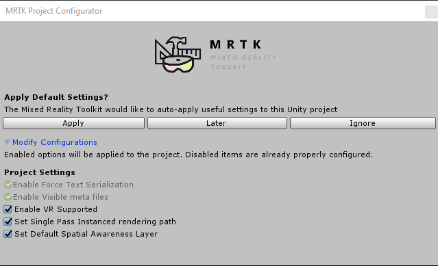
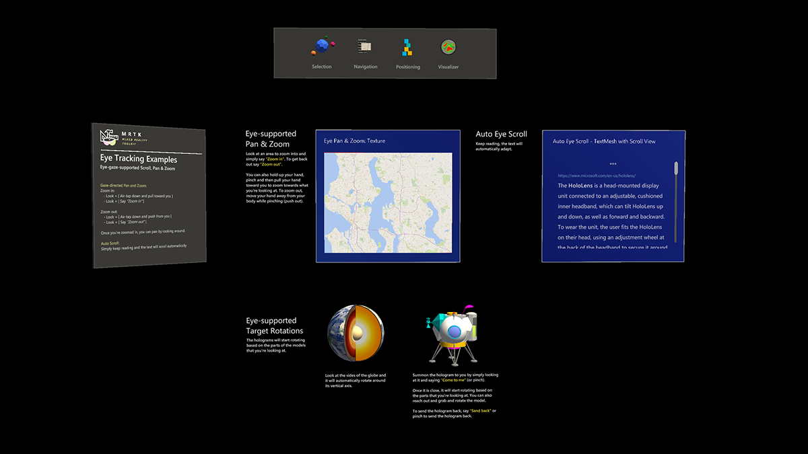

# MRTK を始める

Mixed Reality Toolkit (MRTK) は、Virtual Reality (VR) 及び Augmented Reality (AR) の Mixed Reality エクスペリエンスを構築するためのクロスプラットフォーム ツールキットです。

## 前提条件

Mixed Reality Toolkit を始めるには、次のものが必要です。

* [Visual Studio 2019](https://visualstudio.microsoft.com/downloads/)
* [Unity 2018.4.x, 2019.1.x または 2019.2.x](https://unity3d.com/get-unity/download/archive)

  MRTKは、 Unity 2018 で IL2CPP と .NET scripting backends の両方をサポートします。

* [最新の MRTK release](https://github.com/Microsoft/MixedRealityToolkit-Unity/releases)
* [Windows SDK 18362+](https://developer.microsoft.com/en-US/windows/downloads/windows-10-sdk).

  これは WMR、HoloLens 1、または HoloLens 2 向けの UWP アプリを構築する場合に必要です。OpenVR 向けに構築する場合は不要です。

## チュートリアルを始める

MRTK、または MR 開発が初めての場合は、MRTKv2 を使った [チュートリアルを始める](https://docs.microsoft.com/en-us/windows/mixed-reality/mrlearning-base)をチェックすることをお勧めします。

## MRTK を Unity Project に追加する

### 最新の MRTK Unity パッケージを取得する

1. [MRTK のリリース ページ](https://github.com/Microsoft/MixedRealityToolkit-Unity/releases) を開きます。
2. Assets の下から以下をダウンロードします。

    * `Microsoft.MixedRealityToolkit.Unity.Foundation.unitypackage`
    * `Microsoft.MixedRealityToolkit.Unity.Extensions.unitypackage`
    * `Microsoft.MixedRealityToolkit.Unity.Tools.unitypackage`
    * `Microsoft.MixedRealityToolkit.Unity.Examples.unitypackage`

より詳細な配布の仕組みは、[MRTK をダウンロードする](DownloadingTheMRTK.md)を参照して下さい。

### Unity プロジェクトをターゲット プラットフォームに切り替える

次のステップ **MRTK のパッケージ を Unity プロジェクトへインポート** するでは、インポートした時点でプロジェクトで選択されているプラットフォームに応じた変更がプロジェクトに適用されます。

次のステップへ進む前に、正しいプラットフォームを選択していることを確認してください。

例えば、HoloLens アプリケーションを作成する場合は、Universal Windows Platform に切り替えます。

* File > Build Settings からメニューを開きます。
* **Platform** の一覧から、**Universal Windows Platform** を選択します。
* **Switch Platform** ボタンを押します。

### MRTK のパッケージを Unity プロジェクトにインポートする

1. 新しい Unity プロジェクトを作成するか、既存のプロジェクトを開きます。新しいプロジェクトを作成する場合は、テンプレート タイプに 「3D」 が選択されていることを確認してください。
1. ダウンロードした `Microsoft.MixedRealityToolkit.Unity.Foundation.unitypackage` をインポートします。「Asset -> Import Package -> Custom Package」から、 .unitypackage ファイルを選択し、 インポートする全ての項目がチェックされていることを確認してから、「Import」を選択します。
1. `Microsoft.MixedRealityToolkit.Unity.Examples.unitypackage` も上記と同様の手順でインポートします。Examples のパッケージは、オプションであり、現在の MRTK の機能の有用なデモ シーンが含まれています。
1. `Microsoft.MixedRealityToolkit.Unity.Tools.unitypackage` も Foundaiton パッケージと同様にインポートします。Tools のパッケージは、オプションであり、MRTK 開発者のエクスペリエンスを向上させる、ExtensionServiceCreator などの便利なツールが含まれています。
1. `Microsoft.MixedRealityToolkit.Unity.Extensions.unitypackage` も Foundaiton パッケージと同様にインポートします。 Extensions パッケージは、オプションで、 MRTK の便利なオプション コンポーネントのセットを提供します。

Foundation パッケージをインポートすると、次のようなセットアップ プロンプトが表示される場合があります。

MRTK は、以下を実行することで Mixed Reality ソリューションを構築するためのプロジェクトをセットアップします。

* 現在のプラットフォームで XR Settings を有効にします (XR チェックボックスを有効にします)。
* テキストのシリアライズを強制 / メタ ファイルの可視化をします （ソース管理をする Unity プロジェクトに推奨）。

これらのオプションを適用するかは選択的ですが、推奨されています。

一部のプレハブ、及びアセットには、TextMesh Pro が必要です。つまり、TextMesh Pro のパッケージをインストールし、アセットがプロジェクト内にあることが必要です。(Window -> TextMeshPro -> Import TMP Essential Resources)
 **TMP Essentials Resources をインポートした後、変更を確認するには Unity を再起動する必要があります**。

### HandInteractionExamples のシーンを Editor で開いて実行する

[Hand Interaction のサンプル シーン](README_HandInteractionExamples.md) は、MRTK の様々な UX コントロールとインタラクションを紹介しているため、MRTK を始めるには最適な場所です。はじめに、MRTK をインポートし、サンプル シーンを開いて、Editor でシーンを探索します。

1. 新しい Unity プロジェクトを作成し、[上記の手順](#mrtk-のパッケージを-unity-プロジェクトにインポートする) に従って、**Foundation** と **Examples** の Unity パッケージの両方をインポートします。
1. `Assets\MixedRealityToolkit.Examples\Demos\HandTracking\Scenes\HandInteractionExamples` の下の HandInteractionExamples のシーンを開きます。

1. 「TMP Essentials」をインポートするかを尋ねるプロンプトが表示されます。
  
    
  
    このようなプロンプトが表示された場合は、「Import TMP essentials」 ボタンを選択します。「TMP Essentials」とは、Text Mesh プラグインを指し、MRTK のサンプルの一部はテキスト レンダリングを改善するために使用しています。(詳細については、[Unity のテキスト](https://docs.microsoft.com/en-us/windows/mixed-reality/text-in-unity)を参照してください。)

1. TMP ダイアログを閉じます。この後、シーンをリロードする必要があります。これを行うには、プロジェクト タブでシーンをダブルクリックします。

1. Play ボタンを押します。

## Editor 内ハンド入力シミュレーションを使ってシーンをテストする

Editor 内の入力シミュレーション を使って、[手](InputSimulation/InputSimulationService.md#ハンド-シミュレーション)や[目](EyeTracking/EyeTracking_BasicSetup.md#simulating-eye-tracking-in-the-unity-editor)などの特定のタイプの入力に対し、バーチャルなオブジェクトの動作をテストすることができます。

シーン内を移動する：

* W/A/S/D キーを使用して、カメラを前後/左右に移動します。
* マウスの右ボタンを押したままにして、カメラを回転させます。

手の入力をシミュレートする：

* Space キーを押し続けて、右手を有効にします。
* Space キーを押しながら、マウスを動かして手を動かします。
* 中央のマウス スクロールを使用して、手の奥行を調整します。
* マウスの左ボタンをクリックして、ジェスチャを切り替えます。

シーンの探索を楽しんでください！ UI コントロールの詳細については、[ハンド インタラクションのサンプル ガイド](README_HandInteractionExamples.md) で学ぶことができます。また、[入力シミュレーションのドキュメント](InputSimulation/InputSimulationService.md)を読んで、MRTK の Editor 内の手の入力シミュレーションの詳細を確認してください。

おめでとうございます、最初の MRTK のシーンを使うことができました。これであなた自身のエクスペリエンスを創りはじめることができます。

### MRTK を新しいシーン、または新しいプロジェクトに追加する

1. 新規のプロジェクトを作成する、あるいは新しいシーンを現在のプロジェクトに作成します。

1. MRTK のパッケージが[上記の手順](#mrtk-のパッケージを-unity-プロジェクトにインポートする) に従ってインポートされていることを確認します。(Examples は必須ではありませんが、 Foundation と Examles の両方をインポートすることを推奨します。 )

1. メニュー バーから、Mixed Reality Toolkit -> Add to Scene and Configure を選択します。

    

1. 次のようなプロンプトが表示されます。

    

    「OK」を押します。  

1. その後、MRTK Configuration profile を選択するよう求められます。「DefaultMixedRealityToolkitConfigurationProfile」をダブルクリックします。

    

    > **注意**： HoloLens 2 で始める場合は、「DefaultHoloLens2ConfigurationProfile」を選択することを推奨します。
    > DefaultMixedRealityToolkitConfigurationProfile と DefaultHoloLens2ConfigurationProfile の違いは、
    > [プロファイル](Profiles/Profiles.md#hololens-2-profile) を参照してください。

    シーンのヒエラルキーが以下のようになります。

    

    ヒエラルキーには以下のものが含まれます。

    * Mixed Reality Toolkit - フレームワーク全体に対する中心的な設定のエントリ ポイントを提供します。
    * MixedRealityPlayspace - ヘッドセットの親オブジェクト。ヘッドセット / コントローラー及びその他の必要なシステムがシーンで正しく管理されるようにします。
    * Playspace の下に移動した Main Camera - プレイスペースが SDK と連動してカメラを管理できるようにします。

    > **注意**: シーンで作業している間、シーンの原点 (0,0,0) から **Main Camera を動かさないでください** (または playspace)。これは MRTK と アクティブな SDK によって制御されます。player を初期位置から動かしたい場合は、**カメラではなくシーンのコンテンツを移動してください**！

1. Play を押して再生し、Space キーを押して、ハンド シミュレーションでテストします。

これで、デバイスにビルドしてデプロイする準備ができました！ [MRTK のビルドとデプロイ](BuildAndDeploy.md) の手順に従ってください。

## 次のステップ

お勧めの次のステップを紹介します。

* [PressableButton](README_Button.md) をシーンに追加する。(最初は、 `PressableButtonPlated` プレハブを使うことを推奨します。)
* キューブをシーンに追加して、それを [ManipulationHandler](README_ManipulationHandler.md) コンポーネントを使って動かせるようにする。
* [UI とインタラクションのビルディング ブロック](#ui-とインタラクションのビルディング-ブロック) で UX コントロール について学ぶ。
* [入力シミュレーションのガイド](InputSimulation/InputSimulationService.md) を読んで、Editor 内で手の入力をシミュレートする方法を学ぶ。
* [Mixed Reality 設定ガイド](MixedRealityConfigurationGuide.md) で MRTK Configuration profile の使い方を学ぶ。

## UI とインタラクションのビルディング ブロック

|   [Button](README_Button.md) |  [Bounding Box](README_BoundingBox.md) |  [Manipulation Handler](README_ManipulationHandler.md) |
|:--- | :--- | :--- |
| HoloLens 2 の多関節ハンド (articulated hand) を含む様々な入力方法をサポートするボタン コントロール | 3D 空間でオブジェクトを操作するための標準 UI | 片手、または両手でオブジェクトを操作するためのスクリプト |
|   [Slate](README_Slate.md) |  [System Keyboard](README_SystemKeyboard.md) |  [Interactable](README_Interactable.md) |
| 多関節ハンドの入力によるスクロールをサポートする 2D スタイル平面 | Unity でシステム キーボードを使用するスクリプトのサンプル  | 視覚的にオブジェクトとインタラクションするためのスクリプトとテーマ サポート |
|   [Solver](README_Solver.md) |  [Object Collection](README_ObjectCollection.md) |  [Tooltip](README_Tooltip.md) |
| tag-along、body-lock、constant view size、 surface magnetism のような様々なオブジェクト配置動作 |  オブジェクトの配列を3次元にレイアウトするためのスクリプト |モーション コントローラーとオブジェクトのラベル付けに使用できる柔軟なアンカー/ピボット システムを備えた注釈 UI。 |
|   [App Bar](README_AppBar.md) |  [Pointers](Input/Pointers.md) |  [Fingertip Visualization](README_FingertipVisualization.md) |
| Bounding Box の手動で有効化する UI | 様々なタイプのポインターについて学ぶ | 直接的なインタラクションの信頼性を向上させる、指先の視覚的アフォーダンス |
|   [Slider](README_Sliders.md) |  [MRTK Standard Shader](README_MRTKStandardShader.md) |  [Hand Joint Chaser](README_HandJointChaser.md) |
| ダイレクト ハンド トラッキング インタラクションをサポートする、値を調整するためのスライダー | フルーエント デザインの要素をサポートし、パフォーマンスの良い MRTK の標準シェーダー | ソルバーを使用してオブジェクトを手の関節にアタッチする方法のデモ |
|   [Eye Tracking: Target Selection](EyeTracking/EyeTracking_TargetSelection.md) |  [Eye Tracking: Navigation](EyeTracking/EyeTracking_Navigation.md) |  [Eye Tracking: Heat Map](EyeTracking/EyeTracking_ExamplesOverview.md#visualization-of-visual-attention) |
| 目、音声、手の入力を組み合わせて、シーン内の holograms を簡単に選択する | 見ている場所に基づいてテキストを自動スクロールする方法やフォーカスされたコンテンツをズームする方法を学ぶ | アプリでユーザーが見ているものを記録、読み込み、視覚化するサンプル |

## ツール

|   [Optimize Window](Tools/OptimizeWindow.md) |  [Dependency Window](Tools/DependencyWindow.md) |  Build Window |  [Input recording](InputSimulation/InputAnimationRecording.md) |
| :--- | :--- | :--- | :--- |
| パフォーマンスの最適化のための Mixed Reality プロジェクトの構成の自動化 | アセット間の依存関係を分析し、未使用のアセットを特定する | Mixed Reality アプリケーションのエンドツーエンドのビルド プロセスを構成および実行する | エディターでのヘッドの動きとハンド トラッキング データの記録と再生 |

## HoloToolkit (HTK/MRTK v1) からアップグレードする

フレームワークが再構築されたため、HoloToolkit から Mixed Reality Toolkit v2 への直接的なアップグレード パスはありません。ただし、MRTK を HoloToolkit プロジェクトにインポートし、実装を移行することは可能です。詳細については、 [HoloToolkit to Mixed Reality Toolkit Porting Guide](HTKToMRTKPortingGuide.md) を参照してください。
