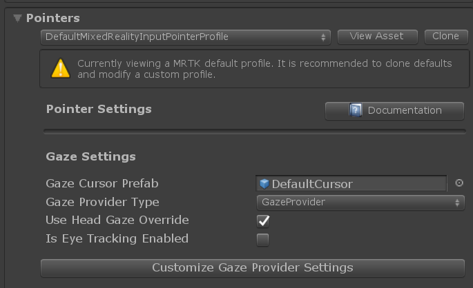

# Gaze (ゲイズ)

[Gaze](https://docs.microsoft.com/ja-jp/windows/mixed-reality/gaze) は、ユーザがどこを見ているかに基づいています。ゲイズには2つの異なる特徴があります。

## ヘッド ゲイズ

このタイプのゲイズは、頭/カメラが向いている方向に基づきます。ヘッド ゲイズがアクティブである目のゲイズをサポートしていないシステムや、ハードウェアが目のゲイズをサポートしている可能性があるが [アクセス許可とセットアップ](../EyeTracking/EyeTracking_BasicSetup.md#eye-tracking-requirements-checklist) が正しく実行されていない場合にアクティブになります。

ヘッド ゲイズは、通常、HoloLens 1 スタイルのインタラクションに関連しており、次のような方法でオブジェクトを見ることができます。
ホログラフィックフレームの中央に配置し、エア タップのジェスチャを実行します。

## アイ ゲイズ (視線)

このタイプのゲイズは、ユーザの目がどこを見ているかに基づいています。視線は視線追跡をサポートするシステムにのみ存在します。視線の使用方法の詳細については、[アイ トラッキング文書](../EyeTracking/EyeTracking_Main.md) を参照してください。

## GazeProvider

ゲイズ機能 (ヘッドと視線) は、[GazeProvider](xref:Microsoft.MixedReality.Toolkit.Input.GazeProvider) によって提供されます。このプロバイダは入力システムプロファイルの *Pointer* セクションで次の操作を行います:



他の入力ソースと同様に、GazeProvider はポインタ [(see this document for information on pointers)](../Architecture/InputSystem/ControllersPointersAndFocus.md) を使用してシーン内のオブジェクトと対話します。
GazeProvider の場合、ポインタは `InternalGazePointer` によって実装され、プロファイルを使用して設定されます。

*Gaze Provider Type* を [IMixedRealityGazeProvider](xref:Microsoft.MixedReality.Toolkit.Input.IMixedRealityGazeProvider) と [IMixedRealityEyeGazeProvider](xref:Microsoft.MixedReality.Toolkit.Input.IMixedRealityEyeGazeProvider) を実装する別のクラスを参照するように変更することで、標準の GazeProvider を別の実装に置き換えることができます。
GazeProvider の再実装は簡単ではないので、通常はストック GazeProvider (およびバグ発見時の問題報告) を使うことをお勧めします。

## 使用方法

### 現在の gaze targer (ゲイズ ターゲット) を取得する方法

このサンプルは、ユーザのゲイズのターゲットとなる現在のゲームオブジェクトを取得する方法を示します。

```csharp
void LogCurrentGazeTarget()
{
    if (CoreServices.InputSystem.GazeProvider.GazeTarget)
    {
        Debug.Log("User gaze is currently over game object: "
            + CoreServices.InputSystem.GazeProvider.GazeTarget)
    }
}
```

### 現在のゲイズの方向と原点を取得する方法

このサンプルは、ユーザの視線の方向と原点 (方向が向かっている点) を表す Vector3 を取得する方法を示します。

```csharp
void LogGazeDirectionOrigin()
{
    Debug.Log("Gaze is looking in direction: "
        + CoreServices.InputSystem.GazeProvider.GazeDirection);

    Debug.Log("Gaze origin is: "
        + CoreServices.InputSystem.GazeProvider.GazeOrigin);
}
```
