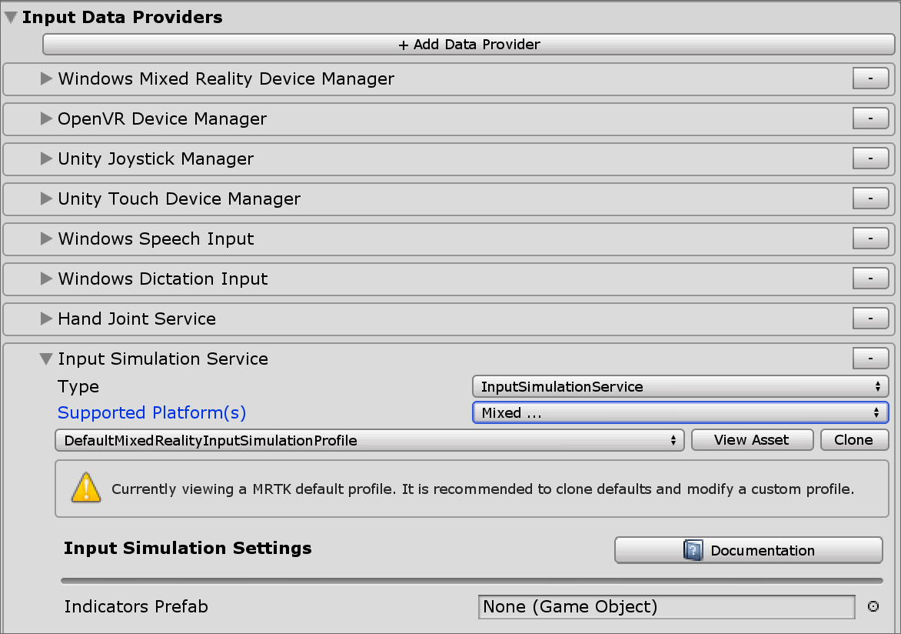

# 入力シミュレーション サービス (Input Simulation Service)

入力シミュレーション サービスは、Unity Editor 上で使用できない場合があるデバイスやプラットフォームをエミュレートします。例:

* HoloLens または VR デバイスのヘッド トラッキング
* HoloLens のハンド ジェスチャ
* HoloLens 2 の多関節ハンド トラッキング
* HoloLens 2 のアイ トラッキング
* VR デバイスのコントローラー

ユーザーは、従来のキーボードやマウスの組み合わせで実行時に操作をシミュレーションすることができます。このアプローチにより、デバイスにデプロイする前に Unity Editor 上でインタラクションをテストすることができます。

> [!WARNING]
> これは、Unity の XR Holographic Emulation > Emulation Mode = "Simulate in Editor" では動作しません。Unity Editor 内でのシミュレーションは、MRTK の入力シミュレーションの制御を奪い取ります。MRTK の入力シミュレーション サービスを使用するには、XR Holographic Emulation を、Emulation Mode = *"None"* にセットする必要があります。

## 入力シミュレーション サービスの有効化

入力シミュレーションは MRTK に同梱されているプロファイルではデフォルトで有効化されています。

入力シミュレーションは、オプションの [Mixed Reality サービス](../MixedRealityServices.md) であり、[Input System プロファイル](../Input/InputProviders.md) のデータ プロバイダーから取り除くこともできます。

Input System データ プロバイダー設定で、入力シミュレーション サービスは以下の設定が可能です。

* **Type** は、*Microsoft.MixedReality.Toolkit.Input > InputSimulationService* である必要があります。
* **Supported Platform(s)** は、デフォルトで全ての *Editor* プラットフォームを含みます。これは、サービスがキーボードとマウスの入力を使用するためです。

> [!NOTE]
> 入力シミュレーション サービスは、**Supported Platform(s)** プロパティを望みのターゲットを含むように変更することでスタンドアローンのような他のプラットフォームで使うこともできます。
> 

## 入力シミュレーション ツール ウィンドウ

**Mixed Reality Toolkit** > **Utilities** > **Input Simulation** メニューから、入力シミュレーション ツール ウィンドウを有効化します。このウィンドウは、プレイモードの間、入力シミュレーションの状態へのアクセスを提供します。

## ビューポート ボタン

基本的なハンドの配置をコントロールするエディタ内ボタンのプレファブは、入力シミュレーションサービスの **Indicators Prefab** 配下の入力シミュレーション プロファイルで指定することができます。これは、オプションのユーティリティで、同じ機能には [入力シミュレーション ツール ウィンドウ](#入力シミュレーション-ツール-ウィンドウ) からアクセスすることができます。

> [!NOTE]
> ビューポート インジケーターは、現在 Unity UI インタラクションと時々干渉しうるため、デフォルトで無効になっています。イシュー [#6106](https://github.com/microsoft/MixedRealityToolkit-Unity/issues/6106) をご覧ください。有効にするには、InputSimulationIndicators プレハブを **Indicators Prefab** に追加してください。

ハンドアイコンは、シミュレーションされたハンドの状態を表します。

*  ハンドは追跡されていません。クリックでハンドを有効化します。
*  ハンドは追跡されています。しかし、ユーザーにコントロールされていません。クリックでハンドを非表示にします。
*  ハンドは追跡されており、ユーザーにコントロールされています。クリックでハンドを非表示にします。
*  クリックしてハンドをデフォルトの位置にリセットします。

## Editor 内の入力シミュレーション チート シート

HandInteractionExamples シーンで 左 Ctrl + H を押すと、入力シミュレーション操作のチート シートが表示されます。

## カメラ コントロール

頭の動きは入力シミュレーション サービスでエミュレートされます。

### カメラの回転

1. Editor ウィンドウにカーソルを合わせます。
    *ボタンを押しても動作しない場合は、フォーカスを得るためにウィンドウをクリックする必要があります。*
1. **Mouse Look Button** (デフォルト: 右マウスボタン)を押したままにします
1. マウスをウィンドウ内で動かしてカメラを回転させます
1. スクロールホイールを使ってカメラを視線方向を軸として回転させます

カメラの回転速度は、入力シミュレーション プロファイルの **Mouse Look Speed** 設定を変更して構成できます。

または、カメラを回転させるために **Look Horizo​​ntal**/**Look Vertical** 軸を使用します（デフォルト:ゲームコントローラの右スティック）

### カメラの移動

**Move Horizontal**/**Move Vertical** 軸を使用してカメラを移動させます（規定:WASDキーまたはゲームコントローラーの左スティック）

カメラの位置と回転角度は、ツール ウィンドウで明示的にセットすることもできます。**Reset**　ボタンでカメラをデフォルトの状態にリセットすることができます。

<iframe width="560" height="315" src="https://www.youtube.com/embed/Z7L4I1ET7GU" class="center" frameborder="0" allow="accelerometer; encrypted-media; gyroscope; picture-in-picture" allowfullscreen />

## コントローラー シミュレーション

入力シミュレーションは、エミュレートされたコントローラー デバイス（モーション コントローラーとハンド）をサポートします。これらのバーチャル コントローラーは、ボタンやグラブ可能オブジェクトなどの、通常のコントローラーをサポートしたオブジェクトとインタラクションできます。

### コントローラー シミュレーション モード

[入力シミュレーション ツール ウィンドウ](#入力シミュレーション-ツール-ウィンドウ) 内で、 **Default Controller Simulation Mode** 設定は、3つの異なる入力モデルの切り替えを行います。
デフォルトのモードは入力シミュレーション プロファイルでもセットできます。

* *Articulated Hands*: 関節の位置のデータを持った多関節ハンドをシミュレートします。

   HoloLens 2 のインタラクション モデルをエミュレートします。

   このモードでは、ハンドの正確な位置やタッチに基づいたインタラクションをシミュレートできます。

* *Hand Gestures*: Air Tap や基本的なジェスチャを持ったシンプルなハンドをシミュレートします。

  [HoloLens interaction model](https://docs.microsoft.com/windows/mixed-reality/gestures) をエミュレートします。

   フォーカスは視線ポインターを使ってコントロールします。*Air Tap* ジェスチャでボタンと対話します。

* *Motion Controller*: VR ヘッドセットとともに使われるモーション コントローラーをシミュレートします。これは多関節ハンドのファー インタラクションと同様の動作をします。

   VR ヘッドセットとコントローラーのインタラクション モデルをエミュレートします。

   トリガー、グラブ、メニュー キーはキーボードとマウス入力でシミュレーションされます。

### コントローラーの動作のシミュレーション

**Left/Right Controller Manipulation Key (左右のコントローラー操作キー)** （デフォルト: *左 Shift* が左コントローラー、*Space* が右コントローラー）を押し続けてそれぞれのコントローラーの制御を得ます。操作キーを押し続けている間、コントローラーが表示されます。操作キーが押されなくなると、短い **Controller Hide Timeout** の後にハンドは表示されなくなります。

[入力シミュレーション ツール ウィンドウ](#入力シミュレーション-ツール-ウィンドウ)内、または **Toggle Left/Right Controller Key** （デフォルト: *T* が左、*Y* が右）を押すことで、コントローラーを表示してカメラに対する相対位置を固定できます。Toggle キーを再度押すと、再度コントローラーの表示を消すことができます。コントローラーを操作するには、**Left/Right Controller Manipulation Key** を押し続ける必要があります。**Left/Right Controller Manipulation Key** をダブル タップすることでもコントローラーのオン オフを切り替えられます。

マウスの動きによって、ビュー平面内でコントローラーが動きます。コントローラーは、**マウス ホイール** を使ってカメラから遠ざけたり近づけたりすることができます。

マウスを使用してコントローラーを回転させるには、**Left / Right Controller Manipulation Key**（*左 Shift* か *Space*）*と* **Controller Rotate Button (コントローラー回転ボタン)**（デフォルト: *左 Ctrl* ボタン）の両方を押し、マウスを動かしてコントローラーを回転させます。入力シミュレーション プロファイルの **Mouse Controller Rotation Speed** 設定を変更することにより、コントローラーの回転速度を設定できます。

全てのハンドの配置（ハンドをデフォルトの状態にリセットすることも含む）は[入力シミュレーション ツール ウィンドウ](#入力シミュレーション-ツール-ウィンドウ)でも変更することができます。

### 追加のプロファイル設定

* **Controller Depth Multiplier** は、マウス スクロール ホイールによるデプス方向の動きの感度を制御します。数値を大きくすると、コントローラーのズームが速くなります。
* **Default Controller Distance** は、カメラからのコントローラーの初期距離です。 **Reset** ボタンのコントローラーをクリックすると、コントローラーもこの距離に配置されます。
* **Controller Jitter Amount** は、ランダムな動きをコントローラーに追加します。この機能を使用して、デバイス上の不正確なコントローラーの追跡をシミュレートし、ノイズの多い入力でインタラクションが適切に機能することを確認できます。

<iframe width="560" height="315" src="https://www.youtube.com/embed/uRYfwuqsjBQ" class="center" frameborder="0" allow="accelerometer; encrypted-media; gyroscope; picture-in-picture" allowfullscreen />

### ハンド ジェスチャ

ピンチ、グラブ、指差しなどのハンド ジェスチャをシミュレートできます。

1. **Left/Right Controller Manipulation Key** (*左 Shift* か *Space*) を使ってハンドを有効にしてください。

2. 操作の間、マウスのボタンを押し続けることによってハンド ジェスチャを実行することができます。

*Left/Middle/Right Mouse Hand Gesture* 設定を使用して、それぞれのマウスのボタンを、ハンドの形が異なるジェスチャにマップすることができます。 *Default Hand Gesture* は、どのボタンも押されていないときのハンドの形です。

> [!NOTE]
> *Pinch* ジェスチャは、この時点では "Select" アクションを発生させる唯一のジェスチャです

### 片手での操作

1. **Left/Right Controller Manipulation Key** (*左 Shift* か *Space*) を押し続けてください
2. オブジェクトをポイントしてください
3. マウスのボタンを押し続けるとピンチ操作となります
4. マウスでオブジェクトを動かしてください
5. マウスのボタンを離すと操作が終了します

<iframe width="560" height="315" src="https://www.youtube.com/embed/rM0xaHam6wM" class="center" frameborder="0" allow="accelerometer; encrypted-media; gyroscope; picture-in-picture" allowfullscreen />

### 両手での操作

オブジェクトを両手で操作するには、ハンドを永続化するモードが推奨されます。

1. Toggle キー（*T/Y*）を押すことで両手の表示を切り替えることができます。
1. １回に１つのハンドを操作します。
    1. **Space** を押し続けて右ハンドを操作します。
    1. グラブしたいオブジェクトにハンドを動かします。
    1. **マウスの左クリック**を押して *Pinch* ジェスチャを有効にします。 
    1. **Space** を放して、右ハンドの操作を止めます。ハンドは操作されなくなるので、その場に *Pinch* ジェスチャで固定されます。
1. 同じ手順をもう片方のハンドで繰り返します。同じオブジェクトの別のポイントをグラブします。
1. これで両手で同じオブジェクトをグラブした状態になるので、どちらかのハンドを動かして両手での操作を行います。

<iframe width="560" height="315" src="https://www.youtube.com/embed/Qol5OFNfN14" class="center" frameborder="0" allow="accelerometer; encrypted-media; gyroscope; picture-in-picture" allowfullscreen />

### GGV (Gaze, Gesture, and Voice) インタラクション

デフォルトで、GGV インタラクションはエディター内でシーンに多関節ハンドがない間有効になります。

1. カメラを回転させて、視線カーソルをインタラクション可能なオブジェクトにポイントします（マウスの右クリックを使用）
1. **マウスの左クリック** を押し続けてインタラクションします
1. 再度カメラを回転させてオブジェクトを操作します

Input Simulation Profile の中の *Is Hand Free Input Enabled* オプションを切り替えることで、無効にすることもできます。

さらに、GGV インタラクションでシミュレーション ハンドを使うこともできます。

1. [Input Simulation Profile](#入力シミュレーション-サービスの有効化) で、**Hand Simulation Mode** を *Gestures* にすることにより、GGV のシミュレーションを有効にします
1. カメラを回転させて、視線カーソルをインタラクション可能なオブジェクトにポイントします（マウスの右クリックを使用）
1. **Space** を押し続けて、右ハンドを操作します
1. **マウスの左クリック** を押し続けてインタラクションします
1. マウスを使ってオブジェクトを移動させます
1. マウスのクリックを放し、インタラクションを停止します

<iframe width="560" height="315" src="https://www.youtube.com/embed/6841rRMdqWw" class="center" frameborder="0" allow="accelerometer; encrypted-media; gyroscope; picture-in-picture" allowfullscreen />

### モーション コントローラーの操作

シミュレーションのモーション コントローラーは、多関節ハンドと同じ方法で操作できます。操作モデルは多関節ハンドのファー インタラクションに似ていますが、トリガー、グラブ、メニュー キーはそれぞれ*マウスの左クリック*, *G*, *M* に割り当てられています。

### アイ トラッキング

[Eye tracking simulation](../EyeTracking/EyeTracking_BasicSetup.md#simulating-eye-tracking-in-the-unity-editor) は、[Input Simulation Profile](#enabling-the-input-simulation-service) の **Simulate Eye Position** オプションをチェックすることで有効になります。これは GGV やモーション コントローラー操作では使用すべきではありません（ですので、 **Default Controller Simulation Mode** が *Articulated Hand* に設定されていることを確認してください）。

## 関連項目

- [Input System プロファイル](../Input/InputProviders.md)
