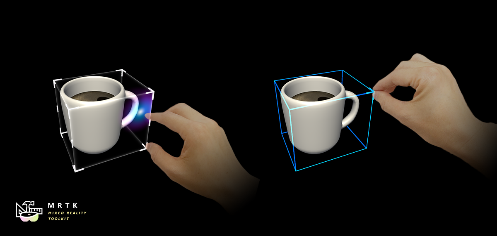
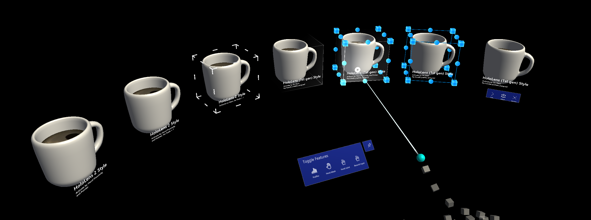
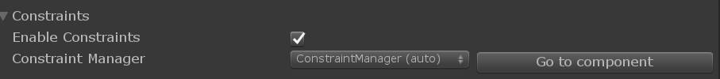
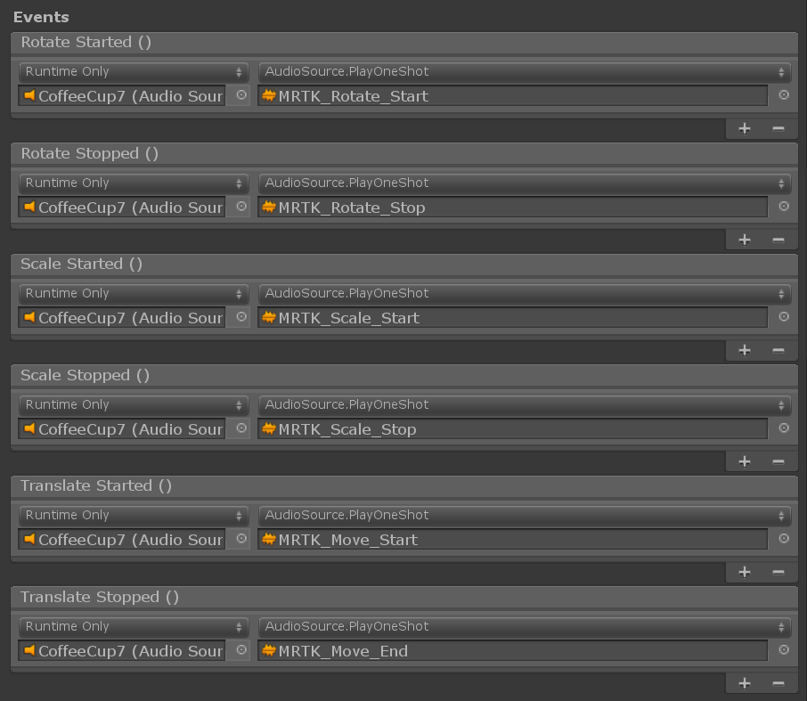
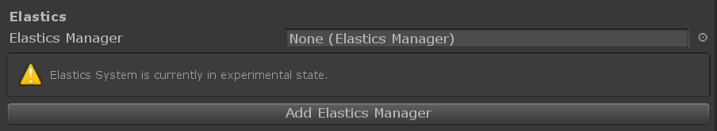
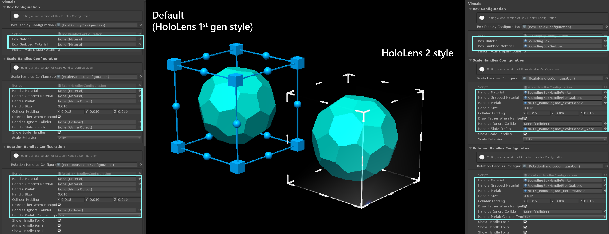
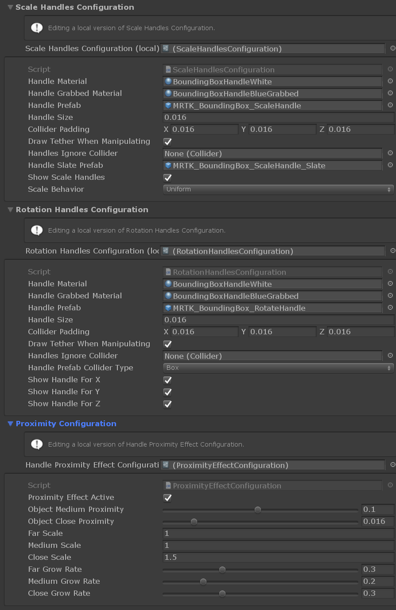
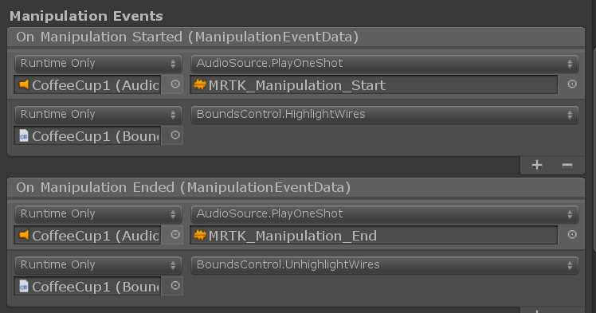
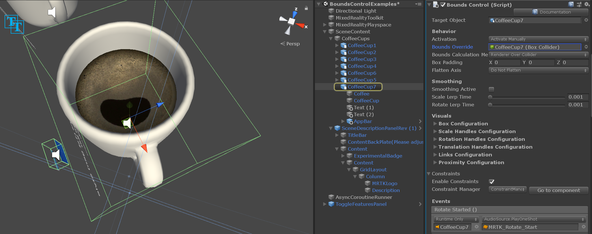
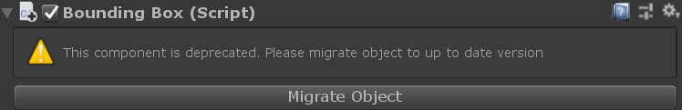

# Bounds Control (バウンズ コントロール)



*BoundsControl (バウンズ コントロール)* は、以前は *BoundingBox* にあったマニピュレーション動作のための新しいコンポーネントです。バウンズ コントロールは、セットアップにおける多くの改善と簡素化が行われ、新しい機能が追加されています。このコンポーネントはバウンディング ボックスの代替品であり、バウンディング ボックスは非推奨となります。

[`BoundsControl.cs`](xref:Microsoft.MixedReality.Toolkit.UI.BoundsControl) スクリプトは、Mixed Reality でオブジェクトを変化させるための基本的な機能を提供します。バウンズ コントロールは、ホログラムの周りにボックスを表示して、インタラクション可能であることを示します。ボックスの角と辺にあるハンドルを使って、オブジェクトを拡大縮小、回転、平行移動させることができます。バウンズ コントロールは、ユーザーの入力にも反応します。例えば、HoloLens 2 では、バウンズ コントロールは指の接近に反応し、オブジェクトからの距離を知覚するのに役立つ視覚的なフィードバックを提供します。すべてのインタラクションとビジュアルは簡単にカスタマイズできます。

## サンプル シーン

バウンズ コントロールの設定の例は、`BoundsControlExamples` シーンで見ることができます。



## インスペクターのプロパティ

### Target Object (対象オブジェクト)

このプロパティは、バウンズ コントロールの操作によってどのオブジェクトが変化させられるかを指定します。オブジェクトが設定されていない場合、デフォルトでコンポーネントを所有するオブジェクトになります。

### Activation Behavior (活性化の動作)

バウンズ コントロール インターフェイスを活性化するには、いくつかのオプションがあります。

* *Activate On Start (スタート時に活性化)*: シーンが開始されるとバウンズ コントロールが表示されます。
* *Activate By Proximity (近接時に活性化)*: 多関節ハンドがオブジェクトに近づいたときにバウンズ コントロールが表示されます。
* *Activate By Pointer (ポインターで活性化)*: ハンドレイ ポインターでターゲットされたときにバウンズ コントロールが表示されます。
* *Activate By Proximity and Pointer (近接時とポインターで活性化)*: ハンドレイ ポインターでターゲットされたときや多関節ハンドがオブジェクトに近づいたときにバウンズ コントロールが表示されます。
* *Activate Manually (手動で活性化)*: バウンズ コントロールは自動的には表示されません。boundsControl.Active プロパティにアクセスすることで、スクリプトを使って手動で活性化することができます。

### Bounds Override (境界のオーバーライド)

境界の計算のためにオブジェクトからボックス コライダーを設定します。

### Box Padding (ボックスのパディング)

バウンズ コントロールの範囲を計算するために使用されるコライダーの境界にパディングを追加します。これはインタラクションだけでなく、ビジュアルにも影響を与えます。

<a name="flatten-axis"></a>

### Flatten Axis (平坦化軸)
バウンズ コントロールが2次元になって1つの軸に沿った操作ができなくなるように、1つの軸について平坦化されるかどうかを示します。この機能は、スレートのような薄いオブジェクトに使用できます。
Flatten Axis が *Flatten Auto* に設定されている場合、スクリプトは自動的に最小の範囲を持つ軸を Flatten Axis として選択します。

### Smoothing (スムージング)
スムージングのセクションでは、バウンズ コントロールのスケールと回転に対するスムージングの動作を設定することができます。

### Visuals (ビジュアル)
バウンズ コントロールの見た目は、対応するビジュアル コンフィギュレーションの1つを変更することで設定できます。
ビジュアル コンフィギュレーションはリンクされたオブジェクトかインラインのスクリプタブル オブジェクトで、詳細は[コンフィギュレーション オブジェクトのセクション](#configuration-objects)で説明されています。

<a name="configuration-objects"></a>

## Configuration Objects (設定オブジェクト)
バウンズ コントロールには、スクリプタブル オブジェクトとして保存され、異なるインスタンスやプレハブ間で共有することができる設定オブジェクトのセットが付属しています。設定は、個々のスクリプタブル アセット ファイルとして、またはプレハブ内にネストされたスクリプタブル アセットとして、共有したりリンクしたりすることができます。また、外部のスクリプタブル アセットやネストされたスクリプタブル アセットにリンクすることなく、インスタンス上で直接設定を定義することもできます。

バウンズ コントロールのインスペクターは、設定が共有されているか、現在のインスタンスの一部としてインライン化されているかを、プロパティ インスペクターにメッセージを表示することで示します。さらに、共有されたインスタンスはバウンズ コントロールのプロパティ ウィンドウで直接編集することはできず、かわりに、共有された設定を誤って変更しないようにリンク先のアセットを直接修正しなければなりません。

現在のところ、バウンズ コントロールは以下の機能のための設定オブジェクトのオプションを提供しています。
- ハンドル
  - [拡大縮小ハンドル](#scale-handles-configuration)
  - [回転ハンドル](#rotation-handles-configuration)
  - [移動ハンドル](#translation-handles-configuration)
- [リンク / ワイヤーフレーム](#links-configuration)
- [ボックス表示](#box-configuration)
- [近接効果](#proximity-effect-configuration)

<a name=box-configuration></a>

### Box Configuration (ボックス設定)
ボックス設定は、コライダーのサイズとボックスのパディングで定義された境界を持つソリッド ボックスのレンダリングを担当します。以下のプロパティを設定可能です。

- **Box Material (ボックスのマテリアル)**: インタラクションが行われていないときにレンダリングされるボックスに適用されるマテリアルを定義します。ボックスは、このマテリアルが設定されている場合にのみレンダリングされます。
- **Box Grabbed Material (掴まれたボックスのマテリアル)**：ユーザーがニアまたはファー インタラクションで掴んでバウンズ コントロールとインタラクションしたときのボックスのマテリアルです。
- **Flatten Axis Display Scale (平坦化軸の表示スケール)**: 軸の1つが[平坦化](#flatten-axis)されている場合にボックスの表示に適用されるスケールです。

<a name=scale-handles-configuration></a>

### Scale Handles Configuration (拡大縮小ハンドル設定)
このプロパティでは、バウンズ コントロールの拡大縮小ハンドルの動作や見た目を変更することができます。

- **Handle Material (ハンドルのマテリアル)**: ハンドルに適用されるマテリアルです。
- **Handle Grabbed Material (掴まれたハンドルのマテリアル)**: 掴まれたハンドルに適用されるマテリアルです。
- **Handle Prefab (ハンドルのプレハブ)**: 拡大縮小ハンドルのオプションのプレハブです。何も設定されていない場合は MRTK はデフォルトとしてキューブを使います。
- **Handle Size (ハンドルのサイズ)**: 拡大縮小ハンドルのサイズです。
- **Collider Padding (コライダーのパディング)**: ハンドルのコライダーに追加されるパディングです。
- **Draw Tether When Manipulating (操作時のテザー描画)**: アクティブにすると、インタラクションの開始点から現在の手またはポインタの位置までテザー線を描画します。
- **Handles Ignore Collider (ハンドルが無視するコライダー)**: コライダーがここにリンクされている場合、ハンドルはこのコライダーとの衝突を無視します。
- **Handle Slate Prefab (ハンドル スレートのプレハブ)**: バウンズ コントロールが平坦化されたときにハンドルに使われるプレハブです。
- **Show Scale Handles (拡大縮小ハンドルを表示)**: ハンドルの表示をコントロールします。
- **Scale Behavior (拡大縮小動作)**: 一様もしくは不一様のスケーリングに設定できます。

<a name=rotation-handles-configuration></a>

### Rotation Handles Configuration (回転ハンドル設定)
この設定では回転ハンドルの動作を定義します。

- **Handle Material (ハンドルのマテリアル)**: ハンドルに適用されるマテリアルです。
- **Handle Grabbed Material (掴まれたハンドルのマテリアル)**: 掴まれたハンドルに適用されるマテリアルです。
- **Handle Prefab (ハンドルのプレハブ)**: ハンドルのオプションのプレハブです。何も設定されていない場合は MRTK はデフォルトとして球を使います。
- **Handle Size (ハンドルのサイズ)**: ハンドルのサイズです。
- **Collider Padding (コライダーのパディング)**: ハンドルのコライダーに追加されるパディングです。
- **Draw Tether When Manipulating (操作時のテザー描画)**: アクティブにすると、インタラクションの開始点から現在の手またはポインタの位置までテザー線を描画します。
- **Handles Ignore Collider (ハンドルが無視するコライダー)**: コライダーがここにリンクされている場合、ハンドルはこのコライダーとの衝突を無視します。
- **Handle Prefab Collider Type (ハンドル プレハブのコライダー タイプ)**: 作成されるハンドルに使われるコライダーのタイプです。
- **Show Handle For X (X のハンドル表示)**: X 軸のハンドル表示をコントロールします。
- **Show Handle For Y (Y のハンドル表示)**: Y 軸のハンドル表示をコントロールします。
- **Show Handle For Z (Z のハンドル表示)**: Z 軸のハンドル表示をコントロールします。

<a name=translation-handles-configuration></a>

### Translation Handles Configuration (移動ハンドル設定)
バウンズ コントロールの移動ハンドルの有効化や設定ができます。移動ハンドルはデフォルトでは無効になっていることに注意してください。

- **Handle Material (ハンドルのマテリアル)**: ハンドルに適用されるマテリアルです。
- **Handle Grabbed Material (掴まれたハンドルのマテリアル)**: 掴まれたハンドルに適用されるマテリアルです。
- **Handle Prefab (ハンドルのプレハブ)**: ハンドルのオプションのプレハブです。何も設定されていない場合は MRTK はデフォルトとして球を使います。
- **Handle Size (ハンドルのサイズ)**: ハンドルのサイズです。
- **Collider Padding (コライダーのパディング)**: ハンドルのコライダーに追加されるパディングです。
- **Draw Tether When Manipulating (操作時のテザー描画)**: アクティブにすると、インタラクションの開始点から現在の手またはポインタの位置までテザー線を描画します。
- **Handles Ignore Collider (ハンドルが無視するコライダー)**: コライダーがここにリンクされている場合、ハンドルはこのコライダーとの衝突を無視します。
- **Handle Prefab Collider Type (ハンドル プレハブのコライダー タイプ)**: 作成されるハンドルに使われるコライダーのタイプです。
- **Show Handle For X (X のハンドル表示)**: X 軸のハンドル表示をコントロールします。
- **Show Handle For Y (Y のハンドル表示)**: Y 軸のハンドル表示をコントロールします。
- **Show Handle For Z (Z のハンドル表示)**: Z 軸のハンドル表示をコントロールします。

<a name=links-configuration></a>

### Links Configuration (リンク設定) (ワイヤーフレーム)
リンク設定はバウンズ コントロールのワイヤーフレーム機能を有効にします。以下のプロパティが設定可能です。

- **Wireframe Material (ワイヤーフレームのマテリアル)**: ワイヤーフレームのメッシュに適用されるマテリアルです。
- **Wireframe Edge Radius (ワイヤーフレームの辺の半径)**: ワイヤーフレームの厚みです。
- **Wireframe Shape (ワイヤーフレームの形状)**: ワイヤーフレームの形状を立方体か円柱のどちらかに設定できます。
- **Show Sireframe (ワイヤーフレームの表示)**: ワイヤーフレームの表示をコントロールします。

<a name=proximity-effect-configuration></a>

### Proximity Effect Configuration (近接効果設定)
手との距離に応じたアニメーションでハンドルを表示・非表示します。2段階のスケーリング アニメーションがあります。デフォルトは Hololens 2 スタイルの動作に設定されています。


- **Proximity Effect Active (近接効果の有効化)**: 近接ベースのハンドル有効化を有効にします。
- **Object Medium Proximity (オブジェクトへの中距離近接)**: 第1ステップ スケーリングが実行される距離
- **Object Close Proximity (オブジェクトへの近距離近接)**: 第2ステップ スケーリングが実行される距離
- **Far Scale (遠距離スケール)**: ハンドがバウンズ コントロールのインタラクション範囲（上の 'Object Medium Proximity' で定義された距離）よりも外側にある場合のハンドル アセットのデフォルト スケール値（デフォルトでハンドルを非表示にする場合は 0 を利用してください)
- **Medium Scale (中距離スケール)**: ハンドがバウンズ コントロールのインタラクション範囲（上の 'Object Medium Proximity' で定義された距離）の内側にある場合のハンドル アセットのスケール値（通常サイズで表示するには 1 を利用してください)
- **Close Scale (近距離スケール)**: ハンドがグラブ インタラクション範囲（上の 'Object Close Proximity' で定義された距離）の内側にある場合のハンドル アセットのスケール値（拡大したサイズで表示するには 1.x を利用してください)
- **Far Grow Rate (遠距離での成長率)**: ハンドが中距離近接から遠距離近接へと移動したときの、近接スケールされたオブジェクトをスケールさせる割合です。
- **Medium Grow Rate (中距離での成長率)**: ハンドが中距離近接から近距離近接へと移動したときの、近接スケールされたオブジェクトをスケールさせる割合です。
- **Close Grow Rate (近距離での成長率)**: ハンドが近距離近接からオブジェクト中心へと移動したときの、近接スケールされたオブジェクトをスケールさせる割合です。

## Constraint System (コンストレイント システム)
バウンズ コントロールは [コンストレイント マネージャー](README_ConstraintManager.md) を使用して、バウンズ コントロール ハンドルを使用している際の移動、回転、スケーリングの動作を制限または変更することをサポートしています。

インスペクターのプロパティでは、同じゲーム オブジェクトにアタッチされているすべての利用可能なコンストレイント マネージャがドロップダウンで表示され、スクロールや選択されているコンストレイント マネージャーのハイライト表示ができます。



## Events (イベント)

バウンズ コントロールは以下のイベントを提供します。この例では、これらのイベントを使用してオーディオ フィードバックを再生します。

* **Rotate Started (回転開始)**: 回転が開始したときに発火されます。
* **Rotate Stopped (回転終了)**: 回転が終了したときに発火されます。
* **Scale Started (拡大縮小開始)**: 拡大縮小が開始したときに発火されます。
* **Scale Stopped (拡大縮小終了)**: 拡大縮小が終了したときに発火されます。
* **Translate Started (移動開始)**: 移動が開始したときに発火されます。
* **Translate Stopped (移動終了)**: 移動が終了したときに発火されます。



## Elastics (エラスティックス) [Experimental]
エラスティックスはバウンズ コントロールでオブジェクトを操作する際に使用することができます。[Elastics System (エラスティックス システム)](Elastics/ElasticSystem.md) はまだ実験段階であることにご注意ください。エラスティックスを有効にするには、既存のエラスティックス マネージャー コンポーネントをリンクするか、`Add Elastics Manager` ボタンを使って新しいエラスティックス マネージャーを作成してリンクします。



## ハンドルのスタイル

By default, when you just assign the [`BoundsControl.cs`](xref:Microsoft.MixedReality.Toolkit.UI.BoundsControl) script, it will show the handle of the HoloLens 1st gen style. To use HoloLens 2 style handles, you need to assign proper handle prefabs and materials.



Below are the prefabs, materials, and the scaling values for the HoloLens 2 style bounds control handles. You can find this example in the `BoundsControlExamples` scene.



### ハンドル (HoloLens 2 スタイルのセットアップ)

* **Handle Material (ハンドルのマテリアル)**: BoundingBoxHandleWhite.mat
* **Handle Grabbed Material (掴まれたハンドルのマテリアル)**: BoundingBoxHandleBlueGrabbed.mat
* **Scale Handle Prefab (拡大縮小ハンドルのプレハブ**: MRTK_BoundingBox_ScaleHandle.prefab
* **Scale Handle Slate Prefab (スレートの拡大縮小ハンドルのプレハブ)**: MRTK_BoundingBox_ScaleHandle_Slate.prefab
* **Scale Handle Size (拡大縮小ハンドルのサイズ)**: 0.016 (1.6cm)
* **Scale Handle Collider Padding (拡大縮小ハンドルのコライダーのパディング)**: 0.016 (掴めるコライダーをハンドルの見た目よりも少し大きくします)
* **Rotation Handle Prefab (回転ハンドルのプレハブ)**: MRTK_BoundingBox_RotateHandle.prefab
* **Rotation Handle Size (回転ハンドルのサイズ)**: 0.016
* **Rotation Handle Collider Padding (回転ハンドルのコライダーのパディング)**: 0.016 (掴めるコライダーをハンドルの見た目よりも少し大きくします)

## Transformation changes with object manipulator

A bounds control can be used in combination with [`ObjectManipulator.cs`](README_ObjectManipulator.md) to allow for certain types of manipulation (eg. moving the object) without using handles. The manipulation handler supports both one and two-handed interactions. [Hand tracking](Input/HandTracking.md) can be used to interact with an object up close.



In order for the bounds control edges to behave the same way when moving it using [`ObjectManipulator`](README_ObjectManipulator.md)'s far interaction, it is advised to connect its events for *On Manipulation Started* / *On Manipulation Ended* to `BoundsControl.HighlightWires` / `BoundsControl.UnhighlightWires` respectively, as shown in the screenshot above.


## How to add and configure a bounds control using Unity Inspector

1. Add Box Collider to an object
2. Assign `BoundsControl` script to an object
3. Configure options, such as 'Activation' methods (see [Inspector properties](#inspector-properties) section below)
4. (Optional) Assign prefabs and materials for a HoloLens 2 style bounds control (see [Handle styles](#handle-styles) section below)

> [!NOTE]
> Use *Target Object* and *Bounds Override* field in the inspector to assign specific object and collider in the object with multiple child components.



## How to add and configure a bounds control in the code

1. Instantiate cube GameObject

    ```c#
    GameObject cube = GameObject.CreatePrimitive(PrimitiveType.Cube);
    ```

1. Assign `BoundsControl` script to an object with collider, using AddComponent<>()

    ```c#
    private BoundsControl boundsControl;
    boundsControl = cube.AddComponent<BoundsControl>();
    ```

1. Configure options either directly on the control or via one of the scriptable configurations (see [Inspector properties](#inspector-properties) and [Configurations](#configuration-objects) section below)

    ```c#
	// Change activation method
	boundsControl.BoundsControlActivation = BoundsControlActivationType.ActivateByProximityAndPointer;
    // Make the scale handles large
    boundsControl.ScaleHandlesConfig.HandleSize = 0.1f;
    // Hide rotation handles for x axis
    boundsControl.RotationHandlesConfig.ShowRotationHandleForX = false;
    ```

1. (Optional) Assign prefabs and materials for a HoloLens 2 style bounds control. This still requires assignments through the inspector since the materials and prefabs should be dynamically loaded.

> [!NOTE]
> Using Unity's 'Resources' folder or [Shader.Find]( https://docs.unity3d.com/ScriptReference/Shader.Find.html) for dynamically loading shaders is not recommended since shader permutations may be missing at runtime.

```c#
BoxDisplayConfiguration boxConfiguration = boundsControl.BoxDisplayConfig;
boxConfiguration.BoxMaterial = [Assign BoundingBox.mat]
boxConfiguration.BoxGrabbedMaterial = [Assign BoundingBoxGrabbed.mat]
ScaleHandlesConfiguration scaleHandleConfiguration = boundsControl.ScaleHandlesConfig;
scaleHandleConfiguration.HandleMaterial = [Assign BoundingBoxHandleWhite.mat]
scaleHandleConfiguration.HandleGrabbedMaterial = [Assign BoundingBoxHandleBlueGrabbed.mat]
scaleHandleConfiguration.HandlePrefab = [Assign MRTK_BoundingBox_ScaleHandle.prefab]
scaleHandleConfiguration.HandleSlatePrefab = [Assign MRTK_BoundingBox_ScaleHandle_Slate.prefab]
scaleHandleConfiguration.HandleSize = 0.016f;
scaleHandleConfiguration.ColliderPadding = 0.016f;
RotationHandlesConfiguration rotationHandleConfiguration = boundsControl.RotationHandlesConfig;
rotationHandleConfiguration.HandleMaterial = [Assign BoundingBoxHandleWhite.mat]
rotationHandleConfiguration.HandleGrabbedMaterial = [Assign BoundingBoxHandleBlueGrabbed.mat]
rotationHandleConfiguration.HandlePrefab = [Assign MRTK_BoundingBox_RotateHandle.prefab]
rotationHandleConfiguration.HandleSize = 0.016f;
rotationHandleConfiguration.ColliderPadding = 0.016f;
```

### 例: MinMaxScaleConstraint を使ってバウンズ コントロールの最小スケール最大スケールを設定する

最小スケール最大スケールを設定するには、 [`MinMaxScaleConstraint`](xref:Microsoft.MixedReality.Toolkit.UI.MinMaxScaleConstraint) をバウンズ コントロールに追加します。バウンズ コントロールはコンストレイント マネージャーを自動的にアタッチして有効にするため、MinMaxScaleConstraint がアタッチされて設定されると、MinMaxScaleConstraint は Transform の変更に自動的に適用されます。

MinMaxScaleConstraint は [`ObjectManipulator`](xref:Microsoft.MixedReality.Toolkit.UI.ObjectManipulator) の最小スケール最大スケールを設定するためにも利用できます。

```c#
GameObject cube = GameObject.CreatePrimitive(PrimitiveType.Cube);
bcontrol = cube.AddComponent<BoundsControl>();
// 重要: BoundsControl はスタート時にコンストレイント マネージャーが存在しない場合は作成します。
// 手動でコンストレイント マネージャーをアタッチする必要はありません。
MinMaxScaleConstraint scaleConstraint = bcontrol.gameObject.AddComponent<MinMaxScaleConstraint>();
scaleConstraint.ScaleMinimum = 1f;
scaleConstraint.ScaleMaximum = 2f;
```

## 例: バウンズ コントロールをゲーム オブジェクトの周囲に追加する

オブジェクトの周囲にバウンズ コントロールを追加するには、単に `BoundsControl` コンポーネントを追加します。

```c#
private void PutABoundsControlAroundIt(GameObject target)
{
   target.AddComponent<BoundsControl>();
}
```

## Bounding Box からの移行
既存のプレハブや、[Bounding Box](README_BoundingBox.md) を使用しているインスタンスは、MRTK Tools パッケージの一部である [Migration Window](Tools/MigrationWindow.md) を使用して、新しいバウンズ コントロールにアップグレードすることができます。

Bounding Box の個々のインスタンスをアップグレードするために、コンポーネントのプロパティ インスペクターの中に移行オプションもあります。



## 関連項目

- [Object manipulator](README_ObjectManipulator.md)
- [Constraint manager](README_ConstraintManager.md)
- [Migration window](Tools/MigrationWindow.md)
- [Elastics system (Experimental)](Elastics/ElasticSystem.md)