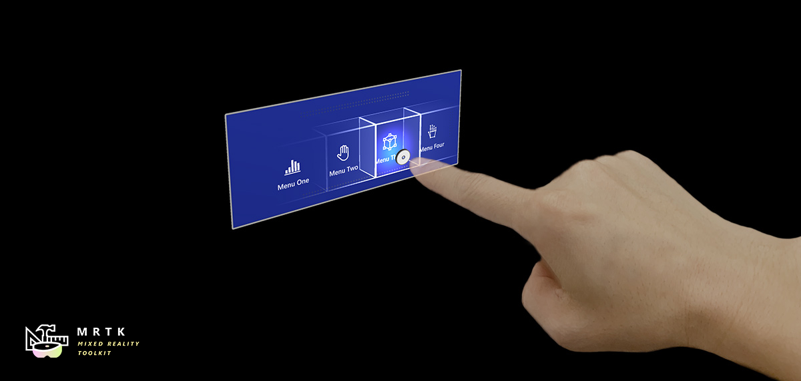
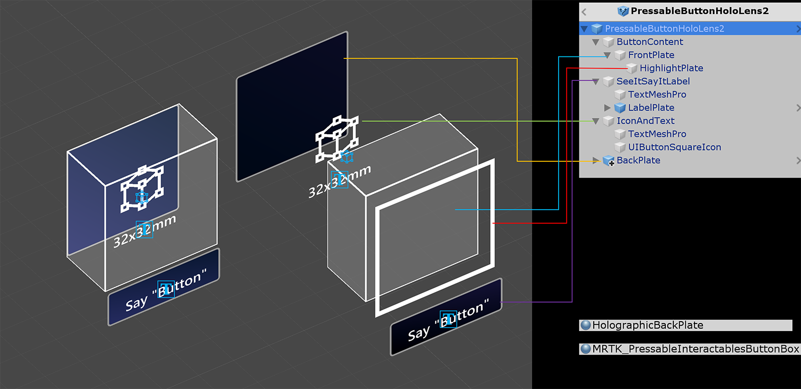

# ボタン (Button)

ボタン (button) を使うと、ユーザは即座にアクションを引き起こすことができます。Mixed Reality の最も基本的なコンポーネントの１つです。MRTK は、様々なタイプのボタン プレハブを提供しています。

## MRTK のボタン プレハブ

``MixedRealityToolkit.SDK/Features/UX/Interactable/Prefabs`` フォルダ下のボタン プレハブのサンプル

|   PressableButtonHoloLens2 |  PressableButtonHoloLens2Unplated |  PressableButtonHoloLens2Circular |
|:--- | :--- | :--- |
| HoloLens 2 のバック プレート付きのシェル スタイル ボタンは、ボーダー ライト (border light)、近接ライト (proximity light)、扁平なフロント プレート (compressed front plate) などの様々な視覚フィードバックをサポートします。 | バックプレートのない HoloLens 2 のシェル スタイル ボタン | HoloLens 2 の円形シェル スタイル ボタン |
|   **PressableButtonHoloLens2_32x96** |  **PressableButtonHoloLens2Bar3H** |  **PressableButtonHoloLens2Bar3V** |
| ワイドな HoloLens 2 のシェル スタイル ボタン 32x96mm | バック プレートを共有する水平な HoloLens 2 ボタン バー | バック プレートを共有する垂直な HoloLens 2 ボタン バー |
|   **Radial** |  **Checkbox** |  **ToggleSwitch** |
| Radial button | Checkbox  | Toggle switch |
|   **ButtonHoloLens1** |  **PressableRoundButton** |  **Button** |
| HoloLens 1 のシェル スタイル ボタン | 丸型押しボタン | ベーシックなボタン |

[`Button.prefab`](https://github.com/Microsoft/MixedRealityToolkit-Unity/blob/mrtk_release/Assets/MixedRealityToolkit.SDK/Features/UX/Interactable/Prefabs/Button.prefab) は、 [Interactable](README_Interactable.md) のコンセプトに基づいており、ボタンまたはその他のタイプのインタラクション可能な面に簡単な UI コントロールを提供します。 ベースライン ボタンは、近くのインタラクション要素に対して多関節ハンド (articulated hand) で入力する場合や、遠くのインタラクション要素に対してゲイズ＋エアタップなど、利用可能な全ての入力方法をサポートします。音声コマンドを使用してボタンをトリガーすることもできます。

[`PressableButtonHoloLens2.prefab`](https://github.com/Microsoft/MixedRealityToolkit-Unity/blob/mrtk_release/Assets/MixedRealityToolkit.SDK/Features/UX/Interactable/Prefabs/PressableButtonHoloLens2.prefab) は、HoloLens 2 のシェル スタイル ボタンで、ダイレクト ハンド トラッキングの入力用に精密な動きをサポートします。 `Interactable` のスクリプトと `PressableButton` のスクリプトを組合わせています。

## 押しボタン (Pressable button) の使い方

単に [`PressableButtonHoloLens2.prefab`](https://github.com/Microsoft/MixedRealityToolkit-Unity/blob/mrtk_release/Assets/MixedRealityToolkit.SDK/Features/UX/Interactable/Prefabs/PressableButtonHoloLens2.prefab) または[`PressableButtonHoloLens2Unplated.prefab`](https://github.com/Microsoft/MixedRealityToolkit-Unity/blob/mrtk_release/Assets/MixedRealityToolkit.SDK/Features/UX/Interactable/Prefabs/PressableButtonHoloLens2Unplated.prefab) をドラッグしてシーンに置くだけです。これらのボタン プレハブは、多関節ハンド (articulated hand) 入力やゲイズなど、様々なタイプの入力に対して視聴覚フィードバックするように既に設定されています。

プレハブ自体と [Interactable](README_Interactable.md) コンポーネントで公開されているイベントを使用して、追加のアクションをトリガーできます。 [HandInteractionExample のシーン](README_HandInteractionExamples.md)の pressable buttons は、Interactable の *OnClick* イベントを使って、キューブの色の変更をトリガーします。このイベントは、ゲイズ、エアタップ、ハンド レイ などの様々なタイプの入力メソッド、及び pressable button のスクリプトを介した物理的なボタンの押下に対してトリガーされます。

ボタンの `PhysicalPressEventRouter` を介して、Pressable button が *OnClick* イベントを発生させるタイミングを設定できます。例えば、*Interactable On Click* を *Event On Press* に設定することにより、*OnClick* をボタンを押して離した時ではなく、最初に押した時にトリガーするよう設定できます。

多関節ハンドの入力状態情報を活用するには、pressable button イベントの - *Touch Begin*, *Touch End*, *Button Pressed*, *Button Released* を使用できます。ただし、これらのイベントは、エアタップ、ハンド レイ、ゲイズ 入力には応答して発生はしません。

## インタラクションの状態

アイドル状態では、ボタンの前面プレートは見えません。指が近づいたり、視線入力のカーソルが表面をターゲットすると、前面のプレートの光る境界線が現れます。前面プレートの表面には、指先の位置がさらにハイライトされます。指で押すと、前面プレートが指先で動きます。指先が前面プレートの表面に触れると、わずかにパルスのエフェクトが現れ、タッチ ポイントの視覚的なフィードバックが得られます。

このわずかなパルス エフェクトは、現在インタラクションしているポインター上に存在する  *ProximityLight(s)* を探す、pressable button によってトリガーされます。近接ライトが見つかった場合、  `ProximityLight.Pulse` メソッドが呼び出され、シェーダー パラメーターを自動的にアニメーション化してパルスを表示します。

## [Inspector] (インスペクター) プロパティ

**ボックスコライダー (Box Collider)**
ボタンの前面プレートのための `Box Collider`。

**押しボタン (Pressable Button)**
ハンド プレス インタラクションでのボタン移動のロジック。

**物理的なプレス イベントのルーター (Physical Press Event Router)**
ハンド プレス インタラクションから [Interactable](README_Interactable.md) へイベントを送るスクリプト。

**Interactable**
[Interactable](README_Interactable.md) は様々なタイプのインタラクションの状態とイベントを処理します。HoloLens のゲイズ、ジェスチャ、及び音声入力と、没入型ヘッドセットのモーションコントローラーの入力は、このスクリプトによって直接処理されます。

**オーディオ ソース**
音声フィードバック クリップ用の Unity のオーディオ ソース。

*NearInteractionTouchable.cs*
多関節ハンドでオブジェクトをタッチ可能にするために必要です。

## プレハブのレイアウト

*ButtonContent* オブジェクトには、フロント プレート、テキスト ラベル、およびアイコンが含まれています。 *FrontPlate*は、*Button_Box* シェーダーを使用して、人差し指の近接に応答します。 光る境界線、近接ライト、およびタッチのパルス エフェクトを示します。 テキスト ラベルは TextMesh Pro で作成されます。 *SeeItSayItLabel* の可視性は、[Interactable]（README_Interactable.md）のテーマによって制御されます。

## 音声コマンド ('See-it, Say-it')

**音声入力ハンドラー (Speech Input Handler)**
Pressable Buttonの [Interactable]（README_Interactable.md）スクリプトは、すでに `IMixedRealitySpeechHandler`を実装しています。 ここで音声コマンドのキーワードを設定できます。

**音声入力プロファイル (Speech Input Profile)**
さらに、グローバルな *Speech Commands Profile* に音声コマンド キーワードを登録する必要があります。

**See-it, Say-it ラベル**
Pressable Button プレハブには、*SeeItSayItLabel* オブジェクトの下にプレースホルダー TextMesh Pro ラベルがあります。このラベルを使用して、ボタンの音声コマンド キーワードをユーザーに伝えることができます。

## ボタンをゼロから作成する方法

これらのボタンの例は、**PressableButtonExample** のシーンにあります。

### 1. キューブで Pressable Button を作成する (ニア インタラクションのみ)

1. Unity のキューブを作成します (GameObject> 3D Object> Cube)
2. `PressableButton.cs` のスクリプトを追加します
3. `NearInteractionTouchable.cs` のスクリプトを追加します

`PressableButton` の [Inspector] (インスペクター) パネルで、キューブ オブジェクトを **Moving Button Visuals** に割り当てます。

キューブを選択すると、オブジェクト上に複数の色付きのレイヤーが表示されます。 これにより、**Press Settings** 以下で設定されている距離の値が可視化されます。ハンドルを使用して、プレスを開始する (オブジェクトが動く) タイミングとイベントをトリガーするタイミングを設定できます。

ボタンを押すと、ボタンが移動し、TouchBegin()、TouchEnd()、ButtonPressed()、ButtonReleased() などの `PressableButton.cs` のスクリプトで公開されている適切なイベントが生成されます。

### 2. 視覚的なフィードバックをベーシックなキューブ ボタンに加える

MRTK Standard Shader は、視覚的なフィードバックを簡単に追加できるさまざまな機能を提供しています。 マテリアルを作成し、シェーダー `Mixed Reality Toolkit/Standard` を選択します。 または、MRTK 標準シェーダーを使用している `/SDK/StandardAssets/Materials/` にある既存のマテリアルの１つを使用または複製できます。

**Fluent Options** の下の `Hover Light` と `Proximity Light` をチェックします。 これにより、近くの手 (近接ライト) と遠くのポインター (ホバーライト) の両方のインタラクションの視覚的なフィードバックが可能になります。

### 3. オーディオ フィードバックをベーシックなキューブ ボタンに加える

`PressableButton.cs` のスクリプトは TouchBegin()、TouchEnd()、ButtonPressed()、ButtonReleased() などのイベントを公開するため、音声フィードバックを簡単に割り当てることができます。Unity の `Audio Source` をキューブ オブジェクトに追加し、AudioSource.PlayOneShot() を選択してオーディオ クリップを割り当てます。`/SDK/StandardAssets/Audio/` フォルダーの下の MRTK_Select_Main および MRTK_Select_Secondary オーディオ クリップを使用できます。

### 4. 視覚的な状態とファー インタラクションイベントの処理を加える

[Interactable]（README_Interactable.md）は、さまざまなタイプの入力インタラクションの視覚的な状態を簡単に作成できるスクリプトです。 また、ファー インタラクション イベントも処理します。`Interactable.cs` を追加し、キューブ オブジェクトを **Profiles** の下の **Target** フィールドにドラッグ アンド ドロップします。 次に、**ScaleOffsetColorTheme** タイプの新しいテーマを作成します。このテーマでは、**Focus** や **Pressed** などの特定のインタラクションの状態におけるオブジェクトの色を指定できます。スケールとオフセットも制御できます。**Easing** をチェックし、継続時間を設定して視覚的な変化をスムーズにします。

 
 

オブジェクトが遠く（ハンド レイ、またはゲイズ カーソル）と近く（ハンド）の両方のインタラクションに応答するのがわかります。

## カスタム ボタンのサンプル ##

[HandInteractionExample のシーン](README_HandInteractionExamples.md) で、ピアノと丸ボタンの例を見てみましょう。どちらも `PressableButton` を使用しています。

各ピアノのキーには、`PressableButton` と `NearInteractionTouchable` のスクリプトが割り当てられています。`NearInteractionTouchable` の *Local Forward* の方向が正しいことを確認することが重要です。エディターでは白い矢印で表されます。矢印がボタンの前面からその先を指していることを確認してください。

