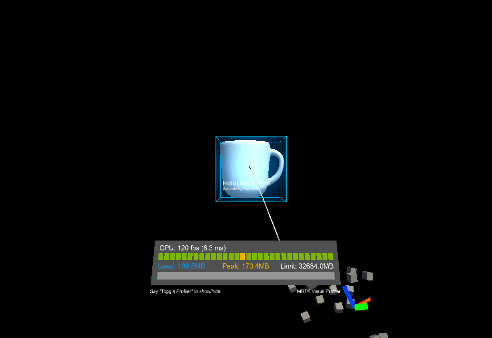

# Constraint Manager (コンストレイント マネージャー)

コンストレイント マネージャー (制約マネージャー) を利用すると、Transform にコンストレイント コンポーネントのセットを適用することができます。GameObject にアタッチされている [`TransformConstraint`](xref:Microsoft.MixedReality.Toolkit.UI.TransformConstraint) 型のコンポーネントが対象となります。
デフォルトでは、コンストレイント マネージャーは GameObject にアタッチされているすべての [コンストレイント コンポーネント](#transform-constraints) を自動的に集め、処理される Transform に適用します。
しかしながら、適用される制約のリストを手動で設定し、アタッチされている制約の一部分だけが適用されるようにすることを選択することもできます。

現在、以下の MRTK UX エレメントがコンストレイント マネージャーをサポートしています。
- [Bounds Control](README_BoundsControl.md)
- [Object Manipulator](README_ObjectManipulator.md)

## Inspector properties and fields

コンストレイント マネージャーは2つのモードで動作します。
- Auto Constraint Selection (自動制約選択)
- Manual Constraint Selection (手動制約選択)

### Auto Constraint Selection (自動制約選択)

コンストレイント マネージャーのデフォルトのモードである自動制約選択は、すべてのアタッチされているコンストレイント コンポーネントのリスト、[移動ボタン](#go-to-component)、[制約追加ボタン](#add-constraint-to-game-object) を提供しています。

#### Add Constraint to GameObject (GameObject に制約を追加)

このボタンでは、コンストレイント マネージャーのインスペクターから直接コンストレイント コンポーネントを追加することができます。プロジェクト内の全ての制約のタイプがここに表示されます。詳細については  [Transform 制約](#transform-constraints) をご覧ください。

#### Go to component (コンポーネントへ移動)

オブジェクト上で見つかった全ての制約は *Go to component* ボタンとともにここに表示されます。このボタンを押すと、選択されたコンストレイント コンポーネントの設定ができるよう、そのコンポーネントまでスクロールします。

### Manual Constraint Selection (手動制約選択)

If constraint manager is set to manual mode, only constraints that are linked in the constraint list are processed and applied to the transform. The list displayed will only show the user selected constraints as well as [go to buttons](#go-to-component) or options to remove or add entries.
When enabling manual mode for the first time, constraint manager will populate the list will all available components as a starting point for selecting attached constraint components.

### Remove Entry (項目の削除)
This removes the entry from the manually selected list. Note that this option will not remove the constraint component from the game object. Constraint components always need to be removed manually to ensure not accidentally breaking any other component referring to this component.

### Add Entry (項目の追加)
Add entry will open a dropdown showing all available constraint components that are not in the manual list yet. By clicking on any of the entries that component will be added to the manual constraint selection.

### Add New Constraint (新しい制約の追加)
This option will add a component of the selected type to the game object and add the newly created constraint component to the manual constraint list.

## Transform Constraints (Transform 制約)

Constraints can be used to limit manipulation in some way. For example, some applications may require rotation, but also require that the object remain upright. In this case, a `RotationAxisConstraint` can be added to the object and used to limit rotation to y-axis rotation. MRTK provides a number of constraints, all of which are described below.

It is also possible to define new constraints and use them to create unique manipulation behaviour that may be needed for some applications. To do this, create a script that inherits from [`TransformConstraint`](xref:Microsoft.MixedReality.Toolkit.UI.TransformConstraint) and implement the abstract `ConstraintType` property and the abstract `ApplyConstraint` method. Upon adding a new constraint to the object, it should constrain manipulation in the way that was defined. This new constraint should also show in the constraint manager [auto selection](#auto-constraint-selection) or [add entry](#add-entry) dropdown in manual mode.

All of the constraints provided by MRTK share the following properties:

#### Hand Type

Specifies whether the constraint is used for one handed, two handed or both kinds of manipulation. Because this property is a flag, both options can be selected.

* *One handed*: Constraint will be used during one handed manipulation if selected.
* *Two handed*: Constraint will be used during two handed manipulation if selected.

#### Proximity Type

Specifies whether the constraint is used for near, far or both kinds of manipulation. Because this property is a flag, both options can be selected.

* *Near*: Constraint will be used during near manipulation if selected.
* *Far*: Constraint will be used during far manipulation if selected.

### FaceUserConstraint (ユーザーのほうを向く制約)

When this constraint is attached to an object, rotation will be limited so that object will always face the user. This is useful for slates or panels. The properties for `FaceUserConstraint` are as follows:

#### Face Away (向こうを向く)

True の場合、オブジェクトはユーザーの反対側を向きます。

### FixedDistanceConstraint (固定距離制約)

This constraint fixes the distance between the manipulated object and another object transform on manipulation start. This is useful for behaviour such as fixing the distance from the manipulated object to the head transform. The properties for `FixedDistanceConstraint` are as follows:

#### Constraint transform

This is the other transform that the manipulated object will have a fixed distance to. Defaults to the camera transform.

### FixedRotationToUserConstraint (ユーザーに対する回転固定制約)

This constraint fixes the relative rotation between the user and the manipulated object while it is being manipulated. This is useful for slates or panels as it ensures that the manipulated object always shows the same face to the user as it did at the start of manipulation. The `FixedRotationToUserConstraint` does not have any unique properties.

### FixedRotationToWorldConstraint (ワールドに対する回転固定制約)

This constraint fixes the global rotation of the manipulated object while it is being manipulated. This can be useful in cases where no rotation should be imparted by manipulation. The `FixedRotationToWorldConstraint` does not have any unique properties:

### MaintainApparentSizeConstraint

When this constraint is attached to an object, no matter how far the object is from the user, it will maintain the same apparent size to the user (i.e. it will take up the same proportion of the user's field of view). This can be used to ensure that a slate or text panel remains readable while manipulating. The `MaintainApparentSizeConstraint` does not have any unique properties:

### MoveAxisConstraint (移動軸制約)

この制約は、操作されるオブジェクトが移動できる軸を固定するために使用できます。これは、平面の表面上や線に沿ってオブジェクトを移動させるのに便利です。`MoveAxisConstraint` のプロパティは以下の通りです。

#### Constraint On Movement (移動の制約)

移動を防止する軸を指定します。デフォルトでは、これらの軸はローカルではなくグローバルですが、以下で変更できます。このプロパティはフラグなので、任意の数のオプションを選択することができます。

* *X Axis (X 軸)*: 選択された場合、X 軸に沿った移動が制約されます。
* *Y Axis (Y 軸)*: 選択された場合、Y 軸に沿った移動が制約されます。
* *Z Axis (Z 軸)*: 選択された場合、Z 軸に沿った移動が制約されます。

#### Use Local Space For Constraint (制約にローカル スペースを使う)

True の場合、操作されるオブジェクトのローカル座標系の軸相対での制約となります。デフォルトでは False です。

### RotationAxisConstraint (回転軸制約)

この制約は、操作されるオブジェクトが回転できる軸を固定するために使用できます。例えば、操作されるオブジェクトを直立させたまま、Y 軸まわりの回転は許可したい場合などに便利です。 `RotationAxisConstraint` のプロパティは以下の通りです。

#### Constraint On Rotation (回転の制約)

回転を防止する軸を指定します。デフォルトでは、これらの軸はローカルではなくグローバルですが、以下で変更できます。このプロパティはフラグなので、任意の数のオプションを選択することができます。

* *Y Axis (Y 軸)*: 選択された場合、Y 軸まわりの回転が制約されます。
* *Z Axis (Z 軸)*: 選択された場合、Z 軸まわりの回転が制約されます。
* *X Axis (X 軸)*: 選択された場合、X 軸まわりの回転が制約されます。

#### Use Local Space For Constraint (制約にローカル スペースを使う)

True の場合、操作されるオブジェクトのローカル座標系の軸相対での制約となります。デフォルトでは False です。

### MinMaxScaleConstraint (最小最大スケール制約)

この制約により、操作されるオブジェクトのスケールに最小値と最大値を設定することができます。これは、ユーザーがオブジェクトを小さくしすぎたり大きくしすぎたりするのを防ぐのに便利です。`MinMaxScaleConstraint` のプロパティは以下の通りです。

#### Scale Minimum (最小スケール)

操作中の最小のスケール値です。

#### Scale Maximum (最大スケール)

操作中の最大のスケール値です。

#### Relative To Initial State (初期値相対)

True の場合、上の値はオブジェクトの初期値相対の値として解釈されます。そうでなければ、絶対的なスケール値として解釈されます。
