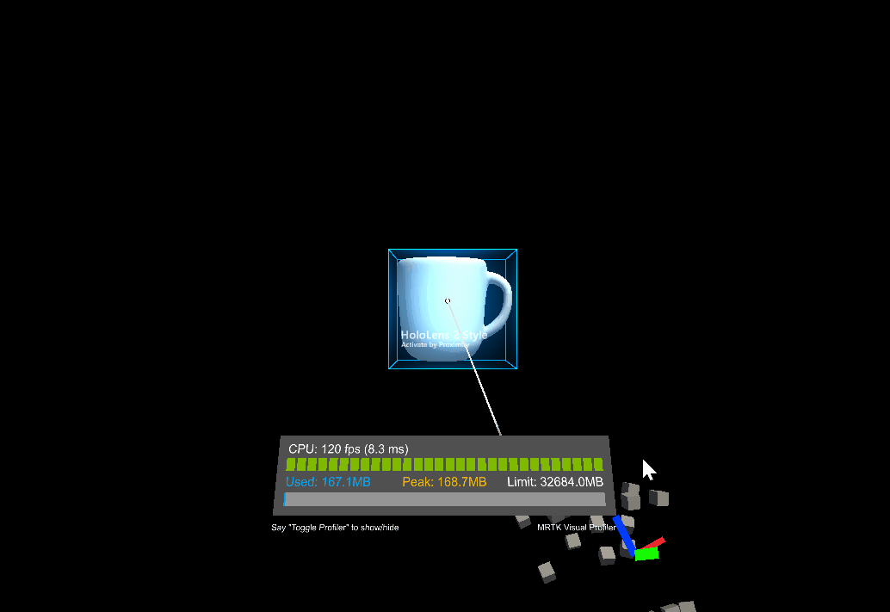
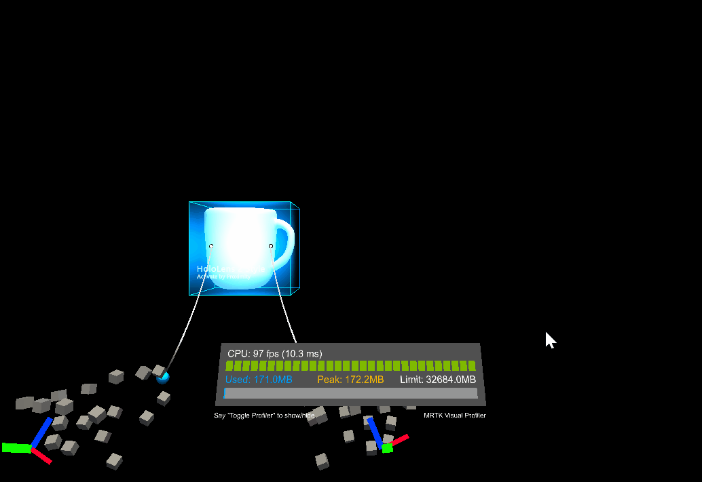

# Constraint Manager (コンストレイント マネージャー)

コンストレイント マネージャー (制約マネージャー) を利用すると、Transform にコンストレイント コンポーネントのセットを適用することができます。GameObject にアタッチされている [`TransformConstraint`](xref:Microsoft.MixedReality.Toolkit.UI.TransformConstraint) 型のコンポーネントが対象となります。
デフォルトでは、コンストレイント マネージャーは GameObject にアタッチされているすべての [コンストレイント コンポーネント](#transform-constraints) を自動的に集め、処理される Transform に適用します。
しかしながら、適用される制約のリストを手動で設定し、アタッチされている制約の一部分だけが適用されるようにすることを選択することもできます。

現在、以下の MRTK UX エレメントがコンストレイント マネージャーをサポートしています。
- [Bounds Control](README_BoundsControl.md)
- [Object Manipulator](README_ObjectManipulator.md)

## Inspector properties and fields

コンストレイント マネージャーは2つのモードで動作します。
- Auto Constraint Selection (自動制約選択)
- Manual Constraint Selection (手動制約選択)

### Auto Constraint Selection (自動制約選択)

コンストレイント マネージャーのデフォルトのモードである自動制約選択は、すべてのアタッチされているコンストレイント コンポーネントのリスト、[移動ボタン](#go-to-component)、[制約追加ボタン](#add-constraint-to-game-object) を提供しています。

#### Add Constraint to GameObject (GameObject に制約を追加)

このボタンでは、コンストレイント マネージャーのインスペクターから直接コンストレイント コンポーネントを追加することができます。プロジェクト内の全ての制約のタイプがここに表示されます。詳細については  [Transform 制約](#transform-constraints) をご覧ください。

#### Go to component (コンポーネントへ移動)

オブジェクト上で見つかった全ての制約は *Go to component* ボタンとともにここに表示されます。このボタンを押すと、選択されたコンストレイント コンポーネントの設定ができるよう、そのコンポーネントまでスクロールします。

### Manual Constraint Selection (手動制約選択)

コンストレイント マネージャーが手動モードに設定されている場合、制約リストでリンクされている制約のみが Transform に適用されます。表示されるリストには、ユーザーが選択した制約と[移動ボタン](#go-to-component)、項目の削除や追加のオプションが表示されます。
はじめて手動モードを有効にした際、コンストレイント マネージャーはアタッチされたコンストレイント コンポーネントを選択する出発点として、すべての利用可能なコンポーネントのリストを生成します。

### Remove Entry (項目の削除)
手動で選択されたリストから項目を削除します。このオプションは GameObject からコンストレイント コンポーネントを削除しないことに注意してください。コンストレイント コンポーネントを参照している他のコンポーネントを誤って壊してしまわないようにするため、コンストレイント コンポーネントは常に手動で削除する必要があります。

### Add Entry (項目の追加)
Add Entry では手動のリストには入っていないすべての利用可能なコンストレイント コンポーネントがドロップダウンで表示されます。いずれかの項目をクリックすると、そのコンポーネントが手動制約選択に追加されます。

### Add New Constraint (新しい制約の追加)
このオプションは、選択したタイプのコンポーネントを GameObject に追加し、新しく作成したコンストレイント コンポーネントを手動制約リストに追加します。

## Transform Constraints (Transform 制約)

制約は、何らかの方法で操作を制限するために使用することができます。例えば、アプリケーションによっては回転が必要な場合もありますが、オブジェクトが直立したままであることも必要な場合があります。このような場合には、`RotationAxisConstraint` をオブジェクトに追加して、回転を Y 軸回転に制限することができます。MRTK はいくつかの制約を提供しており、その全てを以下で説明します。

また、新しい制約を定義して、アプリケーションによっては必要となるかもしれない独自の操作動作を作成するために使用することも可能です。これを行うには、[`TransformConstraint`](xref:Microsoft.MixedReality.Toolkit.UI.TransformConstraint) を継承するスクリプトを作成し、抽象的な `ConstraintType` プロパティと抽象的な `ApplyConstraint` メソッドを実装します。オブジェクトに新しい制約を追加すると、定義された方法で操作を制約しなければなりません。この新しい制約は、コンストレイント マネージャーの [Auto Selection](#auto-constraint-select) や、手動モードの [Add Entry](#add-entry) ドロップダウンにも表示されなければなりません。

MRTK で提供される全ての制約は、以下のプロパティを共有しています。

#### Hand Type (ハンド タイプ)

制約を片手操作に使用するか、両手操作に使用するか、両方の種類の操作に使用するかを指定します。このプロパティはフラグなため、両方のオプションを選択できます。

* *One Handed (片手)*: 選択されていると、片手操作の際に制約が使用されます。
* *Two Handed (両手)*: 選択されていると、両手操作の際に制約が使用されます。

#### Proximity Type (近接タイプ)

制約をニア マニピュレーションに使用するか、ファー マニピュレーションに使用するか、両方に使用するかを指定します。このプロパティはフラグなため、両方のオプションを選択できます。

* *Near (ニア)*: 選択されていると、ニア マニピュレーションの際に制約が使用されます。
* *Far (ファー)*: 選択されていると、ファー マニピュレーションの際に制約が使用されます。

### FaceUserConstraint (ユーザーのほうを向く制約)

この制約がオブジェクトにアタッチされていると、オブジェクトが常にユーザーの方を向くように回転が制限されます。これはスレートやパネルに便利です。`FaceUserConstraint` のプロパティは以下の通りです。

#### Face Away (向こうを向く)

True の場合、オブジェクトはユーザーの反対側を向きます。

### FixedDistanceConstraint (固定距離制約)

この制約は、操作するオブジェクトの Transform と別のオブジェクトの Transform との間の操作開始時の距離を固定します。これは、例えば操作するオブジェクトから頭の Transform への距離を固定するのに便利です。`FixedDistanceConstraint` のプロパティは以下の通りです。

#### Constraint Transform (制約 Transform)

これは、操作するオブジェクトが距離を固定する対象となる Transform です。デフォルトではカメラの Transform です。

### FixedRotationToUserConstraint (ユーザーに対する回転固定制約)

この制約は、操作している間のユーザーと操作するオブジェクトとの相対的な回転を固定します。この制約は、操作するオブジェクトが操作開始時と常に同じ面をユーザーに向けるようにするので、スレートやパネルに便利です。`FixedRotationToUserConstraint` には固有のプロパティはありません。

### FixedRotationToWorldConstraint (ワールドに対する回転固定制約)

この制約は、操作している間の操作しているオブジェクトのグローバルな回転を固定します。これは、操作によって回転すべきではない場合に便利です。`FixedRotationToWorldConstraint` には固有のプロパティはありません。

### MaintainApparentSizeConstraint

この制約がオブジェクトにアタッチされていると、オブジェクトがユーザーからどれだけ離れていても、ユーザーに対して見た目上同じサイズを保ちます (すなわち、ユーザーの視野の同じ割合を占めます)。これは、スレートやテキスト パネルを操作している間、読みやすい状態を維持するために使うことができます。`MaintainApparentSizeConstraint` には固有のプロパティはありません。

### MoveAxisConstraint (移動軸制約)

この制約は、操作されるオブジェクトが移動できる軸を固定するために使用できます。これは、平面の表面上や線に沿ってオブジェクトを移動させるのに便利です。`MoveAxisConstraint` のプロパティは以下の通りです。

#### Constraint On Movement (移動の制約)

移動を防止する軸を指定します。デフォルトでは、これらの軸はローカルではなくグローバルですが、以下で変更できます。このプロパティはフラグなので、任意の数のオプションを選択することができます。

* *X Axis (X 軸)*: 選択された場合、X 軸に沿った移動が制約されます。
* *Y Axis (Y 軸)*: 選択された場合、Y 軸に沿った移動が制約されます。
* *Z Axis (Z 軸)*: 選択された場合、Z 軸に沿った移動が制約されます。

#### Use Local Space For Constraint (制約にローカル スペースを使う)

True の場合、操作されるオブジェクトのローカル座標系の軸相対での制約となります。デフォルトでは False です。

### RotationAxisConstraint (回転軸制約)

この制約は、操作されるオブジェクトが回転できる軸を固定するために使用できます。例えば、操作されるオブジェクトを直立させたまま、Y 軸まわりの回転は許可したい場合などに便利です。 `RotationAxisConstraint` のプロパティは以下の通りです。

#### Constraint On Rotation (回転の制約)

回転を防止する軸を指定します。デフォルトでは、これらの軸はローカルではなくグローバルですが、以下で変更できます。このプロパティはフラグなので、任意の数のオプションを選択することができます。

* *Y Axis (Y 軸)*: 選択された場合、Y 軸まわりの回転が制約されます。
* *Z Axis (Z 軸)*: 選択された場合、Z 軸まわりの回転が制約されます。
* *X Axis (X 軸)*: 選択された場合、X 軸まわりの回転が制約されます。

#### Use Local Space For Constraint (制約にローカル スペースを使う)

True の場合、操作されるオブジェクトのローカル座標系の軸相対での制約となります。デフォルトでは False です。

### MinMaxScaleConstraint (最小最大スケール制約)

この制約により、操作されるオブジェクトのスケールに最小値と最大値を設定することができます。これは、ユーザーがオブジェクトを小さくしすぎたり大きくしすぎたりするのを防ぐのに便利です。`MinMaxScaleConstraint` のプロパティは以下の通りです。

#### Scale Minimum (最小スケール)

操作中の最小のスケール値です。

#### Scale Maximum (最大スケール)

操作中の最大のスケール値です。

#### Relative To Initial State (初期値相対)

True の場合、上の値はオブジェクトの初期値相対の値として解釈されます。そうでなければ、絶対的なスケール値として解釈されます。
