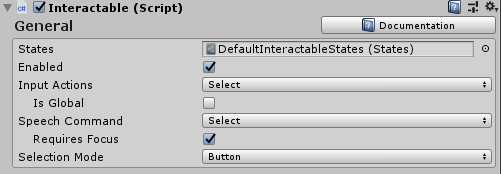
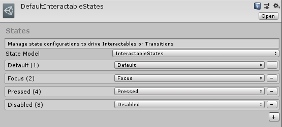
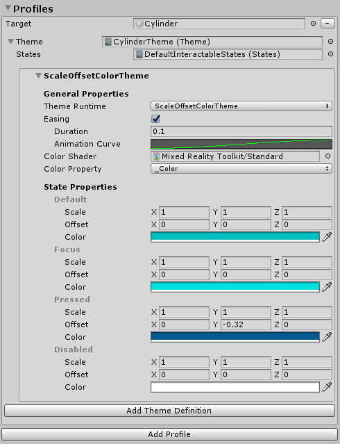
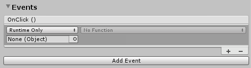
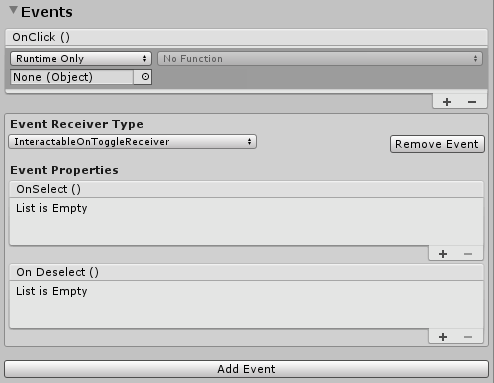
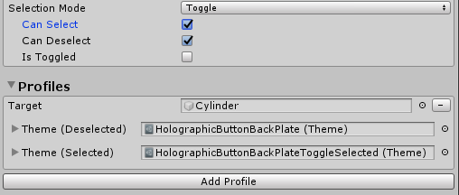
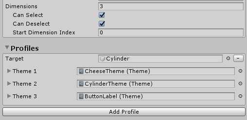

# Interactable (対話型 : インターラクティブル)


[`Interactable`](xref:Microsoft.MixedReality.Toolkit.UI.Interactable) コンポーネントは、あらゆるオブジェクトを容易に対話可能にし、入力に応答するオールインワンコンテナです。Interactable は、タッチ、ハンド レイ、音声認識などを含むすべてのタイプの入力のためのキャッチオールとして機能し、これらの相互作用を [イベント](#events) および [ビジュアル テーマ (Visual Themes)](visualthemes.md) の応答に流し込みます。このコンポーネントを使用すると、ボタンの作成やフォーカスのあるオブジェクトの色の変更などを簡単に行うことができます。

## Interactable の設定方法

このコンポーネントには、3つの主要な構成セクションがあります:

1) [General 入力設定](#general-入力設定)
1) 複数の GameObject を対象とした [ビジュアル テーマ](VisualThemes.md)
1) [イベント ハンドラ](#events)

### General 入力設定



**States**

*States* は [ScriptableObject](https://docs.unity3d.com/Manual/class-ScriptableObject.html) パラメータで、[Interactable プロファイル](#Interactable-プロファイル)と[ビジュアル テーマ](VisualThemes.md)に対して、押下や監視などの相互作用フェーズを定義します。

[**DefaultInteractableStates**](https://github.com/microsoft/MixedRealityToolkit-Unity/tree/mrtk_release/Assets/MixedRealityToolkit.SDK/Features/UX/Interactable/States/DefaultInteractableStates.asset) は MRTK の Out-Of-Box に付属しており、*Interactable* コンポーネントの既定のパラメータです。



*DefaultInteractableStates* アセットには4つの状態が含まれており、[`InteractableStates`](xref:Microsoft.MixedReality.Toolkit.UI.InteractableStates) ステート モデルの実装を利用します。

* **Default**: 何も起こっていません。これは最も独立したベース状態です。

* **Focus**: オブジェクトが指定されています。これは単一の状態で、他の状態は現在設定されていませんが、ランクはDefaultになります。

* **Press**: オブジェクトをポイントし、ボタンまたはハンドを押しています。Press 状態は Default と Focus をランク付けします。この状態は、フィジカルでの押す動作に対するフィードバックとしても設定されます。

* **Disabled**: このボタンはインタラクティブであってはなりません。また、何らかの理由でこのボタンが現在使用できないことが視覚的なフィードバックによってユーザーに通知されます。理論的には、disabled 状態には他のすべての状態を含めることができますが、Enabled がオフの場合は、Disabled 状態が他のすべての状態より優先されます。

リスト内の順序に応じて、ビット値 (#) が状態に割り当てられます。

> [!NOTE]
>  一般に、*Interactable* コンポーネントを作成する場合は、 [**DefaultInteractableStates**](https://github.com/microsoft/MixedRealityToolkit-Unity/tree/mrtk_release/Assets/MixedRealityToolkit.SDK/Features/UX/Interactable/States/DefaultInteractableStates.asset) を使用することをお勧めします。
>
> ただし、テーマの駆動に使用できる Interactable の状態は17ありますが、一部は他のコンポーネントによって駆動されるように設計されています。以下は、機能が組み込まれているもののリストです。
>
> * Visited: Interactable がクリックされました。
> * Toggled: ボタンがトグル状態になっているか、Dimension index が奇数です。
> * Gesture: ハンドまたはコントローラーが押され、元の位置から移動しました。
> * VoiceCommand: 音声コマンドを使用して、Interactable をトリガーしました.
> * PhysicalTouch: タッチ入力が検出されました。 [`NearInteractionTouchable`](xref:Microsoft.MixedReality.Toolkit.Input.NearInteractionTouchable) を使用して有効にしてください。
> * Grab: ハンド入力がオブジェクトの境界をグラブしています。[`NearInteractionGrabbable`](xref:Microsoft.MixedReality.Toolkit.Input.NearInteractionGrabbable) を使用して有効にしてください。

**Enabled**

Interactable を有効にするかどうかを切り替えます。これは、コードの [`Interactable.IsEnabled`](xref:Microsoft.MixedReality.Toolkit.UI.Interactable.IsEnabled) に対応します。

*Interactable* の enabled プロパティーは、GameObject/Component (例:SetActiveなど) で設定された enabled プロパティーとは異なります。GameObject または *Interactable* MonoBehavior を無効にすると、入力、ビジュアル テーマ、イベントなど、クラス内のすべてのものの実行が無効になります。[`Interactable.IsEnabled`](xref:Microsoft.MixedReality.Toolkit.UI.Interactable.IsEnabled) を介して無効にすると、ほとんどの入力処理が無効になり、関連する入力状態がリセットされます。ただし、クラスはすべてのフレームを実行し、無視される入力イベントを受け取ります。これは、Interactable をビジュアル テーマを介して無効状態で表示する場合に便利です。この典型的な例は、すべての必須入力フィールドが完了するのを待つ送信ボタンです。

**Input Actions**

入力設定またはコントローラマッピングプロファイルから、*Interactable* コンポーネントが反応する [input action](./Input/InputActions.md) を選択します。

このプロパティは、コードの実行時に [`Interactable.InputAction`](xref:Microsoft.MixedReality.Toolkit.UI.Interactable.InputAction) を使用して設定できます。

**IsGlobal**

true の場合、選択した [input action](./Input/InputActions.md) のグローバル入力リスナーとしてコンポーネントがマークされます。デフォルトの動作は false で、入力はこの *Interactable* collider/GameObject のみに制限されます。

このプロパティは、コードの実行時に [`Interactable.IsGlobal`](xref:Microsoft.MixedReality.Toolkit.UI.Interactable.IsGlobal) を使用して設定できます。

**Speech Command (音声コマンド)**

音声対話のための OnClick イベントをトリガするには、MRTK Speech Commands Profileの [Speech command](./Input/Speech.md) を使用します。

このプロパティは、コードの実行時に [`Interactable.VoiceCommand`](xref:Microsoft.MixedReality.Toolkit.UI.Interactable.VoiceCommand) を使用して設定できます。

**Requires Focus**

true の場合、音声コマンドは、ポインタからすでにフォーカスがある場合にのみ、*Interactable* をアクティブにします。false の場合、*Interactable* は選択した音声コマンドのグローバルリスナーとして機能します。複数のグローバルスピーチリスナーをシーン内に編成するのは困難な場合があるため、既定値の動作は true です。

このプロパティは、コードの実行時に [`Interactable.VoiceRequiresFocus`](xref:Microsoft.MixedReality.Toolkit.UI.Interactable.VoiceRequiresFocus) を使用して設定できます。

**Selection Mode**

このプロパティは、選択ロジックを定義します。*Interactable* がクリックされると、次の *Dimension* レベルに反復されます。*Dimensions* はランクと似ており、入力以外の状態 (例: フォーカス、押下など) を定義します。これらは、ボタンに関連付けられたトグル状態やその他のマルチランク状態を定義する場合に便利です。現在のディメンションレベルは、`Interactable.DimensionIndex` で取得できます。。

使用可能な選択モードは次のとおりです:

* **Button** - *Dimensions* = 1 の場合、*Interactable* をクリック可能
* **Toggle** - *Dimensions* = 2 の場合、*Interactable* は *on*/*off* 状態を交互に切り替えます
* **Multi-dimension** - *Dimensions* >= 3 の場合、クリックするたびに現在の dimension level に 1 加算します。ボタンの状態をリストなどに定義する場合に便利です。

*Interactable* では、*Dimension* ごとに複数のテーマを定義することもできます。たとえば、*SelectionMode=Toggle* の場合、あるテーマは *Interactable* が *deselected* のときに適用され、別のテーマはコンポーネントが *selected* のときに適用されます。

現在の選択モードは、実行時に [`Interactable.ButtonMode`](xref:Microsoft.MixedReality.Toolkit.UI.Interactable.ButtonMode) を使用して照会できます。実行時にモードを更新するには、 [`Interactable.Dimensions`](xref:Microsoft.MixedReality.Toolkit.UI.Interactable.Dimensions) プロパティを使用して、目的の機能に一致させます。さらに、*Toggle* および *Multi-Dimension* モードで便利な現在の寸法には、[`Interactable.CurrentDimension`](xref:Microsoft.MixedReality.Toolkit.UI.Interactable.CurrentDimension) からアクセスできます。

### Interactable プロファイル

*Profiles*は、GameObject と [ビジュアル テーマ](VisualThemes.md) の間の関係を作成するアイテムです。プロファイルは、 [state change occurs](#general-入力設定) 時にテーマによって操作されるコンテンツを定義します。

テーマはマテリアルとよく似ています。これらは、現在の状態に基づいてオブジェクトに割り当てられるプロパティのリストを含むスクリプト可能なオブジェクトです。テーマも再利用可能で、複数の *Interactable* UX オブジェクトに割り当てることができます。



## Events

すべての *Interactable* コンポーネントには、コンポーネントが単純に選択されたときに起動する *OnClick* イベントがあります。ただし、*Interactable* は、*OnClick* 以外の入力イベントの検出にも使用できます。

イベントレシーバ定義の新しいタイプを追加するには、[*Add Event*] ボタンをクリックします。追加したら、目的のイベントのタイプを選択します。

)

さまざまなタイプの入力に応答するイベント受信側には、さまざまなタイプがあります。MRTK には、次のレシーバーが同梱されています。

* [`InteractableAudioReceiver`](xref:Microsoft.MixedReality.Toolkit.UI.InteractableAudioReceiver)
* [`InteractableOnClickReceiver`](xref:Microsoft.MixedReality.Toolkit.UI.InteractableOnClickReceiver)
* [`InteractableOnFocusReceiver`](xref:Microsoft.MixedReality.Toolkit.UI.InteractableOnFocusReceiver)
* [`InteractableOnGrabReceiver`](xref:Microsoft.MixedReality.Toolkit.UI.InteractableOnGrabReceiver)
* [`InteractableOnHoldReceiver`](xref:Microsoft.MixedReality.Toolkit.UI.InteractableOnHoldReceiver)
* [`InteractableOnPressReceiver`](xref:Microsoft.MixedReality.Toolkit.UI.InteractableOnPressReceiver)
* [`InteractableOnToggleReceiver`](xref:Microsoft.MixedReality.Toolkit.UI.InteractableOnToggleReceiver)
* [`InteractableOnTouchReceiver`](xref:Microsoft.MixedReality.Toolkit.UI.InteractableOnTouchReceiver)

カスタム レシーバーを作成するには、[`ReceiverBase`](xref:Microsoft.MixedReality.Toolkit.UI.ReceiverBase) を拡張する新しいクラスを作成します。



*トリガー イベント レシーバーの例*

### Interactable Receivers

 [`InteractableReceiver`](xref:Microsoft.MixedReality.Toolkit.UI.InteractableReceiver) コンポーネントを使用すると、イベントをsource *Interactable* コンポーネントの外部で定義できます。*InteractableReceiver* は、別の *Interactable* によって開始されたフィルター処理済みイベント タイプをリッスンします。*Interactable* プロパティが直接割り当てられていない場合、*Search Scope* プロパティは、*InteractableReceiver* が自身、親、または、子 GameObject のいずれかでイベントをリッスンする方向を定義します。

[`InteractableReceiverList`](xref:Microsoft.MixedReality.Toolkit.UI.InteractableReceiverList) も同じように動作しますが、一致するイベントのリストが表示されます。


### カスタム イベントを作成

[Visual Themes](VisualThemes.md#custom-theme-engines) と同様に、イベントを拡張して任意の状態パターンを検出したり、機能を公開したりすることができます。

カスタムイベントは、主に次の2つの方法で作成できます:

1) [`ReceiverBase`](xref:Microsoft.MixedReality.Toolkit.UI.ReceiverBase) クラスを拡張して、イベント タイプのドロップダウンリストに表示されるカスタム イベントを作成します。Unity イベントはデフォルトで提供されますが、追加の Unity イベントを追加したり、Unity イベントを非表示に設定したりすることができます。この機能を使用すると、設計者はプロジェクトのエンジニアと共同でカスタム イベントを作成し、エディタで設定できます。

1) [`ReceiverBaseMonoBehavior`](xref:Microsoft.MixedReality.Toolkit.UI.ReceiverBaseMonoBehavior) クラスを拡張して、*Interactable* または別のオブジェクトに配置できる完全にカスタムなイベントコンポーネントを作成します。[`ReceiverBaseMonoBehavior`](xref:Microsoft.MixedReality.Toolkit.UI.ReceiverBaseMonoBehavior) は、*Interactable* を参照して状態の変化を検出します。

#### `ReceiverBase` の拡張例
`MixedRealityToolkit.Examples` 配下の [`CustomInteractablesReceiver`](xref:Microsoft.MixedReality.Toolkit.UI) クラスは、*Interactable* に関するステータス情報を表示し、カスタムイベントレシーバの作成例となります。

``` csharp
public CustomInteractablesReceiver(UnityEvent ev) : base(ev, "CustomEvent")
{
    HideUnityEvents = true; // hides Unity events in the receiver - meant to be code only
}
```

次のメソッドは、カスタムイベントレシーバの作成時にオーバーライドまたは実装する場合に便利です。 [`ReceiverBase.OnUpdate()`](xref:Microsoft.MixedReality.Toolkit.UI.ReceiverBase) は、状態パターン/遷移の検出に使用できる抽象メソッドです。さらに、[`ReceiverBase.OnVoiceCommand()`](xref:Microsoft.MixedReality.Toolkit.UI.ReceiverBase) および [`ReceiverBase.OnClick()`](xref:Microsoft.MixedReality.Toolkit.UI.ReceiverBase) メソッドは、*Interactable* が選択されている場合にカスタム イベント ロジックを作成するのに便利です。

``` csharp
public override void OnUpdate(InteractableStates state, Interactable source)
{
    if (state.CurrentState() != lastState)
    {
        // the state has changed, do something new
        lastState = state.CurrentState();
        ...
    }
}

public virtual void OnVoiceCommand(InteractableStates state, Interactable source,
                                    string command, int index = 0, int length = 1)
{
    base.OnVoiceCommand(state, source, command, index, length);
    // voice command called, perform some action
}  

public virtual void OnClick(InteractableStates state,
                            Interactable source,
                            IMixedRealityPointer pointer = null)
{
    base.OnClick(state, source);
    // click called, perform some action
}
```

##### Inspector にカスタム イベント レシーバー フィールドを表示

*ReceiverBase* スクリプトは、 [`InspectorField`](xref:Microsoft.MixedReality.Toolkit.Utilities.Editor.InspectorField) 属性を使用して Inspector (インスペクタ) にカスタムプロパティを公開します。次に、Vector3 のツールチップとラベル情報を持つカスタム プロパティの例を示します。このプロパティは、*Interactable* GameObject が選択され、関連付けられた *Event Receiver* タイプが追加されている場合に、インスペクタで設定可能として表示されます。

```csharp
[InspectorField(Label = "<Property label>",Tooltip = "<Insert tooltip info>",Type = InspectorField.FieldTypes.Vector3)]
public Vector3 EffectOffset = Vector3.zero;
```

## Interactable の使用方法

### シンプルなボタンを作成する

入力イベントを受信するように構成された GameObject に *Interactable* コンポーネントを追加するだけで、簡単なボタンを作成することができます。入力を受け取ためのコライダがついていたり子供がいたりします。Unity UI ベースの GameObject で *Interactable* を使用する場合は、Canvas GameObject の下に配置する必要があります。

ボタンをさらに一歩進めて、新しいプロファイルを作成し、GameObject 自体を割り当て、新しいテーマを作成します。さらに、*OnClick* イベントを使用して、何かを実行します。

> [!NOTE]
> 押下可能な [Button (ボタン)](README_Button.md) を作成するには、コンポーネントが必要です。さらに、 `PhysicalPressEventRouter` コンポーネントは、押下イベントを *Interactable* コンポーネントに転送するために必要です。

### Toggle Button (トグル ボタン) と Multi-Dimension ボタンの作成

#### トグル ボタン

ボタンをトグル可能にするには、[`Selection Mode`](xref:Microsoft.MixedReality.Toolkit.UI.SelectionModes) フィールドに `Toggle` と入力します。*Profiles* セクションでは、*Interactable* がオンになっている場合に使用されるプロファイルごとに、トグルされた新しいテーマが追加されます。

While the [`SelectionMode`](xref:Microsoft.MixedReality.Toolkit.UI.SelectionModes) が `Toggle` に設定されている場合、*IsToggled* チェックボックスを使用して、実行時初期化時のコントロールのデフォルト値を設定できます。

*CanSelect* は、*Interactable* が *off* から *on* になることを意味し、*CanDeselect* はその逆を意味します。



開発者は、[`SetToggled`](xref:Microsoft.MixedReality.Toolkit.UI.Interactable) および [`IsToggled`](xref:Microsoft.MixedReality.Toolkit.UI.Interactable) インタフェースを使用して、コードを介して *Interactable* のトグル状態を取得/設定できます。

```csharp
// If using SelectionMode = Toggle (i.e Dimensions == 2)

// Make the Interactable selected and toggled on
myInteractable.IsToggled = true;

// Get whether the Interactable is selected or not
bool isSelected = myInteractable.IsToggled;
```

##### トグル ボタン コレクション

通常、トグルボタンのリストがあり、一度にアクティブにできるのは1つだけです。これはラジアルセットまたはラジオボタンなどとも呼ばれます。

この機能を有効にするには、[`InteractableToggleCollection`](xref:Microsoft.MixedReality.Toolkit.UI.InteractableToggleCollection) コンポーネントを使用します。このコントロールにより、常に1つの *Interactable* のみがオンになります。 [*RadialSet* prefab](https://github.com/microsoft/MixedRealityToolkit-Unity/tree/mrtk_release/Assets/MixedRealityToolkit.SDK/Features/UX/Interactable/Prefabs/RadialSet.prefab) も、初期状態から始めるのに適しています。

カスタム ラジオ ボタン グループを作成するには:

1) 複数の *Interactable* GameObjects/ボタンの作成
1) *SelectionMode* = Toggle、*CanSelect* = true、および、*CanDeselect* = false を指定して、それぞれ *Interactable* を設定します。
1) すべての *Interactables* に対して、空の親 GameObject を作成し、*InteractableToggleCollection* コンポーネントを追加します。
1) すべての *Interactables* を *InteractableToggleCollection* の *ToggleList* に追加します。
1) *InteractableToggleCollection.CurrentIndex* プロパティを設定して、起動時にデフォルトで選択されるボタンを決定します。


#### Multi-Dimension ボタン

Multi-Dimension 選択モードは、連続したボタンや、速い(1倍)、やや速い(2倍)、最も速い(3倍) という3つの値で速度をコントロールするような、3つ以上のステップを持つボタンを作成するために使用します。

Dimensions が数値の場合、最大9つのテーマを追加して、各速度設定のボタンのテキストラベルまたはテクスチャを制御できます。各ステップに異なるテーマを使用します。

すべてのクリックイベントは、実行時に `DimensionIndex` の値になるまで `Dimensions` の値を 1 づつ進め、その後、数値は 0 にリセットされ、また 1 づつ加算されるサイクルとなります。



開発者は、[`DimensionIndex`](xref:Microsoft.MixedReality.Toolkit.UI.Interactable) を評価して、どのディメンションが現在アクティブかを判断できます。

```csharp
// If using SelectionMode = Multi-dimension (i.e Dimensions >= 3)

//Access the current DimensionIndex
int currentDimension = myInteractable.CurrentDimension;

//Set the current DimensionIndex to 2
myInteractable.CurrentDimension = 2;

// Promote Dimension to next level
myInteractable.IncreaseDimension();
```

### 実行時に Interactable を作成

*Interactable* は、実行時に任意のGameObjectに簡単に追加できます。以下に [ビジュアル テーマ](visualthemes.md) を使用してプロファイルを割り当てる例を示します。

```csharp
var interactableObject = GameObject.CreatePrimitive(PrimitiveType.Cylinder);
var interactable = interactableObject.AddComponent<Interactable>();

// Get the default configuration for the Theme engine InteractableColorTheme
var newThemeType = ThemeDefinition.GetDefaultThemeDefinition<InteractableColorTheme>().Value;

// Define a color for every state in our Default Interactable States
newThemeType.StateProperties[0].Values = new List<ThemePropertyValue>()
{
    new ThemePropertyValue() { Color = Color.black},  // Default
    new ThemePropertyValue() { Color = Color.black}, // Focus
    new ThemePropertyValue() { Color = Random.ColorHSV()},   // Pressed
    new ThemePropertyValue() { Color = Color.black},   // Disabled
};

interactable.Profiles = new List<InteractableProfileItem>()
{
    new InteractableProfileItem()
    {
        Themes = new List<Theme>()
        {
            Interactable.GetDefaultThemeAsset(new List<ThemeDefinition>() { newThemeType })
        },
        Target = interactableObject,
    },
};

// Force the Interactable to be clicked
interactable.TriggerOnClick()
```

### コードを使用した Interactable なイベント

次の例のようなコードを使用して、ベース [`Interactable.OnClick`](xref:Microsoft.MixedReality.Toolkit.UI.Interactable.OnClick) イベントにアクションを追加できます。

```csharp
public static void AddOnClick(Interactable interactable)
{
    interactable.OnClick.AddListener(() => Debug.Log("Interactable clicked"));
}
```

実行時に動的にイベント レシーバーを追加するには、[`Interactable.AddReceiver<T>()`](xref:Microsoft.MixedReality.Toolkit.UI.Interactable) 関数を使用します。

以下のサンプル・コードは、フォーカスの開始/終了をリッスンする [InteractableOnFocusReceiver](xref:Microsoft.MixedReality.Toolkit.UI.InteractableOnFocusReceiver) を追加する方法、さらにイベント インスタンスが起動したときに実行するアクション コードを定義する方法を示しています。

```csharp
public static void AddFocusEvents(Interactable interactable)
{
    var onFocusReceiver = interactable.AddReceiver<InteractableOnFocusReceiver>();

    onFocusReceiver.OnFocusOn.AddListener(() => Debug.Log("Focus on"));
    onFocusReceiver.OnFocusOff.AddListener(() => Debug.Log("Focus off"));
}
```

以下のサンプル コードは、[InteractableOnToggleReceiver](xref:Microsoft.MixedReality.Toolkit.UI.InteractableOnFocusReceiver) を追加する方法を示しています。これは、切り替え可能な *Interactables* 上の選択/選択解除された状態遷移をリッスンし、さらに、イベント インスタンスが発生したときに実行するアクション コードを定義します。

```csharp
public static void AddToggleEvents(Interactable interactable)
{
    var toggleReceiver = interactable.AddReceiver<InteractableOnToggleReceiver>();

    // Make the interactable have toggle capability, from code.
    // In the gui editor it's much easier
    interactable.Dimensions = 2;
    interactable.CanSelect = true;
    interactable.CanDeselect  = true;

    toggleReceiver.OnSelect.AddListener(() => Debug.Log("Toggle selected"));
    toggleReceiver.OnDeselect.AddListener(() => Debug.Log("Toggle un-selected"));
}
```

## 関連項目

* [Visual Themes (ビジュアル テーマ)](VisualThemes.md)
* [Input Actions (入力 アクション)](./Input/InputActions.md)
* [Speech (音声 コマンド)](./Input/Speech.md)
* [Button (ボタン)](README_Button.md)
* [MRTK Standard Shader (MRTK スタンダード シェーダー)](README_MRTKStandardShader.md)
