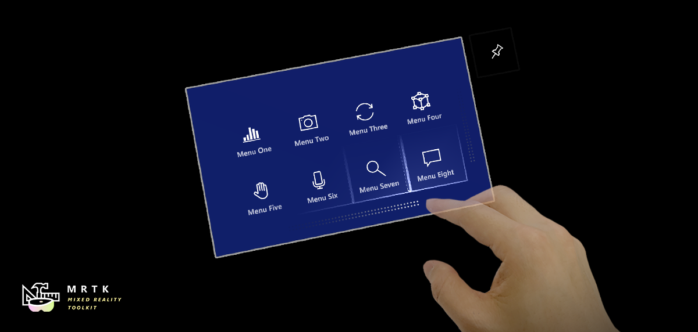
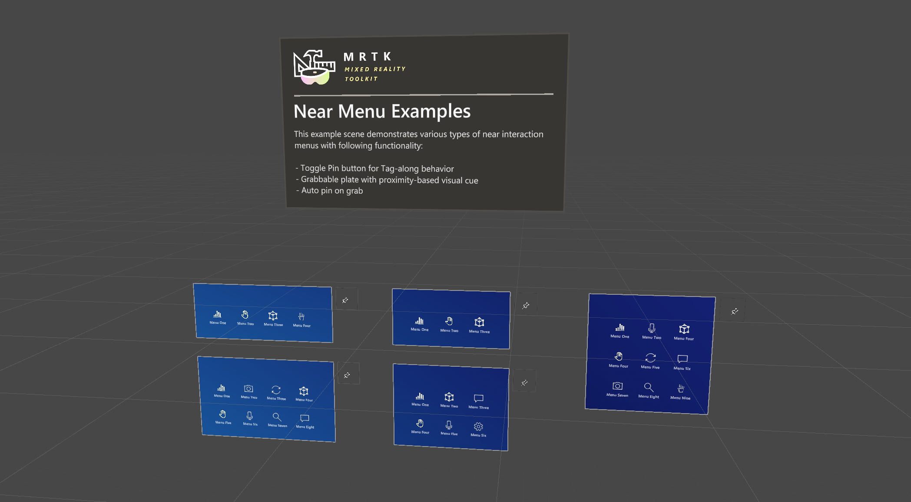

# Near Menu (ニア メニュー)

Near Menu は、ボタンなどの UI コンポーネントの集まりを提供する UX コントロールです。ユーザーの体の周りに浮かんでいて、いつでも簡単にアクセスできます。ユーザーと疎結合しているので、ターゲット コンテンツとユーザーとのインタラクションを妨げることはありません。ユーザーは「Pin」ボタンを使ってメニューをワールドロック/アンロックすることができます。メニューは掴んで特定の位置に配置することができます。

## インタラクションの動作

- **タグアロング**: メニューはニア インタラクションのために、あなたについてきてユーザーから 30〜60cm の範囲内にとどまります。
- **ピン**: 「Pin」ボタンを使うと、メニューをワールドロックにしたりロックを解除したりできます。
- **グラブと移動**: メニューはいつでも掴んで動かすことができます。前の状態に関わらず、メニューを掴んで離すと固定 (ワールドロック) されます。把持可能な領域には視覚的な手がかりがあります。手を近づけると表示されます。

## プレハブ

Near Menu のプレハブは MRTK の様々なコンポーネントを使用してニア インタラクションのためのメニューを構築する方法をデモンストレーションするために設計されています。

- **NearMenu2x4.prefab**
- **NearMenu3x1.prefab**
- **NearMenu3x2.prefab**
- **NearMenu3x3.prefab**
- **NearMenu4x1.prefab**
- **NearMenu4x2.prefab**

## サンプル シーン

Near Menu プレハブのサンプルは、`NearMenuExamples` シーンで見ることができます。

## 構造

Near Menu プレハブは以下の MRTK コンポーネントで出来ています。

- [**PressableButtonHoloLens2**](README_Button.md) プレハブ
- [**Grid Object Collection**](README_ObjectCollection.md): グリッド状の複数ボタンのレイアウト
- [**Manipulation Handler**](README_ManipulationHandler.md): メニューの把持と移動
- [**RadialView Solver**](README_Solver.md): Follow Me (タグアロング) の動作

## カスタマイズ方法

**1. Button の追加/削除**

`ButtonCollection` オブジェクト以下で、ボタンを追加または削除します。  

**2. Grid Object Collection の更新**

インスペクターで `ButtonCollection` オブジェクトの `Update Collection` ボタンをクリックします。グリッド レイアウトが更新されます。  

Grid Object Collection の `Rows` プロパティを使って行の数を設定できます。

**3. バックプレートのサイズ調整**

`Backplate` オブジェクトの下の `Quad` のサイズを調整します。バックプレートの幅と高さは `0.032 * [ボタンの数 + 1]` とします。例えば、ボタンが 3 × 2 個ある場合、バックプレートの幅は `0.032 * 4`、高さは `0.032 * 3` となります。この式は Unity のフィールドに直接入力することができます。  

- HoloLens 2 ボタンのデフォルト サイズは 3.2x3.2 cm (0.032m) です。

## 関連項目

- [**Buttons**](README_Button.md)
- [**Bounds Control**](README_BoundsControl.md)
- [**Slider**](README_Sliders.md)
- [**Grid Object Collection**](README_ObjectCollection.md)
- [**Manipulation Handler**](README_ManipulationHandler.md)
- [**RadialView Solver**](README_Solver.md)
