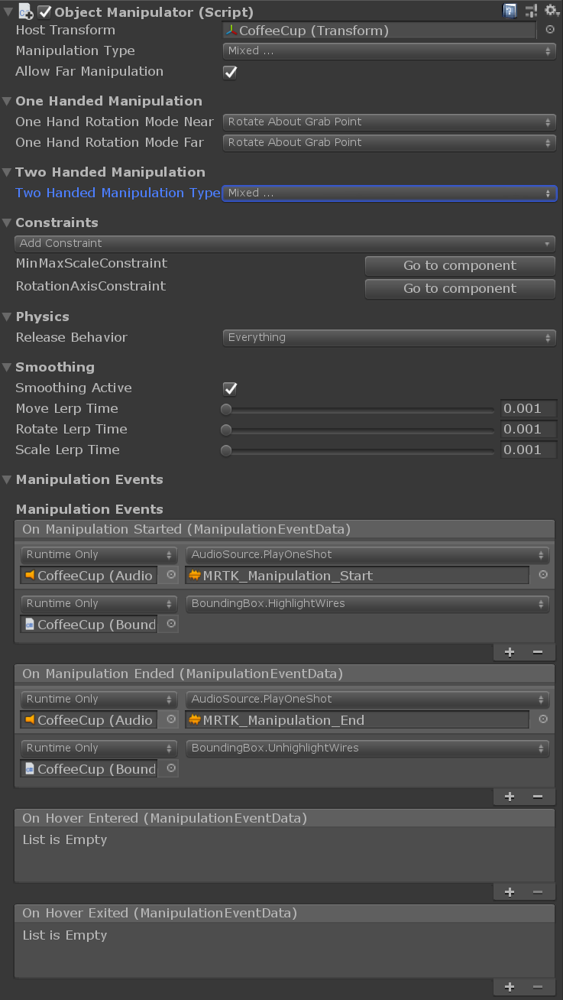

# Object Manipulator (オブジェクト マニピュレーター)

*ObjectManipulator* は、以前は *ManipulationHandler* に含まれていたマニピュレーション動作のための新しいコンポーネントです。オブジェクト マニピュレーターでは、多くの改良と簡略化が行われています。このコンポーネントは Manipulation Handler (マニピュレーション ハンドラー) を置き換えるものであり、マニピュレーション ハンドラーは非推奨となります。

*ObjectManipulator* スクリプトは、片手または両手を使ったオブジェクトの移動、スケール変更、回転を可能にします。オブジェクト マニピュレーターの設定を変更することで、さまざまな入力に対してオブジェクトがどのように反応するかを制御することができます。このスクリプトは、HoloLens 2 の多関節ハンド、HoloLens 2 のハンド レイ、HoloLens 1 のゲイズやジェスチャー、イマーシブ ヘッドセットのモーション コントローラ入力など、ほとんどの形式のインタラクションで動作します。

## オブジェクト マニピュレーターの使い方

オブジェクト マニピュレーターを使うには、まず `ObjectManipulator` スクリプト コンポーネントを GameObject に追加します。また、オブジェクトの把持可能範囲に合わせてコライダーを追加することも忘れないでください。

オブジェクトがニア インタラクションの多関節ハンド入力に反応するようにするには、`NearInteractionGrabbable` スクリプトも追加します。

オブジェクトに Rigidbody コンポーネントを追加することで、オブジェクト マニピュレーターの物理的な動作を有効にすることができます。このコンポーネントを追加することで有効になる物理的な動作については、[*物理とコリジョン*](#physics-and-collisions) で詳しく説明しています。

これと同様に、オブジェクトに [Manipulation Constraint コンポーネント](README_ConstraintManager.md#transform-constraints) を追加することで、マニピュレーションに制約を与えることができます。これらのコンポーネントは、マニピュレーションに作用し、マニピュレーションの動作を何らかの形で変更する特別なコンポーネントです。

## インスペクターのプロパティとフィールド

### General (全般) プロパティ

#### Host Transform (ホスト トランスフォーム)

操作されるオブジェクトのトランスフォーム。デフォルトはコンポーネントのオブジェクトです。

#### Manipulation Type (マニピュレーション タイプ)

オブジェクトを片手で操作するか、両手で操作するかを指定します。このプロパティはフラグであるため、両方のオプションを選択することもできます。

- *One Handed (片手)*: 選択した場合、片手操作が有効になります。
- *Two Handed (両手)*: 選択した場合、両手操作が有効になります。

#### Allow Far Manipulation (ファー マニピュレーションの有効化)

ポインターとのファー インタラクションを使った操作ができるかどうかを指定します。

### One Handed Manipulation (片手操作) プロパティ

#### One Hand Rotation Mode Near (ニアでの片手回転モード)

オブジェクトが片手のニア インタラクションで掴まれているときの動作を指定します。これらのオプションは、多関節ハンドに対してのみ機能します。

* *Rotate About Object Center (オブジェクト中心まわりの回転)*: オブジェクトはハンドの回転を使って回転しますが、オブジェクトの中心点を中心に回転します。回転時のオブジェクトの移動は小さくなりますが、ハンドとオブジェクトの間に断絶感があるかもしれません。ファー インタラクションでより便利です。
* *Rotate About Grab Point (把持点まわりの回転)*: 親指と人差し指の間の把持点を中心にオブジェクトが回転します。オブジェクトを手で掴んでいるように感じるはずです。

#### One Hand Rotation Mode Far (ファーでの片手回転モード)

オブジェクトが遠くから片手で掴まれているときの動作を指定します。これらのオプションは、多関節ハンドに対してのみ機能します。

* *Rotate About Object Center (オブジェクト中心まわりの回転)*: オブジェクトはハンドの回転を使って回転しますが、オブジェクトの中心点を中心に回転します。オブジェクトの回転に伴ってオブジェクトの中心が移動することなく、離れた場所から詳しく眺める場合に便利です。
* *Rotate About Grab Point (把持点まわりの回転)*: オブジェクトはハンドの回転を使って回転しますが、ポインター レイが当たったポイントを中心に回転します。詳しく眺める場合に便利です。

### Two Handed Manipulation (両手操作) プロパティ

#### Two Handed Manipulation Type (両手操作タイプ)

両手操作でオブジェクトのトランスフォームがどのようにを変更されるかを指定します。このプロパティはフラグであるため、任意の数のオプションを選択することができます。

* *Move (移動)*: 選択した場合、移動が許可されます。
* *Scale (スケール)*: 選択した場合、スケール変更が許可されます。
* *Rotate (回転)*: 選択した場合、回転が許可されます。

### Constraints (制約)

#### Enable Constraints (制約の有効化)
この設定により、リンクされた [コンストレイント マネージャー](README_ConstraintManager.md) が有効になります。選択した [コンストレイント マネージャー](README_ConstraintManager.md) に登録された制約によって、トランスフォームの変更が処理されます。

#### Constraint Manager (コンストレイント マネージャー)
ドロップダウンでは、アタッチされている [コンストレイント マネージャー](README_ConstraintManager.md) のいずれかを選択することができます。オブジェクト マニピュレーターは、常に [コンストレイント マネージャー](README_ConstraintManager.md) がアタッチされていることを保証します。
同じタイプの複数のコンポーネントは、Unity では同じ名前で表示されることに注意してください。同じオブジェクト上の複数のコンストレイント マネージャーを簡単に区別できるようにするために、利用可能なオプションには（手動または自動の制約選択によって）選択されたコンストレイント マネージャーの設定に関するヒントが表示されます。

#### Go to component (コンポーネントへ移動)

*Go to component* ボタンを押すとコンストレイント マネージャーが選択されます。このボタンをクリックすると、インスペクターが選択されたコンポーネントまでスクロールし、設定することができます。

### Physics (物理)

このセクションの設定は、オブジェクトに Rigidbody コンポーネントがある場合にのみ表示されます。

#### Release Behavior (リリースの動作)

操作されたオブジェクトがリリースされた時に維持すべき物理的なプロパティを指定します。このプロパティはフラグであるため、両方のオプションを選択することもできます。

* *Keep Velocity (速度の維持)*: このオプションが選択されている場合、オブジェクトがリリースされるときに速度が維持されます。
* *Keep Angular Velocity (各速度の維持)*: このオプションが選択されている場合、オブジェクトがリリースされるときに角速度が維持されます。

#### Use Forces For Near Manipulation (ニア マニピュレーションに力を使う)

ニア マニピュレーションを行う際に、オブジェクトを動かすのに物理的な力を使うかどうかを指定します。これを *false* に設定すると、オブジェクトがユーザーの手に直接接続されているように感じられます。これを *true* に設定すると、オブジェクトの質量と慣性を尊重しますが、オブジェクトがバネを介して接続されているように感じるかもしれません。デフォルトは *false* です。

### Smoothing (スムージング)

#### Smoothing Far (ファー スムージング)

フレームレートに依存しないスムージングをファー インタラクションで有効にするかどうか。デフォルトではファー スムージングは有効になっています。

#### Smoothing Near (ニア スムージング)

フレームレートに依存しないスムージングをニア インタラクションで有効にするかどうか。ニア スムージングはデフォルトでは無効になっています。これはこの効果がハンドから「切り離されている」と認識される可能性があるためです。

#### Smoothing Active (スムージングの有効化)

廃止予定で、将来のバージョンでは削除されます。アプリケーションは SmoothingFar、SmoothingNear、またはそれらの組み合わせを使用する必要があります。

#### Move Lerp Time (移動の線形補間時間)

移動に適用されるスムージングの量。 0 のスムージングはスムージングなしを意味します。最大値は値を変更しないことを意味します。

#### Rotate Lerp Time (回転の線形補間時間)

回転に適用されるスムージングの量。 0 のスムージングはスムージングなしを意味します。最大値は値を変更しないことを意味します。

#### Scale Lerp Time (スケールの線形補間時間)

スケール変更に適用されるスムージングの量。 0 のスムージングはスムージングなしを意味します。最大値は値を変更しないことを意味します。

### Manipulation Events (操作イベント)

Manipulation Handler は以下のイベントを提供しています。

* *OnManipulationStarted (操作開始時)*: マニピュレーション開始時に発火されます。
* *OnManipulationEnded (操作終了時)*: マニピュレーション終了時に発火されます。
* *OnHoverStarted (ホバー開始時)*: ハンドやコントローラーのカーソルが、ニアまたはファーでマニピュレーション可能なオブジェクトに当たったときに発火されます。
* *OnHoverEnded (ホバー終了時)*: ハンドやコントローラーのカーソルが、ニアまたはファーでマニピュレーション可能なオブジェクトから外れたときに発火されます。

マニピュレーションのイベントが発火される順序は以下の通りです。

*OnHoverStarted* -> *OnManipulationStarted* -> *OnManipulationEnded* -> *OnHoverEnded*

マニピュレーションが行われない場合でも、以下の発火順序でホバー イベントを受け取ることができます。

*OnHoverStarted* -> *OnHoverEnded*

## 物理とコリジョン

物理的な動作は、オブジェクト マニピュレーターと同じオブジェクトに Rigidbody コンポーネントを追加することで有効にできます。これにより、上記の [Release Behaviour](#release-behavior) の設定が有効になるだけでなく、コリジョンも有効になります。Rigidbody コンポーネントがないと、以下のようにマニピュレーション中にコリジョンが正しく動作しません。

* 操作されているオブジェクトと静的なコライダー（コライダーはあるが Rigidbody はないオブジェクト）とのコリジョンは動作せず、操作されているオブジェクトは影響を受けずに静的なコライダーをまっすぐ通過します。
* 操作されているオブジェクトと Rigidbody（コライダーと Rigidbody の両方を持つオブジェクト）が衝突した場合、Rigidbody はコリジョンの反応が起こりますが、その反応はジャンプした不自然なものになります。また、操作されているオブジェクトにはコリジョン反応がありません。

Rigidbody が追加されていると、コリジョンは正しく動作します。

### Rigidbody がない場合

### Rigidbody がある場合

## Elastics (エラスティックス) [Experimental]
エラスティックスは、オブジェクト マニピュレーターを介してオブジェクトを操作する際に使用できます。[Eelastics System](Elastics/ElasticSystem.md) はまだ実験的な状態であることに注意してください。エラスティックスを有効にするには、既存のエラスティックス マネージャー コンポーネントをリンクするか、`Add Elastics Manager` ボタンを使って新しいエラスティックス マネージャーを作成してリンクしてください。

## 関連項目

- [Bounds control](README_BoundsControl.md)
- [Constraint manager](README_ConstraintManager.md)
- [Migration window](Tools/MigrationWindow.md)
- [Elastics system (Experimental)](Elastics/ElasticSystem.md)