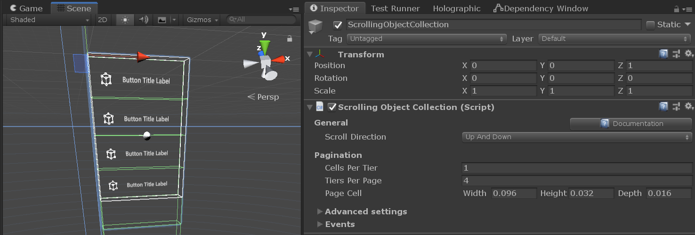
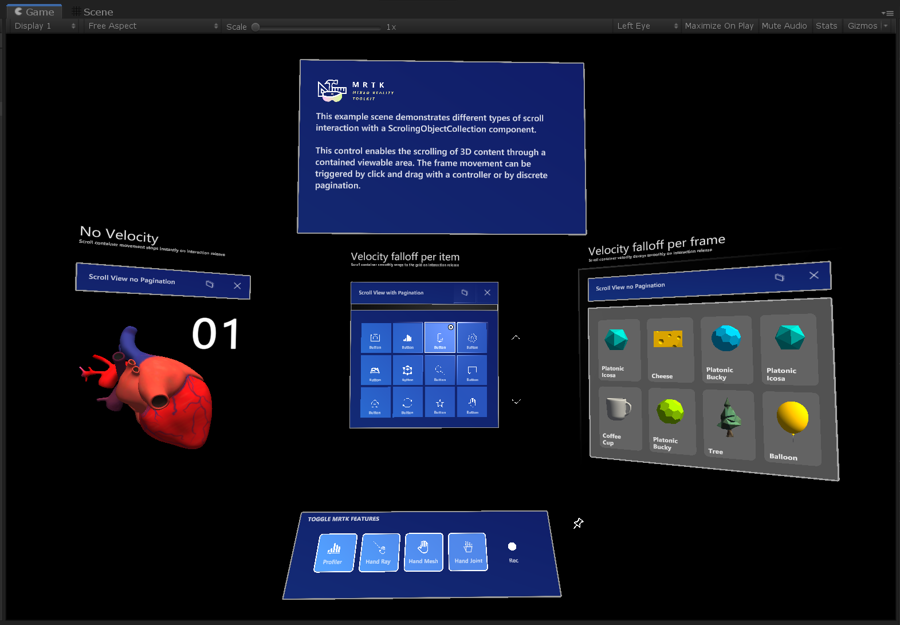

# Scrolling Object Collection (スクローリング オブジェクト コレクション)


MRTK Scrolling Object Collection は、表示エリアを通して 3D コンテンツのスクロールを可能にする UX コンポーネントです。スクロールの動きは、ニア インプットやファー インプットの入力インタラクションや不連続のページネーションによってトリガーすることができます。インタラクティブなオブジェクトと非インタラクティブなオブジェクトの両方をサポートしています。

## Scrolling Object Collection を始める

### シーンのセットアップ

1. 新しい Unity シーンを作成します。
1. **Mixed Reality Toolkit** > **Add to Scene and Configure** からシーンに MRTK を追加します。

### Scrolling Object (スクローリング オブジェクト) のセットアップ

1. シーンに空の GameObject を作成し、位置を (0, 0, 1) に変更します。
1. GameObject に [Scrolling Object Collection](xref:Microsoft.MixedReality.Toolkit.UI.ScrollingObjectCollection) コンポーネントを追加します。

    Scrolling Object Collection が追加されると、ボックス コライダーと [Near Interaction Touchable](xref:Microsoft.MixedReality.Toolkit.Input.NearInteractionTouchable) コンポーネントがルートのゲーム オブジェクトに自動的にアタッチされます。これらのコンポーネントにより、スクローリング オブジェクトはポインターのタッチやクリックのようなニア・ファー インタラクションの入力イベントをリッスンすることができます。  

    MRTK の Scrolling Object Collection には2つの重要な要素があり、それらはルートのスクローリング オブジェクト階層の下に子ゲーム オブジェクトとして作成されます。
    * `Container` - すべてのスクローリング コンテンツ オブジェクトは Container ゲーム オブジェクトの子オブジェクトでなければなりません。
    * `Clipping bounds` - スクローリング コンテンツのマスキングが有効になっている場合、Clipping bounds は、その境界内のスクロール可能なコンテンツのみを表示するようにします。Clipping bounds のゲーム オブジェクトは、無効化されたボックス コライダーと [Clipping Box](xref:Microsoft.MixedReality.Toolkit.Utilities.ClippingBox) の2つのコンポーネントを持っています。

 

### Scrolling Object にコンテンツを追加する

Scrolling Object Collection は、[Grid Object Collection](xref:Microsoft.MixedReality.Toolkit.Utilities.GridObjectCollection) と組み合わせて、サイズと間隔が一定の要素を並べたグリッドにコンテンツをレイアウトすることができます。

1. 空の GameObject を Scroll Container の子要素として作成します。
1. 作成した GameObject に Grid Object Collection コンポーネントを追加します。
1. 縦方向の1列スクロールの場合は、インスペクター タブで以下のように Grid Object Collection を設定します。 
    - **Num Columns**: 1
    - **Layout**: column then row
    - **Anchor**: upper left
1. **Cell Width** と **Height** をコンテンツ オブジェクトに合わせて変更します。
1. Grid Object の子要素としてコンテンツ オブジェクトを追加します。
1. **Update Collection** を押します。


> [!IMPORTANT]
> スクローリング コンテンツ のオブジェクトのマテリアルには、表示領域のクリッピング効果を正常に動作させるために、[MRTK Standard Shader](README_MRTKStandardShader.md) を使用しなければなりません。
   
> [!NOTE]
> スクローリング コンテンツのマスキングが有効な場合、Scrolling Object Collection は Renderer がアタッチされている全てのコンテンツ オブジェクトに [Material Instance](Rendering/MaterialInstance.md) コンポーネントを追加します。このコンポーネントはインスタンス化されたマテリアルのライフタイムを管理し、メモリ性能を向上させるために使用されます。

### スクローリング表示エリアの設定

1. 1列のオブジェクトを縦方向にスクロールする場合は、インスペクター タブで以下のように Scrolling Object Collection を設定します。
    - **Cells Per Tier**: 1
    - 表示したい行の数応じて、**Tiers Per Page** の数値を選択します。
1. **Page Cell Width**, **Height**, **Depth** をコンテンツ オブジェクトのサイズに合わせて変更します。

スクローリング表示領域の外側にあるコンテンツ オブジェクトが無効化され、スクロール ワイヤフレームと交差するオブジェクトはクリッピング プリミティブによって部分的にマスクされている可能性があることに注目してください。


 
### Editor での Scrolling Object Collection のテスト

1. Play を押し、スペース バーを押し続けて入力シミュレーション ハンドを表示します。
1. スクローリング コライダーまたはスクロールするインタラクティブ コンテンツにフォーカスが当たるまでハンドを動かし、マウスの左クリックを押して上下にドラッグすることでスクロールの動きをトリガーします。

## スクローリング オブジェクトをコードで制御する

MRTK Scrolling Object Collection は、`pagination` プロパティの設定にしたがってスクローリング コンテナの位置をスナップして移動させることができるいくつかのパブリック メソッドを公開しています。

Scrolling Object Collection のページネーション インターフェイスへのアクセス方法の例は、``MRTK/Examples/Demos/ScrollingObjectCollection/Scripts`` フォルダ以下にあります。[Scrollable Pagination](xref:Microsoft.MixedReality.Toolkit.Examples.Demos.ScrollablePagination) のサンプル スクリプトは、シーン内の既存の Scrolling Object Collection にリンクすることができます。このスクリプトは、Unity イベントを公開するシーンコンポーネント (例: [MRTK button](README_Button.md)) から参照することができます。

```c#
public class ScrollablePagination : MonoBehaviour
{
    [SerializeField]
    private ScrollingObjectCollection scrollView;

    public void ScrollByTier(int amount)
    {
        scrollView.MoveByTiers(amount);
    }       
}
```

## Scrolling Object Collection のプロパティ

| General                      |                                                                                                                                                                                                     |
|:-----------------------------|:----------------------------------------------------------------------------------------------------------------------------------------------------------------------------------------------------|
| Scroll direction             | The direction in which content should scroll.|

| Pagination                   |                                                                                                                                                                                                     |
|:-----------------------------|:----------------------------------------------------------------------------------------------------------------------------------------------------------------------------------------------------|
| Cells per tier               | Number of cells in a row on up-down scroll view or number of cells in a column on left-right scroll view.                                                                                                         |
| Tiers per page               | Number of visible tiers in the scrolling area.                                                                                                                                                                         |
| Page cell                    | Dimensions of the pagination cell.                  |

| Advanced settings            |                                                                                                                                                                                                     |
|:-----------------------------|:----------------------------------------------------------------------------------------------------------------------------------------------------------------------------------------------------|
| Mask edit mode               | Edit modes for defining the clipping box masking boundaries. Choose 'Auto' to automatically use pagination values. Choose 'Manual' for enabling direct manipulation of the clipping box object.|
| Collider edit mode           | Edit modes for defining the scroll interaction collider boundaries. Choose 'Auto' to automatically use pagination values. Choose 'Manual' for enabling direct manipulation of the collider.|
| Can scroll                   | Enables/disables scrolling with near/far interaction.                  |
| Use on pre render            | Toggles whether the scrollingObjectCollection will use the Camera OnPreRender event to manage content visibility.                  |
| Pagination curve             | Animation curve for pagination.                  |
| Animation length             | The amount of time (in seconds) the PaginationCurve will take to evaluate.                  |
| Hand delta scroll threshold  | The distance, in meters, the current pointer can travel along the scroll direction before triggering a scroll drag.                  |
| Front touch distance         | Distance, in meters, to position a local xy plane used to verify if a touch interaction started in the front of the scroll view.                  |
| Release threshold            | Withdraw amount, in meters, from the scroll boundaries needed to transition from touch engaged to released.                  |

| Velocity |                                                                                                                                                                                    |
|-------------------|------------------------------------------------------------------------------------------------------------------------------------------------------------------------------------|
| Type of velocity       | The desired type of velocity falloff for the scroller.                                                                                        |
| Velocity multiplier     | Amount of (extra) velocity to be applied to scroller.                                                                                                                                                        |
| Velocity dampen     | Amount of falloff applied to the velocity. |
| Bounce multiplier     | Multiplier to add more bounce to the overscroll of a list when using falloff per frame or falloff per item. |

| Debug options |                                                                                                                                                                                    |
|-------------------|------------------------------------------------------------------------------------------------------------------------------------------------------------------------------------|
| Mask enabled       | Visibility mode of scroll content. Default value will mask all objects outside of the scroll viewable area.                                                                                        |
| Show threshold planes     | If true, the editor will render the touch release threshold planes around the scroll boundaries.                                                                                                                                                        |
| Debug pagination     | Use this section to debug the scroll pagination during runtime. |

| Events|                                                                                                                                                                                    |
|-------------------|------------------------------------------------------------------------------------------------------------------------------------------------------------------------------------|
| On click       | Event triggered when the scroll background collider or any of its interactive content receives a click.                                                                                        |
| On touch started     | Event triggered when the scroll background collider or any of its interactive content receives a near interaction touch.                                                                                                                                                        |
| On touch ended     | Event triggered when an active touch interaction is terminated by having the near interaction pointer crossing one of the release threshold planes. |
| On momentum started     | Event triggered when the scroll container starts moving by interaction, velocity fallofff or pagination. |
| On momentum ended     | Event triggered when the scroll container stops moving by interaction, velocity fallofff or pagination. |

## Scrolling example scene

**ScrollingObjectCollection.unity** example scene consists of 3 scrollable examples, each one with a different velocity falloff configuration. The example scene contains walls to show the surface placement behavior that are disabled by default in the hierarchy. The example scene can be found under the ``MRTK/Examples/Demos/ScrollingObjectCollection/Scenes`` folder.



## Scrolling example prefabs

For convenience, two scrolling object collection prefabs are available to use. The example prefabs can be found under the ``MRTK/Examples/Demos/ScrollingObjectCollection/Prefabs`` folder.


## See also

* [Clipping Primitive](Rendering/ClippingPrimitive.md)
* [Material Instance](Rendering/MaterialInstance.md)
* [Standard Shader](README_MRTKStandardShader.md)
* [Object collection](README_ObjectCollection.md)