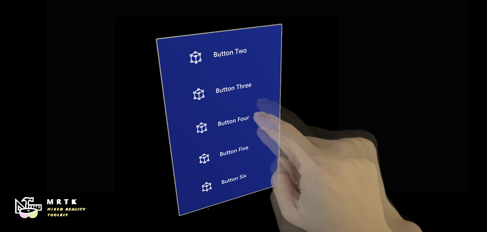
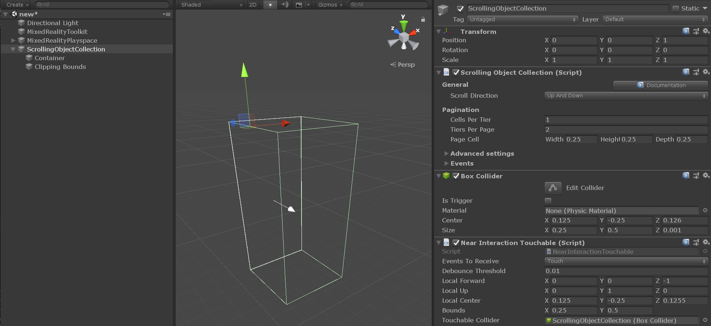
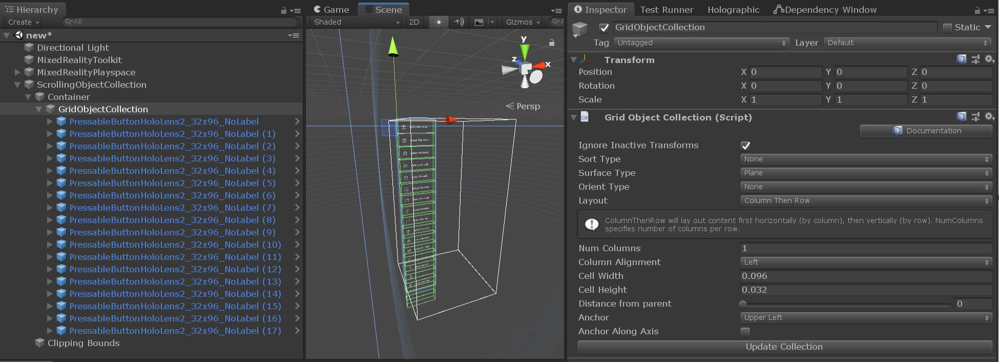
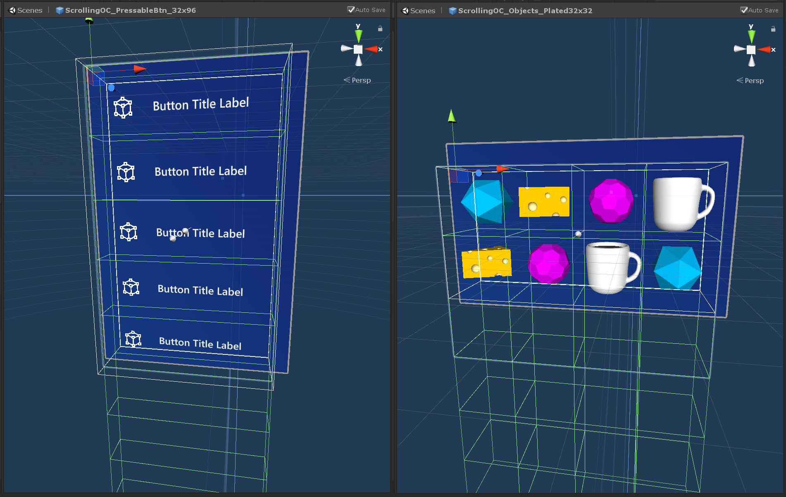

# Scrolling Object Collection (スクローリング オブジェクト コレクション)


MRTK Scrolling Object Collection は、表示エリアを通して 3D コンテンツのスクロールを可能にする UX コンポーネントです。スクロールの動きは、ニア インプットやファー インプットの入力インタラクションや不連続のページネーションによってトリガーすることができます。インタラクティブなオブジェクトと非インタラクティブなオブジェクトの両方をサポートしています。

## Scrolling Object Collection を始める

### シーンのセットアップ

1. 新しい Unity シーンを作成します。
1. **Mixed Reality Toolkit** > **Add to Scene and Configure** からシーンに MRTK を追加します。

### Scrolling Object (スクローリング オブジェクト) のセットアップ

1. シーンに空の GameObject を作成し、位置を (0, 0, 1) に変更します。
1. GameObject に [Scrolling Object Collection](xref:Microsoft.MixedReality.Toolkit.UI.ScrollingObjectCollection) コンポーネントを追加します。

    Scrolling Object Collection が追加されると、ボックス コライダーと [Near Interaction Touchable](xref:Microsoft.MixedReality.Toolkit.Input.NearInteractionTouchable) コンポーネントがルートのゲーム オブジェクトに自動的にアタッチされます。これらのコンポーネントにより、スクローリング オブジェクトはポインターのタッチやクリックのようなニア・ファー インタラクションの入力イベントをリッスンすることができます。  

    MRTK の Scrolling Object Collection には2つの重要な要素があり、それらはルートのスクローリング オブジェクト階層の下に子ゲーム オブジェクトとして作成されます。
    * `Container` - すべてのスクローリング コンテンツ オブジェクトは Container ゲーム オブジェクトの子オブジェクトでなければなりません。
    * `Clipping bounds` - スクローリング コンテンツのマスキングが有効になっている場合、Clipping bounds は、その境界内のスクロール可能なコンテンツのみを表示するようにします。Clipping bounds のゲーム オブジェクトは、無効化されたボックス コライダーと [Clipping Box](xref:Microsoft.MixedReality.Toolkit.Utilities.ClippingBox) の2つのコンポーネントを持っています。

 

### Scrolling Object にコンテンツを追加する

Scrolling Object Collection は、[Grid Object Collection](xref:Microsoft.MixedReality.Toolkit.Utilities.GridObjectCollection) と組み合わせて、サイズと間隔が一定の要素を並べたグリッドにコンテンツをレイアウトすることができます。

1. 空の GameObject を Scroll Container の子要素として作成します。
1. 作成した GameObject に Grid Object Collection コンポーネントを追加します。
1. 縦方向の1列スクロールの場合は、インスペクター タブで以下のように Grid Object Collection を設定します。 
    - **Num Columns**: 1
    - **Layout**: column then row
    - **Anchor**: upper left
1. **Cell Width** と **Height** をコンテンツ オブジェクトに合わせて変更します。
1. Grid Object の子要素としてコンテンツ オブジェクトを追加します。
1. **Update Collection** を押します。



> [!IMPORTANT]
> スクローリング コンテンツ のオブジェクトのマテリアルには、表示領域のクリッピング効果を正常に動作させるために、[MRTK Standard Shader](README_MRTKStandardShader.md) を使用しなければなりません。
   
> [!NOTE]
> スクローリング コンテンツのマスキングが有効な場合、Scrolling Object Collection は Renderer がアタッチされている全てのコンテンツ オブジェクトに [Material Instance](Rendering/MaterialInstance.md) コンポーネントを追加します。このコンポーネントはインスタンス化されたマテリアルのライフタイムを管理し、メモリ性能を向上させるために使用されます。

### スクローリング表示エリアの設定

1. 1列のオブジェクトを縦方向にスクロールする場合は、インスペクター タブで以下のように Scrolling Object Collection を設定します。
    - **Cells Per Tier**: 1
    - 表示したい行の数応じて、**Tiers Per Page** の数値を選択します。
1. **Page Cell Width**, **Height**, **Depth** をコンテンツ オブジェクトのサイズに合わせて変更します。

スクローリング表示領域の外側にあるコンテンツ オブジェクトが無効化され、スクロール ワイヤフレームと交差するオブジェクトはクリッピング プリミティブによって部分的にマスクされている可能性があることに注目してください。


 
### Editor での Scrolling Object Collection のテスト

1. Play を押し、スペース バーを押し続けて入力シミュレーション ハンドを表示します。
1. スクローリング コライダーまたはスクロールするインタラクティブ コンテンツにフォーカスが当たるまでハンドを動かし、マウスの左クリックを押して上下にドラッグすることでスクロールの動きをトリガーします。

## スクローリング オブジェクトをコードで制御する

MRTK Scrolling Object Collection は、`pagination` プロパティの設定にしたがってスクローリング コンテナの位置をスナップして移動させることができるいくつかのパブリック メソッドを公開しています。

Scrolling Object Collection のページネーション インターフェイスへのアクセス方法の例は、``MRTK/Examples/Demos/ScrollingObjectCollection/Scripts`` フォルダ以下にあります。[Scrollable Pagination](xref:Microsoft.MixedReality.Toolkit.Examples.Demos.ScrollablePagination) のサンプル スクリプトは、シーン内の既存の Scrolling Object Collection にリンクすることができます。このスクリプトは、Unity イベントを公開するシーンコンポーネント (例: [MRTK button](README_Button.md)) から参照することができます。

```c#
public class ScrollablePagination : MonoBehaviour
{
    [SerializeField]
    private ScrollingObjectCollection scrollView;

    public void ScrollByTier(int amount)
    {
        scrollView.MoveByTiers(amount);
    }       
}
```

## Scrolling Object Collection のプロパティ

| General<br>(全般)                     |                                                                                                                                                                                                     |
|:-----------------------------|:----------------------------------------------------------------------------------------------------------------------------------------------------------------------------------------------------|
| Scroll Direction<br>(スクロールの方向)            | コンテンツがスクロールする方向 |

| Pagination<br>(ページネーション)                  |                                                                                                                                                                                                     |
|:-----------------------------|:----------------------------------------------------------------------------------------------------------------------------------------------------------------------------------------------------|
| Cells Per Tier<br>(列ごとのセル数)               | 上下スクロール ビューでは横列のセル数、左右スクロール ビューでは縦列のセル数                                                                                                         |
| Tiers Per Page<br>(ページごとの列数)              | スクローリング エリアに表示される列数                                                                                                                                                                         |
| Page Cell<br>(ページ セル)                   | ページネーション セルのサイズ                  |

| Advanced settings<br>(詳細設定)           |                                                                                                                                                                                                     |
|:-----------------------------|:----------------------------------------------------------------------------------------------------------------------------------------------------------------------------------------------------|
| Mask Edit Mode<br>(マスクの編集モード)              | クリッピング ボックスのマスキング境界を定義するための編集モードです。'Auto' を選ぶと自動的にページネーションの値を使用します。'Manual' を選ぶとクリッピング ボックス オブジェクトを直接操作することができます。|
| Collider Edit Mode<br>(コライダーの編集モード)          | スクロール インタラクションのコライダー境界を定義するための編集モードです。'Auto' を選ぶと自動的にページネーションの値を使用します。'Manual' を選ぶとコライダーを直接操作することができます。|
| Can Scroll<br>(スクロール可否)                  | ニア/ファー インタラクションでのスクロール可否                  |
| Use On Pre Render<br>(OnPreRender の利用)           | ScrollingObjectCollection が Camera の OnPreRender イベントを使用してコンテンツの可視性を管理するかどうかを切り替えます。     |
| Pagination Curve<br>(ページネーション カーブ)            | ページネーションのアニメーション カーブ                  |
| Animation Length<br>(アニメーションの長さ)            | PaginationCurve が評価されるのにかかる時間（秒）                  |
| Hand Delta Scroll Threshold<br>(ハンドのスクロールしきい値) | 現在のポインターがスクロール ドラッグをトリガーする前にスクロール方向に沿って移動できる距離 (m)       |
| Front touch distance<br>(前面のタッチ距離)  | スクロール ビューの前面でタッチ インタラクションが開始されたかどうかを確認するために使用されるローカルの xy 平面を配置する距離 (m) |
| Release threshold<br>(リリースのしきい値)            | タッチしている状態から解放されるまでに必要な、スクロール境界から引っこめる移動量 (m)       |

| Velocity<br>(速度) |                                                                                                                                                                                    |
|-------------------|------------------------------------------------------------------------------------------------------------------------------------------------------------------------------------|
| Type Of Velocity<br>(速度のタイプ)      | スクローラーの速度減衰のタイプ                                                                                        |
| Velocity Multiplier<br>(速度倍率)     | スクローラーに適用される（追加の）速度量                                    |
| Velocity Dampen<br>(速度減衰)     | 速度に適用される減衰量 |
| Bounce Multiplier<br>(はずみ倍率)     | Falloff Per Frame や Falloff Per Item を使用するとき、リストのオーバースクロールに対してより大きいはずみ量を追加するための倍率 |

| Debug options<br>(デバッグ オプション) |                                                                                                                                                                                    |
|-------------------|------------------------------------------------------------------------------------------------------------------------------------------------------------------------------------|
| Mask Enabled<br>(マスクの有効化)       | スクロール コンテンツの可視性。デフォルト値はスクロール表示エリアの外側にある全てのオブジェクトをマスクします。    |
| Show Threshold Planes<br>(しきい値平面の表示)    | tru の場合、Editor でスクロール境界の周りのタッチ リリースしきい値平面が描画されます。      |
| Debug pagination<br>(デバッグ ページネーション)     | このセクションを使うことで実行時にスクロールのページネーションをデバッグできます。 |

| Events<br>(イベント) |                                                                                                                                                                                    |
|-------------------|------------------------------------------------------------------------------------------------------------------------------------------------------------------------------------|
| On Click<br>(クリック時)      | スクロール背景のコライダーやいずれかのインタラクティブ コンテンツがクリックを受け取ったときにトリガーされるイベント    |
| On Touch Started<br>(タッチ開始時)     | スクロール背景のコライダーやいずれかのインタラクティブ コンテンツがニア インタラクション タッチを受け取ったときにトリガーされるイベント   |
| On Touch Ended<br>(タッチ終了時)     | ニア インタラクション ポインターがリリースしきい値平面の1つを超えたことでアクティブなタッチ インタラクションが終了したときにトリガーされるイベント |
| On Momentum Started<br>(移動開始時)     | インタラクション、速度減衰やページネーションによってスクロール コンテナーが動き出したときにトリガーされるイベント |
| On Momentum Ended<br>(移動終了時)     | インタラクション、速度減衰やページネーションによってスクロール コンテナーの動きが停止したときにトリガーされるイベント |

## スクロールのサンプル シーン

**ScrollingObjectCollection.unity** サンプル シーンは、3つのスクロール可能なサンプルで構成されています。3つのサンプルはそれぞれ異なる速度減衰が設定されています。サンプルシーンは ``MRTK/Examples/Demos/ScrollingObjectCollection/Scenes`` フォルダ以下にあります。


## スクロールのサンプル プレファブ

便利なように、2つの Scrolling Object Collection のプレハブが用意されています。サンプルのプレハブは ``MRTK/Examples/Demos/ScrollingObjectCollection/Prefabs`` フォルダにあります。



## 関連項目

* [Clipping Primitive](Rendering/ClippingPrimitive.md)
* [Material Instance](Rendering/MaterialInstance.md)
* [Standard Shader](README_MRTKStandardShader.md)
* [Object collection](README_ObjectCollection.md)