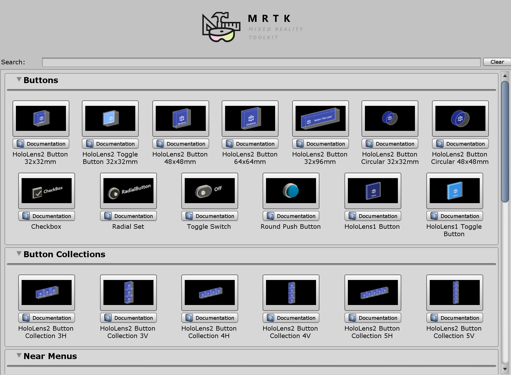

# Toolbox UI

MRTK Toolbox は Unity Editor のウィンドウ ユーティリティで、MRTK UX プレハブ コンポーネントを簡単に発見し、現在のシーンにスポーンすることができます。ウィンドウ上部の検索バーを使用して、表示中のアイテムをフィルタリングすることができます。Toolbox ウィンドウは MRTK の デフォルトの UX プレハブを現在のシーンにスポーンするように設計されています。また、[Bounds Control](README_BoundsControl.md) や [Object Manipulator](README_ObjectManipulator.md) など、スクリプト コンポーネントとして追加できる "UX" コンポーネントもあります。

## Toolbox のインストール

Toolbox は MRTK の Tools パッケージで配布されます。

## Toolbox ウィンドウを使う

1. **Mixed Reality Toolkit** タブ > **Toolbox** から、Toolbox ウィンドウを開きます。

    

1. UX コンポーネントをクリックし、現在のシーンに追加します。

    

## 関連項目

- [Button](README_Button.md)
- [Interactable](README_Interactable.md)
- [Sliders](README_Sliders.md)
- [Slate](README_Slate.md)
- [AppBar](README_AppBar.md)
- [Tooltips](README_Tooltip.md)
