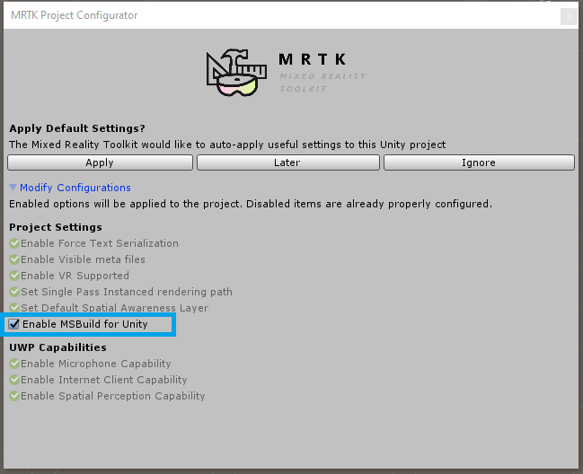
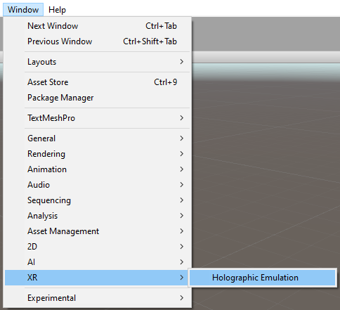
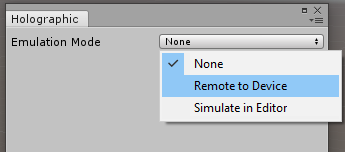

# Getting Started with Holographic Remoting

Holographic remoting streams holographic content from a PC to your Microsoft HoloLens in real-time, using a Wi-Fi connection. This feature can significantly increase developer productivity when developing mixed reality applications.

## Initial setup

To enable remoting to a HoloLens, it is important to ensure that the project is using the latest remoting components.

1. Open **Window > Package Manager**
    - Verify that latest version of the **Windows Mixed Reality** package is installed.
1. Ensure the latest Holographic Remoting application is installed, on the HoloLens, via the Microsoft Store.

When using a HoloLens 2, support for remoting articulated hand and eye tracking data has been added to MRTK. To enable these features,
configure the project using the following steps.

1. Run the MRTK Configurator Utility (**Mixed Reality Toolkit > Utilities > Configure Unity Project**)
1. Expand **Modify Configurations**

    

1. Ensure that **Enable MSBuild for Unity** is selected
1. Click **Apply**

## Connecting to the HoloLens

Once the project has been configured, a connection can be established to the HoloLens.

1. In **File > Build Settings**, ensure that the project build type is set to **Universal Windows Platform**
1. On the HoloLens, launch the **Holographic Remoting** application.
1. In Unity, select **Window > XR > Holographic Emulation**.

    

1. Set **Emulation Mode** to **Remote to Device**.

    

1. Select the **Device Version**.

    

1. Using the IP Address displayed by the Holographic Remoting application, set the **Remote Machine** field.

    

1. Click **Connect**.
> [!Note]
> If you cannot connect, make sure your HoloLens2 is not plugged in and restart Unity.

## Starting a remoting session

With Unity connected to the HoloLens, enter play mode in the editor.

When the session is complete, exit play mode.

> [!Note]
> There is a known issue with some versions of Unity where the editor may hang upon entering play mode during a remoting session. This issue may manifest if the Holographic window is open when the project is loaded. To ensure this issue does not occur, always close the Holographic dialog prior to exiting Unity.

## See Also

- [Holographic Remoting troubleshooting and limitations](https://docs.microsoft.com/en-us/windows/mixed-reality/holographic-remoting-troubleshooting)
- [Microsoft Holographic Remoting software license terms](https://docs.microsoft.com/en-us/legal/mixed-reality/microsoft-holographic-remoting-software-license-terms)