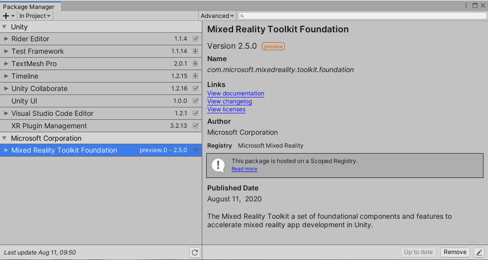
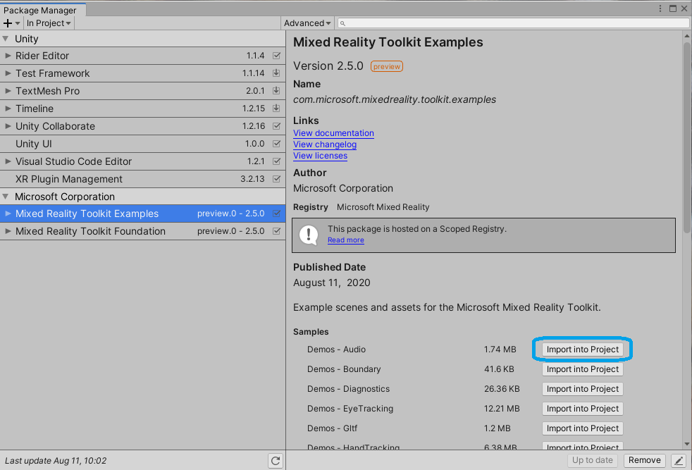

# Mixed Reality Toolkit と Unity Package Manager

バージョン 2.5.0 から、Unity 2019.4 以降において Microsoft Mixed Reality Toolkit は Unity Package Manager (UPM) を使って利用可能です。

## Unity Package Manager を使った Mixed Reality 機能のインストール

Unity Package Manager は [マニフェスト ファイル](https://docs.unity3d.com/Manual/upm-manifestPkg.html) (manifest.json) を利用して、どのパッケージをインストールしてどのレジストリ（サーバー）からインストールされうるかを決定します。

> [!Note]
> MRTK バージョン 2.5.0 現在、サーバーとパッケージの初期登録はプロジェクトごとの手動手順です。詳細な手順は以下のセクションをご覧ください。
> 
> UPM が Azure DevOps でサポートされていないレガシーの npm 検索機能 (/-/all) を使用しているため、このプロセスが必要です。

### Mixed Reality コンポーネント サーバーの登録

Microsoft Mixed Reality Toolkit を使用する各プロジェクトでは、(Packages フォルダ内の) `manifest.json` ファイルに Mixed Reality の Scoped Registry を追加する必要があります。以下は、Mixed Reality をサポートするために `manifest.json` を適切に変更する方法を説明しています。

1. `<projectRoot>/Packages/manifest.json` を [Visual Studio Code](https://code.visualstudio.com/) のようなテキスト エディターで開きます。
1. マニフェスト ファイルの先頭で Scoped Registry のセクションに Mixed Reality サーバーを追加し、ファイルを保存します。

```
{
  "scopedRegistries": [
    {
      "name": "Microsoft Mixed Reality",
      "url": "https://pkgs.dev.azure.com/aipmr/MixedReality-Unity-Packages/_packaging/Unity-packages/npm/registry/",
      "scopes": [
        "com.microsoft.mixedreality",
        "com.microsoft.spatialaudio"
      ]
    }
  ],
```

<a name="adding-mrtk-packages"></a>

### MRTK パッケージの追加

Microsoft Mixed Reality の scoped registry がマニフェストに追加されると、MRTK のパッケージを指定できるようになります。

[Mixed Reality Toolkit package](Packaging/MRTK_Packages.md) ページの [Unity Package Manager](Packaging/MRTK_Packages.md#unity-package-manager) セクションには、利用可能な MRTK パッケージ、内容、利用シナリオが書かれています。

MRTK パッケージを追加するには、`Packages/manifest.json` ファイルの dependencies セクションを変更します。以下の例は Foundation, Tools, Examples パッケージの追加方法を示しています。Standard Assets パッケージは Foundation の依存先として自動的に追加されます。

```
  "dependencies": {
    "com.microsoft.mixedreality.toolkit.foundation": "2.5.0",
    "com.microsoft.mixedreality.toolkit.tools": "2.5.0",
    "com.microsoft.mixedreality.toolkit.examples": "2.5.0",
```

## Mixed Reality 機能を Unity Package Manager で管理する

Mixed Reality Toolkit パッケージがパッケージ マニフェストに追加されると、Unity Package Manager のユーザー インターフェイスを使って管理することができます。



> [!Note]
> もし Unity Package Manager を使用して Mixed Reality Toolkit パッケージを削除した場合、[前述の手順](#adding-mrtk-packages) を使用して再度追加する必要があります。

### Mixed Reality Toolkit のサンプルを使う

アセット パッケージ (.unitypackage) ファイルを使用する場合とは異なり、`com.microsoft.mixedreality.toolkit.examples` や `com.microsoft.mixedreality.toolkit.handphysicsservice` はサンプル シーンやアセットを自動的にインポートしません。

1つ以上のサンプルを利用するには、以下の手順を行ってください。

1. Unity Editor で `Window` > `Package Manager` を開く
1. パッケージのリストで `Mixed Reality Toolkit Examples` を選択する
1. `Samples` リストから目的のサンプルを探す
1. `Import into Project` をクリックする



サンプル パッケージが更新されると、Unity はインポートされたサンプルを更新するオプションを提供します。

> [!Note]
> インポートしたサンプルを更新すると、そのサンプルと関連するアセットに加えられた変更はすべて上書きされます。

## 関連項目

- [Mixed Reality Toolkit パッケージ](Packaging/MRTK_Packages.md)
